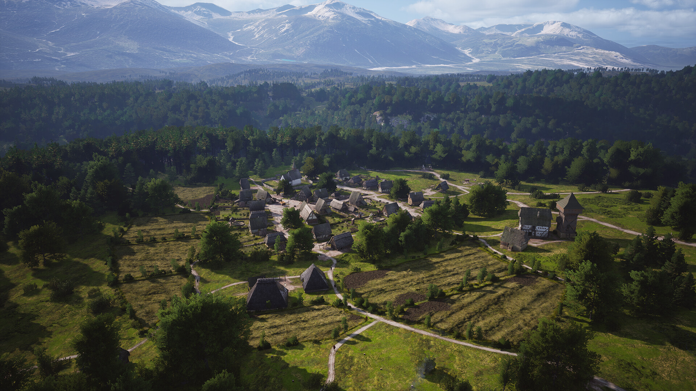
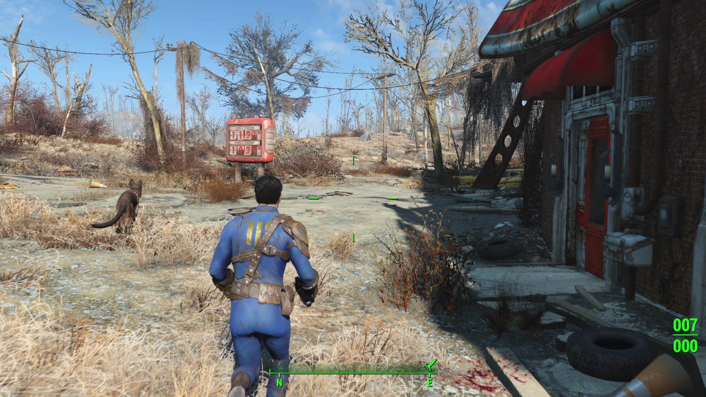

+++
title = "Les sorties de la semaine (28/04)"
date = 2024-04-28T08:00:00+01:00
draft = false
author = "Félix"
tags = ["C’est dispo"]
+++ 

Entre le boulot, les courses et le chien qui a eu la bonne idée de tomber malade en pleines vacances scolaires, vous n’avez peut-être pas eu le temps de vous intéresser aux nouveautés du moment. Qu’à cela ne tienne : voici les sorties de ces derniers jours qui ont retenu notre attention.

## 2K raquette les joueurs ?

La célèbre licence de jeu de tennis (et non de handspinner comme on pourrait facilement le croire) **TopSpin** est revenue d’entre les morts cette semaine, avec une édition 2K25… correcte. La prise en main axée simulation a l’air réussie, les quelques tests que j’ai lus étant tous très positifs sur ce point. En revanche, beaucoup regrettent un mode Carrière assez inégal ainsi que des microtransactions optionnelles bien chères si vous voulez refaire la garde-robe de vos joueurs. À ce sujet, on compte 25 sportifs pour 48 courts, ce qui est honnête d’autant plus que de nouveaux athlètes arriveront gratuitement en DLC. Les graphismes sont loin d’être incroyables, le jeu devant également tourner sur PS4 et Xbox One. Bref, ça pourrait être mieux, mais les fans de jeu de tennis ne devraient pas regretter leur achat (et c’est pas comme s’ils pouvaient se permettre de faire la fine bouche). Comptez [60 balles sur Steam](https://store.steampowered.com/app/1785650/TopSpin_2K25/), beaucoup plus si vous optez pour « l’édition Grand Chelem » ou le Battle Pass.

## La fête au village

Je sais que nos lecteurs sont des esthètes. Pas question de passer le week-end à s’étriper sur *The Finals* ou *Warzone Mobile* : ici, on préfère jouer à des simulateurs de village polonais du XIVe siècle codé main par un unique développeur dans sa cave. Et cela tombe bien, car ***Manor Lords*** est sorti en accès anticipé cette semaine. Ce jeu *wishlisté* par 3 millions de joueurs promet d’être ultra complet, avec construction et aménagement du bourg, gestion des récoltes au fil des saisons, organisation des ressources… *Manor Lords* se démarque surtout par son ambiance très bucolique et détaillée, avec des combats à la *Total War* plutôt secondaires qui me donneraient presque envie d’essayer (alors que c’est vraiment pas mon style de jeu habituellement). Peut-être pas le top si vous débutez dans le domaine des *city-builder*, mais les vieux briscards et autres fans de *Banished* peuvent foncer sans problème. 40 € sur [Steam](https://store.steampowered.com/app/1363080/Manor_Lords/), également dispo via le Game Pass et sur Xbox.

## Pas facile de Nier en bloc

La dernière grosse exclu de la PS5 est sortie cette semaine, à savoir ***Stellar Blade***. Comme on pouvait s’y attendre, il s’agit visiblement d’un bon blockbuster qui vous occupera une vingtaine d’heures sans pour autant marquer les esprits. L’histoire se laisse suivre avec son lot de personnages et de situations clichées dans un univers post-apo qui ne surprendra pas ceux ayant déjà joué à *Nier; Automata*. On alterne entre zones ouvertes et niveaux classiques, le tout entrecoupé de combats ultra-nerveux qui plairont aux fans de *Sekiro*. Si le bilan est globalement positif, de nombreux testeurs regrettent des phases de plateformes oubliables, un scénario bof et un côté parfois répétitif. Pour les amateurs de cyberwaifu et de *Bloodborne* en somme, on attendra qu’il sorte sur PC pour se faire un avis définitif. 80 balles [sur PS5](https://www.playstation.com/fr-fr/games/stellar-blade/).

 

## Failout

Ils sont comme ça chez Bethesda. Une série *Fallout* sort, les jeux se vendent comment des petits pains sans rien faire ni casser les prix, mais non, il fallait quand même foutre en rogne les joueurs. Le studio a profité de l’euphorie du moment pour publier **une grosse mise à jour pour *Fallout 4*** censée apporter tout un tas de correctifs. Sur PC, elle casse plus qu’elle ne répare en flinguant la prise en charge de la majorité des mods. Pire, de nombreux joueurs ayant moddé ce jeu de 2015 se retrouvent avec des sauvegardes qui ne fonctionnent plus. La sortie a également forcé les développeurs du gigantesque mod *Fallout : London* à [repousser](https://www.pcgamesn.com/fallout-london/launch-change) le lancement le temps de faire quelques modifications sous le capot. Si elle apporte un mode Performance 4K/60FPS sur consoles, les joueurs PC expliquent en grande partie ne pas avoir vu d’amélioration significative. Les masochistes qui veulent s’y mettre auront mieux fait d’acheter le jeu sur GoG, où l’édition GOTY est [à 10 balles](https://www.gog.com/fr/game/fallout_4_game_of_the_year_edition) avec une option pour facilement passer sur [la version d’avant la MAJ](https://www.pcgamer.com/games/fallout/thanks-to-fallout-4s-disaster-update-gogs-patch-rollback-feature-makes-it-the-best-version-of-the-game-right-now/). Pas bravo Bethesda.

## Un peu de rab

Bonne nouvelle pour les fans de jeux de zombies : ***Dead Island 2*** est désormais dispo sur Steam après un an d’exclusivité sur la boutique d’Epic. Il est vendu à moitié prix pour l’occasion ([30 €](https://store.steampowered.com/app/934700/Dead_Island_2/)), donc ça peut valoir le coup d’y jeter un œil. Les tests de l’époque décrivaient un jeu correct sans être incroyable, mais vu qu’on à rien eu à se mettre sous la dent dans ce style depuis quelque temps, pourquoi pas. Notons aussi la sortie cette semaine de ***Sand Land***, un jeu tiré d’un manga de Toriyama (*DBZ*). Les premiers retours dépeignent un jeu moyen, donc je ne vois pas trop de raison de vous pencher dessus mis à part si vous êtes fan de l’univers. 60 € [sur Steam](https://store.steampowered.com/app/1979440/SAND_LAND/), également dispo sur consoles.