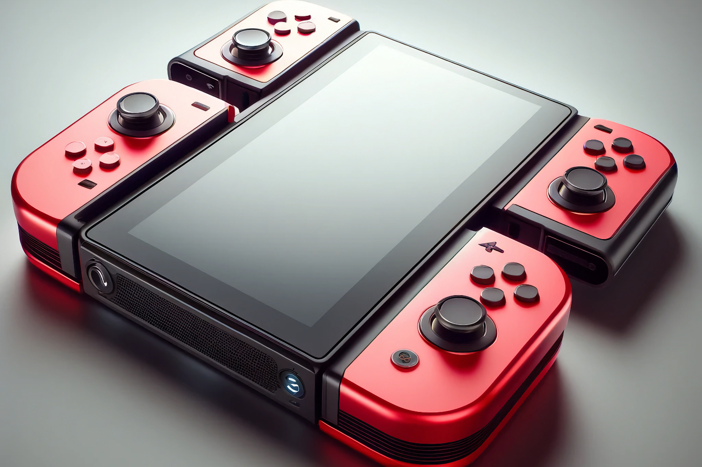

+++
title = "La Switch 2 ressemble de plus en plus à une Switch Pro"
date = 2024-04-29T10:47:32+01:00
draft = false
author = "Mickael"
tags = ["Actu"]
image = "https://nostick.fr/articles/2024/avril/2904-la-switch-2-ressemble-de-plus-en-plus-a-une-switch-pro/switch2.jpg"
+++

 

Il est vraiment  temps que Nintendo donne des nouvelles de la Switch 2, les rumeurs autour de la future console n'en peuvent plus de s'abattre comme les impôts sur les pauvres gens. On a eu droit ces derniers jours à un véritable tsunami de bruits de couloir, certains contradictoires (c'est le jeu après tout), mais qui semblent tous dessiner un appareil finalement assez proche de la console qu'on connait bien. Qui a dit Switch Pro ?

Tellement proche qu'on devrait bel et bien pouvoir jouer aux jeux de la Switch 1 : le slot de la nouvelle console pourrait ainsi accueillir les cartouches de la précédente génération, [affirme](https://www.mobapad.com/blogs/the-latest-scoop-on-nintendo-switch-2/the-latest-scoop-on-nintendo-switch-2) le fabricant d'accessoires Mobapad[^1]. Néanmoins, les cartouches de la Switch 2 ne seraient pas compatibles avec la Switch 1, ce qui pour le coup n'étonnera pas grand monde.

L'accessoiriste assure également que la future hybride supportera le Pro Controller — jusque là rien de très anormal — mais aussi les Joy-Con actuels, ce qui est plus étonnant. La Switch 2 troquerait en effet le système de rails dans lesquels coulissent les petits contrôleurs par des aimants ; Mobapad ajoute que les prochains Joy-Con, plus grands, resteront en place grâce aux aimants donc, augmentés d'une technologie de force électromagnétique, contrôlée par un courant électrique.

Une précédente rumeur annonçait des Joy-Con magnétiques, mais elle affirmait aussi que [les Joy-Con première génération ne seraient pas compatibles](https://nostick.fr/articles/2024/avril/2604-des-joycon-a-aimants/). Mais peut-être qu'il sera possible de jumeler ses anciens contrôleurs avec la nouvelle console, sans pour autant pouvoir les installer de part et d'autre ?

D'après le fabricant, Nintendo aurait ajouté un troisième bouton sur les côtés gauche et droit des nouveaux Joy-Con (en plus des gâchettes), ainsi qu'un bouton supplémentaire sous le bouton d'accueil du Joy-Con droit. Tout cela rend bien étrange la compatibilité annoncée avec les manettes existantes.

L'écran de la Switch 2 serait bien de 8 pouces et prendrait en charge une définition 1080p (7 pouces et 720p pour la Switch OLED). Une fois posée dans son dock, la console afficherait de la 4K,  mais oui. En passant, le dock changerait peu, mais le site parle d'une sorte de béquille réglable à l'arrière. Y a-t-il confusion avec la console elle-même ? La version OLED intègre une large béquille bien pratique.

Et comme si cela ne suffisait pas, le site coréen [MK](https://m.mk.co.kr/news/business/10999380) a [posté](https://m.mk.co.kr/news/business/10999380) durant le week-end des rumeurs concernant cette fois la production de la console en elle-même. Samsung aurait la part du lion, puisqu'il fournirait les écrans LCD de la bête (je continue à croiser les doigts pour un écran OLED…) et la mémoire de stockage V-NAND.

Samsung s'occuperait également de la production de la puce T239 de Nvidia, selon son processus de gravure à 8 nm. C'est TSMC qui s'occupe de la puce Tegra X1 de la Switch première du nom. *MK* évoque pour finir un lancement de la Switch 2 au deuxième semestre, en contradiction totale avec de précédentes rumeurs annonçant un report au début 2025. Mais ce sont là les joies des indiscrétions…

[^1]: Si Mobapad a réussi un coup marketing en balançant ces indiscrétions — qui restent à prendre avec des pincettes —, on n'ose croire que Nintendo va laisser passer sans rien dire…