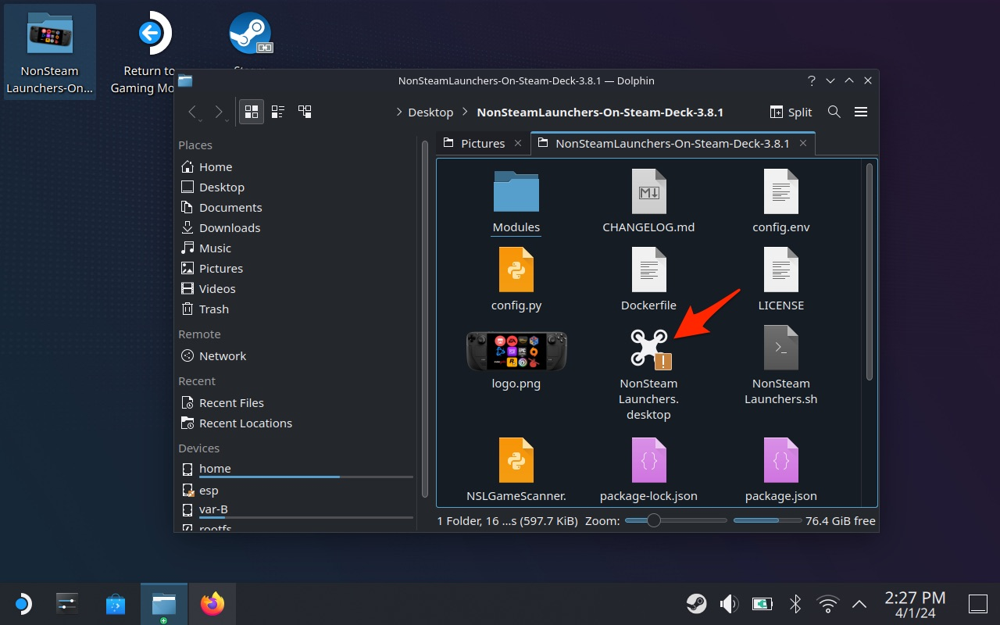

+++
title = "Steam Deck : installez Diablo IV avec le Game Pass et charclez du streum n'importe où !"
date = 2024-04-02T10:50:32+01:00
draft = false
author = "Mickael"
tags = ["Tuto"]
image = "https://nostick.fr/articles/2024/avril/installez-diablo-iv-sur-le-steam-deck/DiabloIV-install.jpg"
+++ 

*Diablo IV* est le premier titre Activision Blizzard jouable sur le Game Pass. Il était temps ! Beaucoup d'abonnés avaient espéré l'arrivée en fanfare et en trombe des jeux du studio dès son acquisition définitive par Microsoft l'an dernier. Mais manifestement, il reste encore pas mal de boulons à serrer avant de voir débouler les *Call of Duty* et autres *Candy Crush* (ça fait envie) dans le « Netflix du jeu vidéo ».

Mais ne boudons pas notre plaisir. *Diablo IV* est un sacré client qui va occuper les amateurs pendant de nombreuses heures : non seulement la campagne est touffue, mais Blizzard ne cesse d'ajouter de nouvelles aventures via un système de passe de combat (dont certains éléments sont gratuits).

Le hack'n slash sorti il y a dix mois a été particulièrement bien accueilli par les critiques et par les joueurs… avant que Blizzard ne vienne mettre le souk avec des rééquilibrages véreux de persos et du contenu qui n'ont pas vraiment séduit la communauté. Mais qu'à cela ne tienne, les plus patients et les plus malins sont maintenant récompensés car *Diablo IV* fait partie du Game Pass, pour pas un rond supplémentaire.

Mais avant de libérer Sanctuaire du joug diabolique de Lilith, il faudra en passer par le jumelage de votre compte Game Pass avec Battle.net, Microsoft ayant décidé de faire au plus simple en conservant le lanceur de Blizzard. L'opération se déroule dans la fiche Xbox de *Diablo IV*, il suffit de saisir ses identifiants Battle.net (si on s'en rappelle), cela ne dure que quelques instants mais c'est vrai que la procédure est casse-pied.

Ensuite, tout se passe dans l'app Battle.net : *Diablo IV* y figurant en bonne place, on met rapidement la main dessus pour lancer le téléchargement. Tout cela est bien sympathique pour les possesseurs de PC ou de Xbox, mais les joueurs sur Steam Deck doivent-ils se la mettre le bras en espérant qu'un jour, Microsoft lance son Game Pass sur SteamOS (on peut rêver) ?

Bien sûr que non. Il est tout à fait possible d'installer Battle.net sur la console PC de Valve, et donc *Diablo IV*, mais il va falloir y mettre un peu du sien… et basculer dans le monde infernal du bureau du Steam Deck ! Il se lance depuis l'option *Marche/arrêt* du menu Steam > *Basculer vers le bureau*.

Une fois sur ce bureau, utilisez le pad de droite pour diriger le curseur, et la gâchette R2 pour valider ; la gâchette L2 fait office de clic droit. Lancez Firefox, qui se trouve normalement dans la barre des menus en bas (il s'installera si jamais ce n'est pas le cas). Il va maintenant falloir installer l'utilitaire NonSteamLaunchers qui se trouve à cette adresse : [https://github.com/moraroy/NonSteamLaunchers-On-Steam-Deck/releases](https://github.com/moraroy/NonSteamLaunchers-On-Steam-Deck/releases). Pour ouvrir le clavier virtuel du Steam Deck, appuyez sur le bouton Steam et sur X.

Sur la page GitHub, cliquez sur le lien « Source code (zip) » de la version la plus récente de l'utilitaire, puis une fois le téléchargement terminé, lancez la décompression du fichier ZIP. Si tout va bien, le Steam Deck va afficher une fenêtre qui contient l'ensemble du dossier décompressé :

Prenez le dossier au complet (« NonSteamLaunchers-On-Steam-Deck-X-X-X ») et glissez-le sur le bureau ou n'importe où vous pourrez le retrouver facilement. Ouvrez-le, cliquez sur *NonSteamLaunchers.dektop*, puis sur le bouton *Execute*.

Dolphin, le gestionnaire de fenêtres du bureau du Steam Deck, va vous demander ensuite de continuer l'opération. Ensuite, c'est NonSteamLaunchers qui prend la main en listant les lanceurs disponibles à l'installation, et il y en a un paquet ! Choisissez Battle.net. 

L'utilitaire d'installation proposera juste après de saisir des adresses de sites web dont on voudrait des raccourcis, si cela vous intéresse faites-le, ou sinon cliquez directement sur OK.

L'installation à proprement parler débute alors, il suffit de laisser le bazar gérer tout seul sa salade. 

À la fin du processus, le logiciel Steam devrait quitter, puis se relancer avec à l'intérieur le raccourci vers Battle.net. Si ce n'est pas le cas, il est toujours possible d'ajouter un jeu directement dans Steam, via le lien en bas à gauche de la fenêtre.

Le chemin vers l'application Battle.net est le suivant : */home/deck/.local/share/Steam/steamapps/compatdata/NonSteamLaunchers/pfx/drive_c/Program Files*.

Revenez sur le mode Gaming, qui est l'interface par défaut du Steam Deck. Si tout va bien, Battle.net est maintenant présent dans votre bibliothèque, je vous recommande de le mettre en favori histoire de l'avoir toujours sous la main.

Pour fonctionner correctement, il faut forcer l'utilisation d'un outil de compatibilité Steam Play spécifique, une option à activer dans les réglages de l'app, puis sélectionnez une version de Proton GE.

Battle.net doit s'ouvrir et vous demander les identifiants du compte. Le lanceur sera finalement disponible et à vous le téléchargement de *Diablo IV* ! Ça risque de prendre un peu de temps (le fichier pèse environ 48 Go sans les assets graphiques haute résolution), mais ça vaut le coup car le jeu rend plutôt bien sur la console PC.

Il faut garder en tête que tout cela est de la bidouille, et le bon fonctionnement de Battle.net et de *Diablo IV* n'est pas garanti. Il faudra de temps en temps relancer l'un ou l'autre. Et le jeu exige une connexion à internet, ce qui n'a rien d'évident pour une console portable. 

Mais cela reste jouable, avec des performances très honorables qui dépassent fréquemment les 60 images/seconde. Même les réglages d'accessibilité permettent d'agrandir les textes qui sont mine de rien assez touffus. Xbox, qui cherche à ouvrir ses horizons, serait bien inspiré de créer une véritable passerelle entre les jeux du Game Pass et le Steam Deck !

 