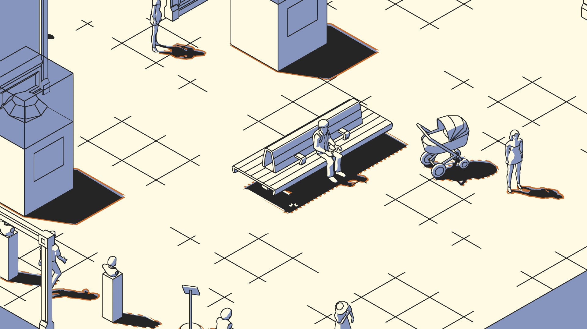

+++
title = "SCHiM passera de l’ombre à la lumière le 18 juillet"
date = 2024-04-18T17:00:32+01:00
draft = false
author = "Félix"
tags = ["Trailer"]
image = "https://nostick.fr/articles/2024/avril/schim-passera-de-lombre-a-la-lumiere-le-18-juillet/SCHiM.jpg"
+++ 

 

Quoi de prévu le 18 juillet ? Profiter des vacances et du soleil, boire des bières en terrasse avec des amis ? Moi ? Oh, trois fois rien : juste fermer les volets et rester devant le PC à attendre la mise en ligne de *SCHiM*, un plateformer 3D incroyablement mignon. Ce jeu indépendant propose d’incarner une sorte de crapaud qui doit constamment rester dans l’ombre : il faut donc traverser les niveaux en sautant d’ombre en ombre, que ce soit celles du mobilier urbain ou bien des passants… qui ont tendance à bouger. 

Le concept est original, et le jeu se démarque grâce à son design de dessin animé et par son parti pris minimaliste au niveau des couleurs. Le gameplay devrait se renouveler, impliquant entre autres de déplacer la caméra pour déceler de nouvelles zones d’ombres ou en faisant bouger les objets pour les transformer en tremplins. Il faudra aussi parfois trouver des moyens de faire apparaître des zones d’ombres en mettant le bazar, par exemple en créant des embouteillages pour remonter une rangée de voitures. On nous promet que chaque niveau propose de petites histoires et son propre décor. Les différents tableaux sont tous inspirés des Pays-Bas.

*SCHiM* sera vendu autour de 25 $ et sortira sur PC, Mac, Linux, Switch et toutes les consoles. La page Steam [est d’ores et déjà en ligne](https://store.steampowered.com/app/1519710/SCHiM/), avec la possibilité d’ajouter le jeu à votre liste de souhait ou de participer à un playtest. Sortie le 18 juillet, donc.