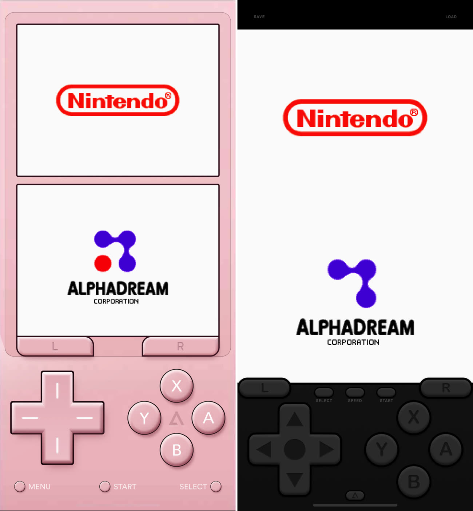
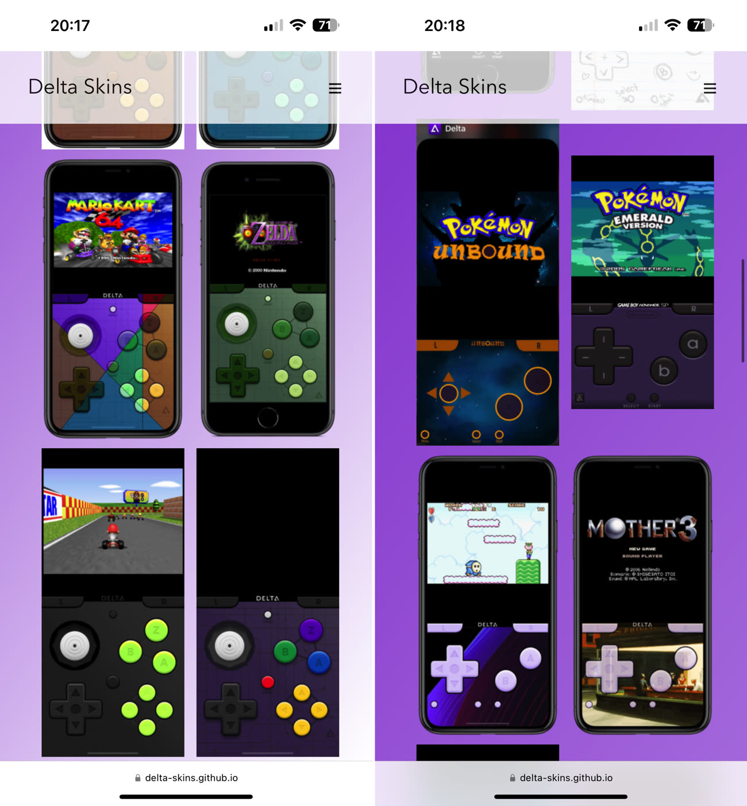
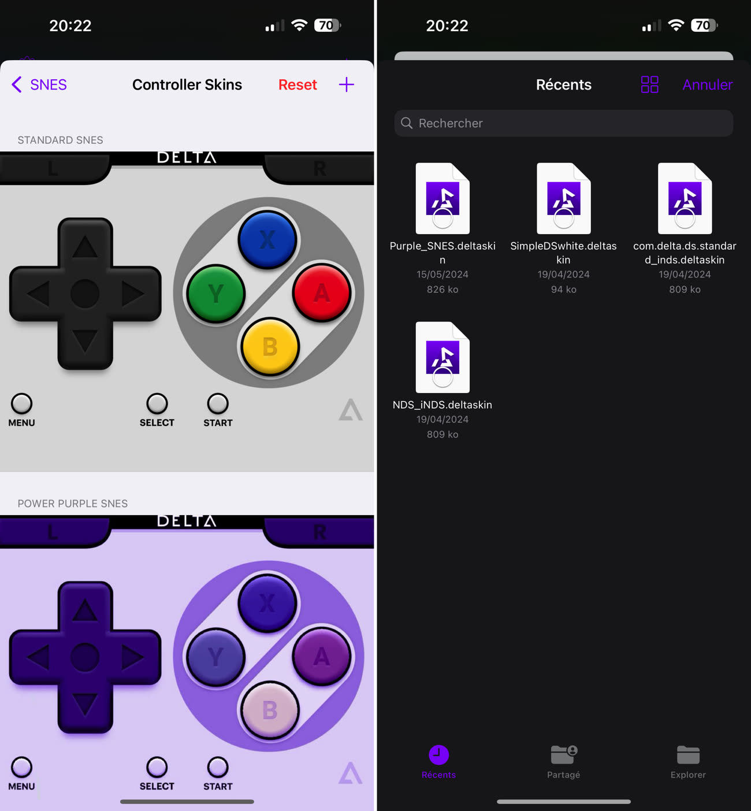

+++
title = "Comment changer l’apparence de l’émulateur Delta sur iOS ?"
date = 2024-07-01T08:00:00+01:00
draft = false
author = "Félix"
tags = ["Tuto"]
image = "https://nostick.fr/articles/2024/juillet/2906-tuto-installer-un-skin-sur-delta/tutovignette.png"
+++

Vous avez suivi [notre chouette guide](https://nostick.fr/articles/2024/avril/1904-comment-installer-et-utiliser-delta/) pour installer Delta sur votre iPhone, tout fonctionne bien mais vous aimeriez bien changer l’apparence des contrôles tactiles ? Pas de soucis : c’est assez simple à faire même s’il faut un peu mettre les mains dans le cambouis. Suivez le guide.

Delta embarque des interfaces de base qui ne sont forcément très jolis selon les consoles. Heureusement, il existe une boutique de *skins* permettant d’en changer l’apparence, qui se trouve [à ce lien](https://delta-skins.github.io/index.html). Les skins sont triés selon les différentes consoles proposées sur l’émulateur ([GBA](https://delta-skins.github.io/gba.html), [NES](https://delta-skins.github.io/nes.html), [N64](https://delta-skins.github.io/n64.html)…). La plupart sont purement cosmétiques et se contentent de changer la couleur de la console et des boutons. D’autres apportent des changements plus importants, par exemple en donnant un joystick à la GameBoy Advance. 

Visitez le site depuis votre iPhone et téléchargez celui qui vous convient (en cliquant dessus avant d’appuyer sur le gros bouton « Download Now »). Votre téléphone va alors récupérer un fichier .deltaskin qu’il ne reste plus qu’à installer sur l'émulateur. Comment ? Ouvrez Delta et cliquez sur le bouton d’options en haut à gauche. Vous devriez trouver une rubrique « Controller skins » avec les différentes consoles émulables. Cliquez sur celle que vous voulez modifier.

Ici, Delta propose de modifier le skin en version portrait ou paysage, ce qui sera pratique pour faire des mélanges. Cliquez sur « Portrait » et sur le « + » en haut à droite, qui va ouvrir l’explorateur de fichier. Ne vous reste plus qu’à trouver le fichier .deltaskin téléchargé plus haut et à cliquer dessus. Bien joué, vous pouvez désormais choisir parmi différentes apparences ! Répétez la manœuvre sur le mode paysage au besoin.

Vous aurez vite fait le tour de la boutique de base. Si vous voulez des skins sympas, n’hésitez pas à jeter un œil sur les subreddits r/[deltaskins](https://www.reddit.com/r/deltaskins/) et r/[Delta_Emulator](https://www.reddit.com/r/Delta_Emulator/) où des passionnés partagent leurs créations. On y trouve des skins optimisés pour certains types d’appareils (iPhone SE, Pro Max…) et d’autres pensés pour faciliter la prise en main de certains jeux. J’aime beaucoup [FS NDS](https://www.reddit.com/r/Delta_Emulator/comments/1cinys6/i_made_a_full_screen_ds_skin_that_is_actually/) pour la DS, qui a l’avantage de s’adapter à la Dynamic Island des iPhone récents. N’hésitez pas à utiliser la barre de recherche, le nombre de skins est grand et vous ne devriez pas peiner à trouver votre bonheur.