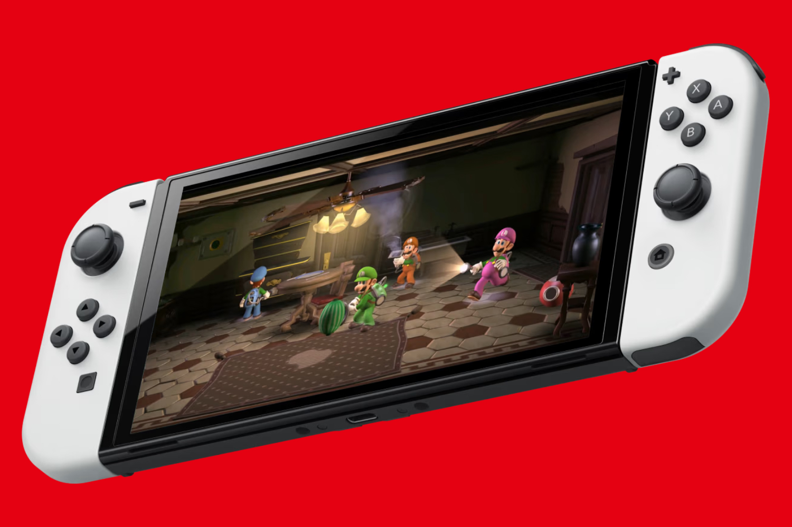

+++
title = "Pour la Switch 2, Nintendo promet de scalper les scalpers"
date = 2024-07-02T10:47:32+01:00
draft = false
author = "Mickael"
tags = ["Actu"]
image = "https://nostick.fr/articles/vignettes/juillet/Nintendo-Switch.jpg"
+++

OK, l'ambiance n'est pas à la rigolade mais essayons tout de même de voir le verre à moitié plein : chaque jour qui passe nous rapproche un peu plus du lancement de la Switch 2 ! Nintendo a promis le dévoilement de sa nouvelle console [avant le 31 mars prochain](https://nostick.fr/articles/2024/mai/0705-nintendo-presentera-sa-nouvelle-console-avant-avril-2025/), ce qui certes nous laisse le temps de mariner dans de l'eau brune. 

Il y a néanmoins une bonne nouvelle à se mettre sous la dent. Le constructeur a en effet assuré qu'il mettait tout en œuvre pour éviter les pratiques détestables des scalpers. Le lancement de la Switch première du nom, en 2017, avait été marqué par difficultés d'approvisionnement, ce qui avait permis à ces fichus scalpers de ramasser le pactole en revendant au prix fort des consoles achetés en masse, au détriment des joueurs honnêtes.

Et ça avait été aussi le cas pour la sortie de la Switch OLED, en 2021, alors que la demande était au plus fort (on était alors en pleine pandémie) et les capacités de production au plus faible. Tout cela n'arrivera pas avec la Switch 2, a [martelé](https://www.nintendo.co.jp/ir/pdf/2024/qa2406.pdf) Shuntaro Furukawa, le président de Nintendo, durant une séance de questions/réponses avec des investisseurs.

« *Pour éviter [la revente sauvage], nous pensons que la chose la plus importante est de produire un nombre suffisant [d'unités] pour répondre à la demande des clients, et cette idée n'a pas changé depuis l'année dernière* », a-t-il déclaré. Autrement dit, Nintendo empilerait les palettes de Switch 2 pour inonder les canaux de distribution.

La situation liée à la pénurie de semi-conducteurs est désormais « *résolue* », et « *nous ne pensons pas que la pénurie de composants aura un impact significatif sur la production du modèle successeur.* » D'autres mesures sont également envisagées, « *dans les limites autorisées par les lois et réglementations, en tenant compte des circonstances de chaque région* ». Le mystère demeure quant à la nature de ces dispositions.

En attendant d'en savoir plus, vous pouvez toujours jeter un œil sur [notre dossier consacré à la Switch 2](https://nostick.fr/articles/2024/mai/0905-switch-2-tout-ce-que-lon-sait/).