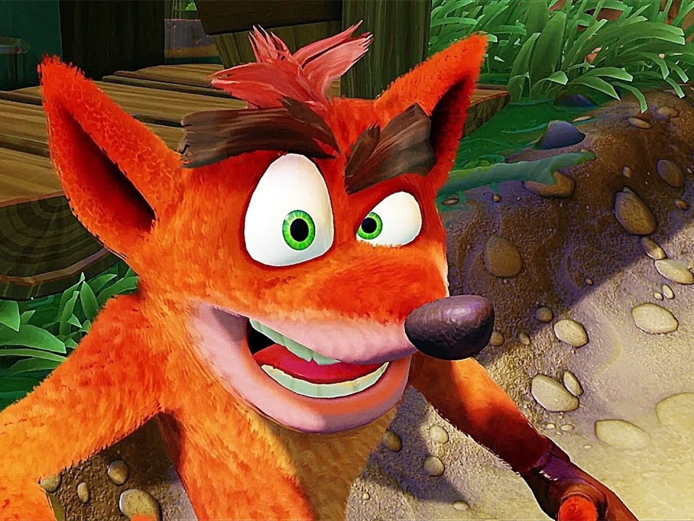

+++
title = "Crash Bandicoot, Spyro et Tony Hawk ne devraient plus tarder sur le Game Pass"
date = 2024-07-03T15:44:32+01:00
draft = false
author = "Mickael"
tags = ["Actu"]
type = "telex"
+++
Depuis le gros chèque de Microsoft définitivement signé l'an dernier pour s'offrir les services d'Activision Blizzard King, les abonnés Game Pass se demandaient, angoissés, quand les jeux du catalogue de l'éditeur allaient leur être livrés tout chauds. Xbox a commencé avec *Diablo 4*, dispo depuis le mois de mars sur le service sur abonnement, et il a été confirmé que le prochain *Call of Duty* sera aussi disponible « day one ». Mais le reste, bon sang, où est le reste ?

Car le catalogue d'Activision est très riche et pas uniquement en nouveautés. Patience ! Plusieurs gros titres rétro sont dans les tuyaux, à commencer par *Crash Bandicoot N. Sane Trilogy* qui devrait débouler en août, selon *[Exputer](https://forums.exputer.com/threads/exclusive-new-details-regarding-activision-games-coming-to-xbox-game-pass-emerge.222/)*. Les remakes de *Tony Hawk 1+2* ainsi que la trilo *Spyro Reignited* arriveront également « *très bientôt* ». C'est un bon début, mais visiblement Microsoft va prendre tout son temps pour enrichir le Game Pass avec les vieilleries d'Activision (un peu comme Nintendo avec le Switch Online…).