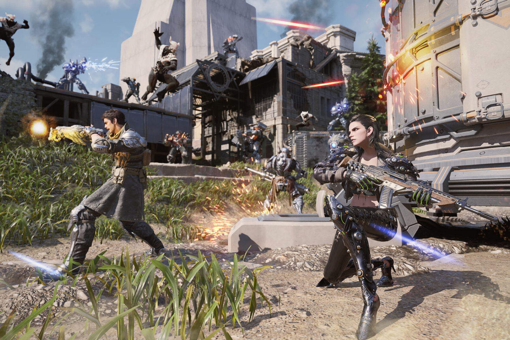
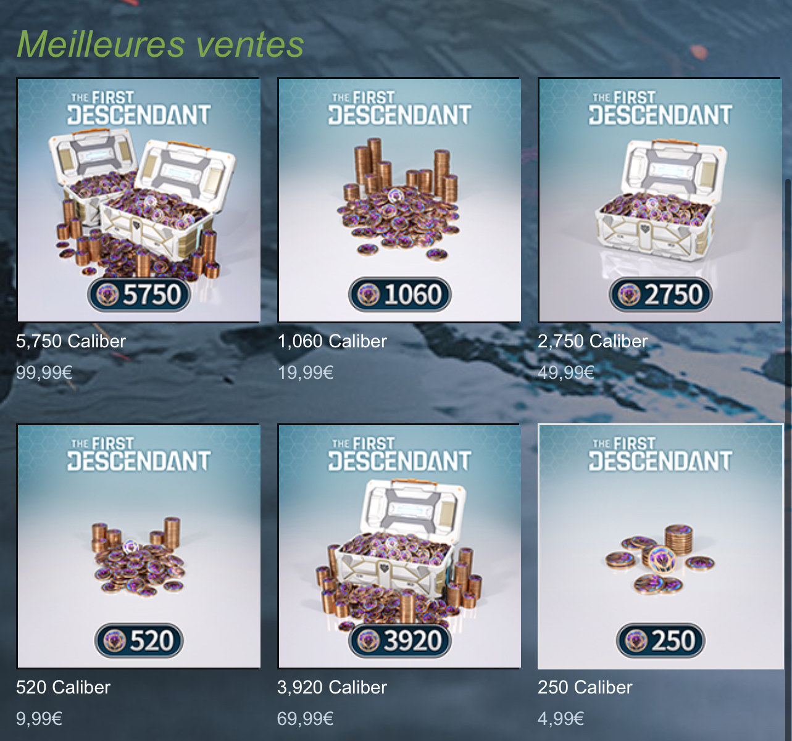

+++
title = "The First Descendant, premier sur les micro-transactions"
date = 2024-07-03T11:47:32+01:00
draft = false
author = "Mickael"
tags = ["Actu"]
image = "https://nostick.fr/articles/2024/juillet/0307-the-first-descendant-premier-micro-transactions/the-First-Descendant-2.jpg"
+++

*The First Descendant*, le gros jeu gratuit du moment, ne s'est pas lancé sans heurts pour de nombreux joueurs. Il y a eu des petits soucis pour ceux qui avaient participé à la bêta et qui n'ont pas retrouvé leurs récompenses, malgré les promesses de l'éditeur Nexon. Les habituels et pénibles problèmes de performance sont aussi au rendez-vous, sans oublier les bugs de serveurs. Bref, du classique pour un jeu multi.

Pour se faire pardonner et éviter de se mettre à dos une communauté à chouchouter, Nexon a [décidé](https://store.steampowered.com/news/app/2074920?emclan=103582791472148873&emgid=4231776500642468953) d'offrir une poignée de bonus qui permettront en substance de gagner plus rapidement des niveaux et repeinturer votre flingue en rouge (c'est un truc dans *The First Descendant*). Ces petits cadeaux tomberont par mail.

Le jeu, qui oppose quatre joueurs contre des méchants aliens dans le plus pur style PvE, est aussi un fier représentant du genre free-to-play, autrement dit : c'est un piège à micro-transactions. Tout est bon pour vous faire claquer des sous, de l'achat de nouveaux héros (des Descendants) aux habituels skins, battle pass, et même un inventaire plus gros.

Et puis il y a ces « coffres » à Caliber, la monnaie du jeu, à acheter avec des sous sonnants et trébuchants. Le montant est tout juste en dessous du coût d'un nouveau personnage, ce qui oblige à acheter plus de Caliber que voulu. Une tactique de margoulin qui est aussi celle de Capcom dans *Street Fighter 6*… Il n'empêche, ça ne fait jamais plaisir !

 

Et s'il est possible de grinder comme un fou pour décrocher un nouveau membre dans votre équipe, ce n'est pas le cas des Caliber, uniquement disponibles en les achetant ou via le battle pass premium. Ce n'est guère étonnant pour Nexon, spécialiste du F2P, mais il y a de quoi repousser des joueurs lassés d'être pressés comme des citrons. Dommage, le jeu n'a pas l'air vilain.