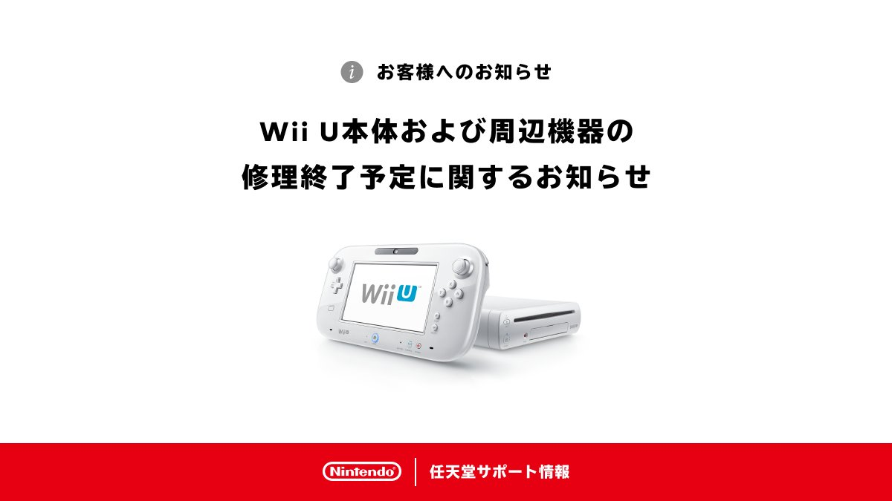

+++
title = "Nintendo plante les derniers clous dans le cercueil de la Wii U"
date = 2024-07-04T13:00:00+01:00
draft = false
author = "Félix"
tags = ["Actu"]
type = "telex"
+++ 

Nintendo continue de jeter des pelletées de terre sur le cercueil de la Wii U. Si la production a été arrêtée en 2017, il était toujours possible de faire réparer sa console directement chez Nintendo. C’est désormais de l’histoire ancienne : dans [un post Twitter](https://x.com/nintendo_cs/status/1808707230377914724), l’entreprise a confié ne plus avoir de pièces en stock et que par conséquent, elle n’acceptait plus « *les demandes de réparations sur la Wii U et ses périphériques* ». La machine a été ajoutée à [sa liste](https://t.co/pmexAcLr4J) de produits obsolètes.

Autrement dit, impossible de faire réparer l’étrange manette-tablette, la console ou les différents accessoires en Europe, aux États-Unis ou au Japon. L’entreprise avait prévenu [l’année dernière](https://support.nintendo.com/jp/information/2023/0523.html) qu’elle était en train d’écouler ses stocks de pièces, invitant les éventuels intéressés par une réparation à se manifester au plus vite. Ne reste maintenant plus qu’à attendre la successeur de la Switch, qui ne devrait plus trop tarder à pointer [le bout de son nez](https://nostick.fr/articles/2024/mai/0905-switch-2-tout-ce-que-lon-sait/).