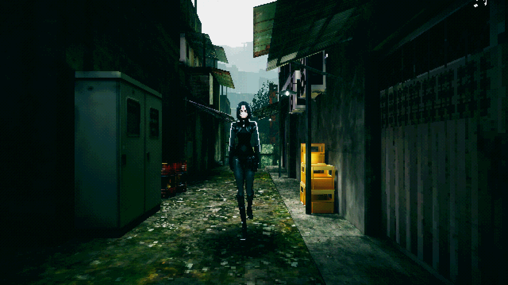
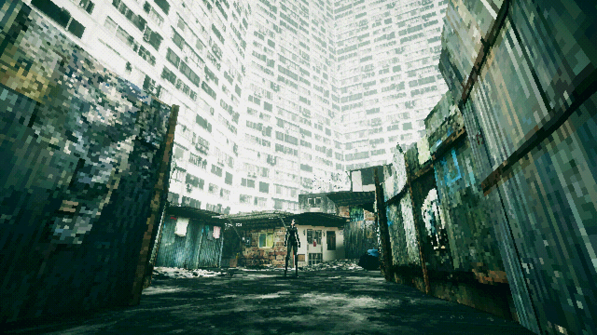

+++
title = "Le créateur de VA-11 Hall-A reviendra bientôt avec un nouveau jeu inspiré de Parasite Eve"
date = 2024-07-04T17:30:00+01:00
draft = false
author = "Félix"
tags = ["Actu"]
image = "https://nostick.fr/articles/vignettes/juillet/Nintendo-Switch.jpg"
+++ 

Vous avez aimé le très chouette simulateur de barman cyberpunk *[VA-11 Hall-A](https://kagi.com/search?q=va-11+hallA)* ? Pas de bol : sa suite est en pause depuis des années et ne semble [pas prête d’arriver](https://www.pcgamer.com/cyberpunk-bartending-game-n1rv-ann-a-is-delayed-indefinitely/). On pourra se consoler avec [les premières images](https://sukeban.moe/index.php/2024/07/03/parabellum/) du futur projet de Sukeban Games, appelé *.45 PARABELLUM BLOODHOUND* (tout en majuscule s’il vous plait) et inspiré du classique de la PS1 *Parasite Eve*.

Le jeu propose d’incarner Reila Mikazuchi, « *une mercenaire à bout de souffle dont les jours de gloire sont depuis longtemps révolus* » qui va essayer de « *prendre la vie par les cornes* » avant de réaliser que « *le véritable ennemi n'est pas en face de son arme* ». Si ce n’est pas très inspiré, Sukeban Games nous a habitués à des personnages hauts en couleur donc on ne se fait pas trop de soucis. L’univers sera visiblement une sorte de cyberpunk post-apo avec de gros polygones d’après les premières captures d’écran.



Et le gameplay dans tout ça ? On nous promet des combats basés sur le système hybride d’[Active Time Battle ](https://en.wikipedia.org/wiki/Active_Time_Battle) que l’on a par exemple vu dans *Final Fantasy VII* et son *Remake*. En pratique, le personnage peut se déplacer librement pendant que sa barre de mana se recharge avant d’effectuer une action. 7 chapitres seront proposés, permettant d’explorer l’univers avec des ennemis placés à la main sans les rencontres aléatoires de *Parasite Eve*.

L’équipe ne s’avance pas sur une date de sortie, mais explique que le jeu est en développement depuis 2 ans et qu’il ne devrait plus trop tarder à arriver. Aucune info à donner sur *N1RV Ann-A* mis à part que le projet est en pause le temps d’accoucher de ce *.45 PARABELLUM BLOODHOUND*. Une première bande-annonce sera diffusée le 19 juillet sur [la chaîne YouTube](https://www.youtube.com/@sukeban498) de Sukeban Games pour les curieux.