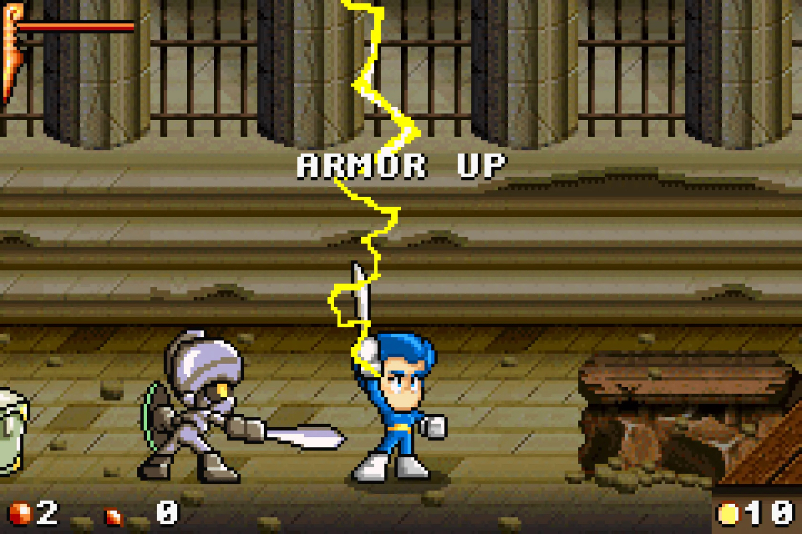
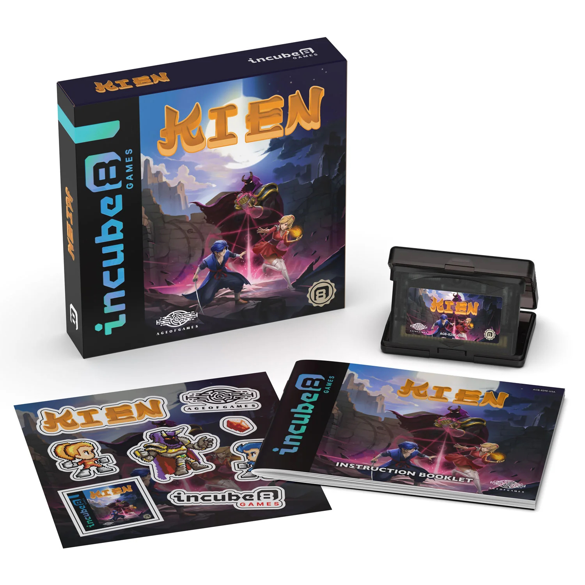

+++
title = "Kien a mis plus de 20 ans pour débouler sur GBA"
date = 2024-07-05T10:47:32+01:00
draft = false
author = "Mickael"
tags = ["Actu"]
image = "https://nostick.fr/articles/vignettes/juillet/kien2.jpg"
+++

*Kien* aurait dû sortir en 2004, sur GBA. Mais ce beat'em up a attendu 20 ans de plus avant d'être finalement disponible sur la petite console que Nintendo ne vend plus depuis belle lurette. L'histoire de ce jeu, qui a connu la plus longue période de *development hell* de l'histoire[^1], a débuté en 2002 en Italie.

Partis fleur au fusil et sans grosse compétence technique, cinq amis fans de jeux vidéo ont bûché pendant deux ans sur ce jeu d'action, avec en bandoulière le titre honorifique de premier studio italien — baptisé AgeOfGames — à développer un jeu pour le Game Boy Advance. Malheureusement, l'éditeur choisi pour sortir *Kien* a fait faux bond : après une analyse de marché, il a estimé que le jeu présentait un trop gros risque financier, comme le [raconte](https://www.theguardian.com/games/article/2024/jul/04/kein-the-most-delayed-video-game-in-history-released-after-22-years) *The Guardian*.

 

Il fallait en effet avancer pas mal d'argent pour produire les cartouches pour la console (chacune coûtant 15 $ à fabriquer). Au vu du marché et des tendances dans l'industrie de ces années-là, les chances de succès étaient faibles, reconnait Fabio Belsanti, le game designer d'AgeOfGames qui a pourtant toujours cru au succès de *Kien*.

Pour survivre, le studio a fait des boulots alimentaires, puis s'est trouvé une niche dans les jeux éducatifs. L'avènement de la mode du rétro-gaming ces dernières années ont toutefois donné à Belsanti l'envie de relancer la machine pour son jeu. « *Je pense que nous traversons une phase similaire à la renaissance des vinyles ou des cassettes pour la musique* », explique-t-il, « *un retour à des formes plus primitives du médium, motivé par la nostalgie des générations qui ont vécu ces époques et la curiosité de celles qui sont venues après cette technologie* ».

*Kien* s'est trouvé un nouvel éditeur, Incube8, spécialisé dans la production de jeux pour les consoles classiques. Le titre a finalement trouvé le chemin des cartouches pour GBA, au prix rondelet de [60 €](https://incube8games.com/fr-eu/products/kien-gba). Mais pour ce prix, on repart avec un superbe packaging, un livret en papier comme au Moyen-Âge et des stickers, parce que ça fait toujours plaisir.

Quant au jeu en lui-même, c'est un sacré morceau, mix d'action, de plateformes et de RPG : dans la peau d'un guerrier ou d'une prêtresse, il faudra tailler sa route dans 23 niveaux balaises. Fabio Belsanti le compare à un *Dark Souls* primitif, alors vous êtes prévenu… Espérons maintenant que *Kien* soit aussi proposé (moins cher, peut-être ?) en version numérique !

[^1]: 22 ans au total, soit 7 de plus que *Duke Nukem*.