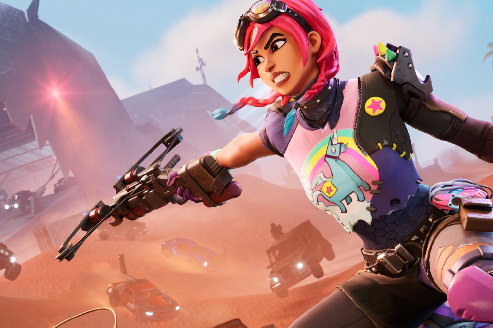
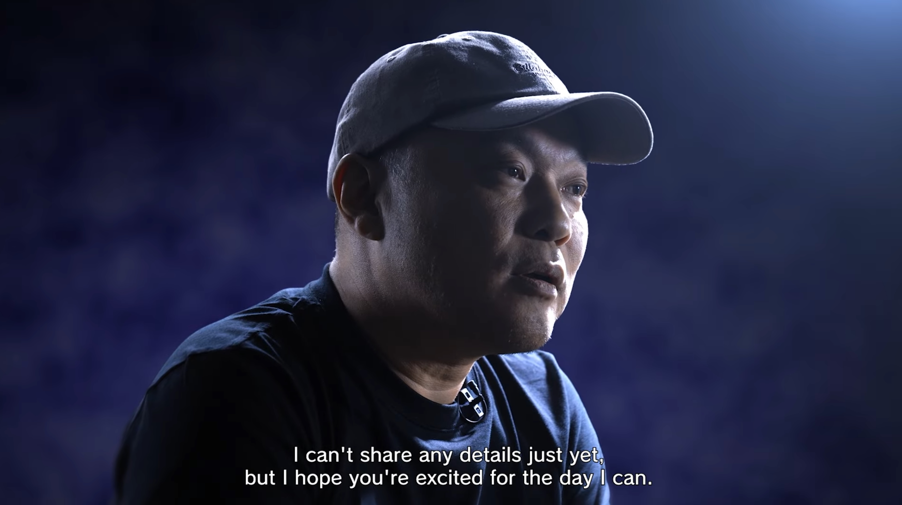
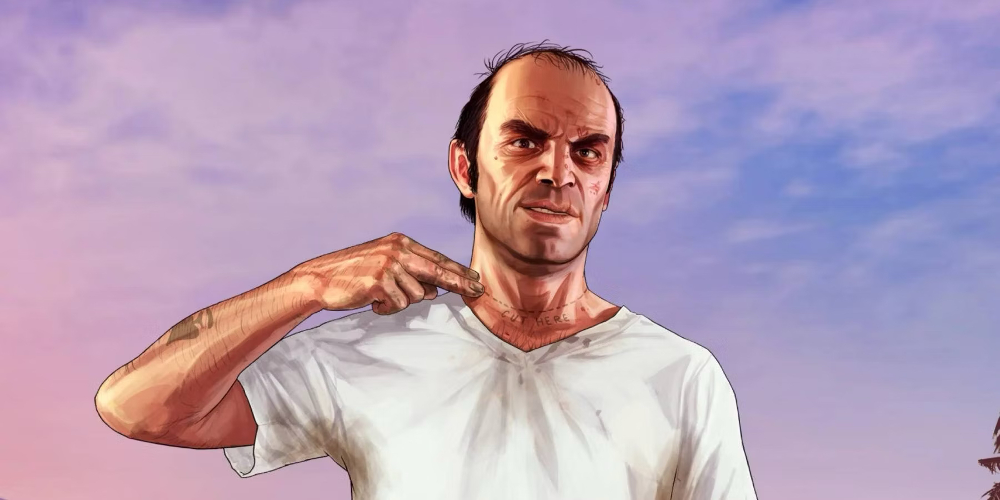

+++
title = "On vide le backlog de la semaine : Resident Evil, FANTASIAN, The Witcher 3, GTA 5, Apple vs Fortnite"
date = 2024-07-06T10:47:32+01:00
draft = false
author = "Mickael"
tags = ["XXL"]
image = "https://nostick.fr/articles/vignettes/juillet/fortnite.jpg"
+++

 

L’actualité du jeu vidéo ne s’arrête pas à la poignée d’articles publiés sur *Nostick* ! Histoire de rattraper le retard accumulé, voici un retour rapide sur quelques unes des infos les plus importantes (ou insignifiantes) de la semaine.

## Allons bon, un nouveau Resident Evil

Alors ça, vraiment, quelle surprise, non mais qui aurait pu le prévoir ? Figurez vous que Capcom prépare un nouvel épisode de — attention, tenez vous bien — *Resident Evil* 🤯. Oui, on a de la peine à y croire (non), mais c'est bien la vérité : après *RE Village*, un *Resident Evil 9* est sur les rails, et c'est Koshi Nakanishi qui va en superviser le développement. Ce qui est plutôt une bonne nouvelle, puisque c'est lui qui a aussi dirigé *RE7 Biohazard*, autrement dit le volet qui a relancé la franchise vers de nouveaux sommets.

 

Lors de la conférence Capcom cette semaine, Koshi Nakanishi a expliqué qu'il avait été difficile d'imaginer quoi faire après *RE7*, mais qu'il avait fini par trouver — un nouvel épisode de *Resident Evil*, donc. « *Et pour être honnête, cela semble substantiel* ». Évidemment, « *je ne peux partager aucun détail* ». Voilà, c'était vraiment histoire de confirmer l'évidence, quoi.

Selon la rumeur provenant du fuiteur [Dusk Golem](https://x.com/AestheticGamer1/status/1786276564080144817) habituellement bien renseigné, *RE9* pourrait être disponible dès le début de l'année prochaine, avec une annonce dans le courant de cet automne. Capcom n'aurait pas mégoté sur le temps de développement, en fait ça aurait débuté en 2018. Et il semble que la grande idée soit… un monde ouvert. À voir ce que ça donne, pour une licence qui s'épanouit surtout dans les endroits fermés et les environnements claustrophobes…

En attendant ce nouveau volet, Capcom devrait miser sur les portages et les remakes histoire de faire vivre la saga horrifique, comme, tenez, *RE7 Biohazard* fraîchement [arrivé](https://www.igen.fr/app-store/2024/07/resident-evil-7-est-desormais-disponible-sympa-sur-mac-du-mieux-sur-iphone-15-pro-144533) sur Mac et iOS, ou encore *RE Zero* et *Code Veronica* qui seraient les prochains sur la liste des remakes.

## Le papa de Final Fantasy ne veut pas revenir sur le passé

Le retour d'Hironobu Sakaguchi dans le giron de Square Enix a donné bien des idées aux fans hardcore de *Final Fantasy*. Et pour cause : le créateur de la saga, qui a quitté le studio en 2003 après *Final Fantasy X-2*, va de nouveau être édité par Squeenix avec *FANTASIAN Neo Dimension*. Le jeu de rôle sortira sur toutes les consoles et sur PC cet hiver.

 

Mais qu'on se calme tout de suite, ho. Ce retour du fils prodigue ne signifie pas de nouvelles versions ou des remakes de ses anciens jeux (*Final Fantasy* donc, ou d'autres titres auxquels il a contribué). Hironobu Sakaguchi a [expliqué](https://www.bloomberg.com/news/newsletters/2024-07-03/-final-fantasy-creator-hironobu-sakaguchi-reunites-with-square-enix?srnd=technology-vp) à *Bloomberg* qu'il est passé de « créateur » à « consommateur » : « *Si je reprends la marque Final Fantasy, je ne sais pas si je pourrai réellement profiter autant de Final Fantasy XIV* ».

En substance, il préfère jouer aux jeux de la licence plutôt que d'avoir un rond de serviette dans la cuisine de leur création. Sakaguchi n'a donc pas l'intention de revisiter ses classiques — et c'est le cas aussi pour *Blue Dragon* et *Lost Odyssey* —, à l'exception d'un titre : *Terra Battle*, sorti sur iOS et Android en 2014 sous la bannière de son studio Mystwalker, et qui n'est plus disponible nulle part. 

 

Ce jeu de stratégie pourrait-il faire un comeback sur les plateformes modernes ? Il n'aurait rien contre. *FANTASIAN* est également un jeu mobile, à l'origine distribué par Apple Arcade.

## Trevor privé de DLC dans GTA 5

C'est entendu, *GTA 6* sera un sacré morceau quand il déboulera à l'automne 2025. Mais plus que le jeu solo, c'est surtout la partie en ligne que Rockstar va couver comme le lait sur le feu. Car si l'histoire se répète, la vraie vache à lait de cette nouvelle génération sera *GTA Online*, comme ça a été le cas pour *GTA 5*.

 

Le jeu multi est d'ailleurs tellement populaire que le studio n'a pas hésité à sacrifier un DLC consacré à Trevor qui, pour l'occasion, devait travailler sous couverture pour les fédéraux ! Joseph Rubino, directeur artistique pendant 6 ans chez Rockstar, était justement chargé de cette extension ; arrivé à la moitié du développement, l'entreprise a décidé d'arrêter les frais, comme il l'explique chez *[SanInPlay](https://www.youtube.com/watch?v=Uikfph7oQoE)*.

Malheureusement, le carton de *GTA Online* (lancé un mois après *GTA 5*, en octobre 2013) a poussé Rockstar à annuler le DLC, purement et simplement. « *Ce qui s'est passé, c'est que lorsque GTA Online est sorti, c'était une telle vache à lait et les gens l'adoraient tellement qu'il était difficile de faire valoir qu'un DLC autonome aurait plus de succès* », a expliqué Rubino.

Cette annulation, qui a été confirmée par Steven Ogg, l'acteur derrière Trevor, n'a toutefois pas complètement remisé au placard les efforts mis dans le DLC. Certains bouts se sont retrouvés dans *GTA Online*… Rockstar a annulé au moins trois extensions pour *GTA 5* : cet « Agent Trevor » donc, mais aussi « Zombie Apocalypse » et « Alien Invasion », qui promettaient du lourd. Dommage.

## Apple bloque toujours Fortnite en Europe

Apple et Epic, c'est toujours pas ça. L'éditeur de *Fornite* avait bon espoir de (re)lancer son battle royale sur les iPhone de l'Union européenne grâce au règlement sur les marchés numériques (DMA) qui permet aux boutiques alternatives de coexister avec l'App Store. *Fortnite* s'est fait virer en 2020, après la tentative d'Epic de vendre des V-Bucks avec autre chose que le système de paiement d'Apple.

En début de semaine, [Epic soumettait la nouvelle version de Fortnite et de son Games Store](https://nostick.fr/articles/2024/juillet/0107-fortnite-epic-games-store-europe/) à Apple pour obtenir leur notarisation, un processus purement technique pour s'assurer que les apps ne posent pas de souci de sécurité. Malheureusement, Apple se fait tirer l'oreille ; par deux fois, l'entreprise a refusé de donner le feu vert pour des broutilles : des boutons au design trop proche de ceux d'Apple.

Epic [explique](https://x.com/EpicNewsroom/status/1809179985682325649) utiliser les conventions de design et de nommage qui ont cours dans toutes les boutiques d'applications. Le rejet par Apple est qualifié d'arbitraire et « *en violation du DMA* », déplore le studio qui en a parlé à la Commission européenne. Un coup de pression qui pourrait permettre de débloquer la situation, sachant qu'Apple ne respecte que le rapport de force… Epic espère toujours pouvoir lancer *Fortnite* dans quelques mois en Europe.

## Une fin inédite pour The Witcher 3

En mai dernier, CD Projekt Red [livrait](https://x.com/witchergame/status/1787802994773233878) à la foule ravie son outil de modding pour *The Witcher 3: Wild Hunt*, dans l'espoir que la communauté continue de développer du contenu pour occuper Geralt, pour les siècles des siècles. Ça a tout à fait l'air d'être le cas, mais peut-être pas comme le studio l'aurait voulu ! Le modder Glassfish a exploité la boîte à outils pour produire des scènes coupées dont le code était toujours présent dans le jeu. Il s'agit d'une fin alternative, ou plutôt d'une « prolongation » de la fin de l'histoire du jeu.

 

Après le combat de Geralt contre Eredin, le héros se réveille sous la tente d'un hôpital de campagne. Il revoit Yennefer où il peut s'enquérir du sort de Ciri ou savoir qui a remporté la guerre, en fonction de l'affection qu'il porte à la sorcière. On assistera également à l'enterrement de Crach, à la trahison de la Loge par Yennefer pour sauver Ciri… 

Le youtubeur xLetalis, qui a réalisé une vidéo des événements restaurés par Glassfish, pense que CD Projekt Red a décidé de ne pas inclure cette fin — avec la trahison de Yennefer donc — pour des raisons créatives. Difficile d'en avoir le cœur net, le studio n'en ayant rien dit. Toujours est-il que les fans ont un peu plus de grain à moudre et qu'ils ne sont peut-être pas au bout de leur peine en matière de surprises.

## Dans le reste de l'actu déchaînée

- On reste sur l'iPhone avec l'émulateur Delta qui est bien sympathique, mais que diriez-vous d'en changer l'apparence ? [Voici un petit tuto facile.](https://nostick.fr/articles/2024/juillet/0107-tuto-installer-un-skin-sur-delta/)
- À l'occasion des soldes Steam, vous venez de craquer pour une flopée de nouveaux jeux auxquels vous ne jouerez pas. Savez-vous le montant que vous jetez par les fenêtres ? [Découvrez-le ici !](https://nostick.fr/articles/2024/juillet/0107-jeux-steam-backlog-milliards/)
- Beaucoup d'actus Capcom cette semaine, après le petit showcase du 1er juillet ! On a ainsi eu droit à [une date de sortie pour le remake de *Dead Rising*](https://nostick.fr/articles/2024/juillet/0107-deluxe-remaster-dead-rising-rentree/) ainsi qu'à [une démo pour *Kunitsu-Gami: Path of the Goddess*](https://nostick.fr/articles/2024/juillet/0107-kunitsu-gami-path-of-the-goddess-demo-capcom/).
- Pas question de revivre la galère des lancements de la Switch puis de la Switch OLED, qui ont été marqués par des scalpers sans foi ni loi ayant profité de la pénurie. [Nintendo a trouvé une solution.](https://nostick.fr/articles/2024/juillet/0207-nintendo-switch-2-scalpers/)
- Sega a plusieurs remakes dans ses cartons, notamment celui de *Crazy Taxi* qui se déroulera dans un monde ouvert avec plein d'autres joueurs sur les routes. [Pas sûr qu'on soit emballé.](https://nostick.fr/articles/2024/juillet/0207-crazy-taxi-multijoueur-sega/)
- Hé non, ne cherchez pas, Insomniac Games n'a aucune intention de porter son hit Xbox *Sunset Overdrive* sur PlayStation… même si le studio est la propriété de Sony ! [Explications par ici.](https://nostick.fr/articles/2024/juillet/0207-sunset-overdrive-naarrivera-pas-de-sitot-sur-playstation/)
- Vous n'êtes pas très doué du clavier ou au contraire, vous avez été diplômé de l'université du stick ? Aucun problème, que vous soyez l'un ou l'autre, et n'importe quel niveau entre les deux, *Dragon Age: The Veilguard* aura des options de difficulté adaptées. [Découvrez-les ici.](https://nostick.fr/articles/2024/juillet/0307-dragon-age-the-veilguard-joueur-niveau-difficulte/)
- Plusieurs vieilleries d'Activision devraient débouler cet été sur le Game Pass, et pas des moindres. Les nostalgiques les retrouveront [dans cette brêve](https://nostick.fr/articles/2024/juillet/0307-crash-bandicoot-spyro-tony-hawk-game-pass/) !
- L'IA générative envahit tout, y compris l'industrie du jeu vidéo… ou presque. Nintendo joue la carte de la prudence, et [on comprend pourquoi](https://nostick.fr/articles/2024/juillet/0407-nintendo-ia-generative-developpement-jeux/).
- Restons encore un moment du côté de Nintendo, avec cette annonce qui décevra les deux derniers utilisateurs de la Wii U : il n'y a plus de pièces détachées pour les réparations ! [C'est à lire par ici.](https://nostick.fr/articles/2024/juillet/0406-derniers-clous-cercueil-wii-u/)
- Univers cyberpunk et gros polygones pour le prochain jeu de Sukeban Games, à qui l'on doit VA-11 Hall-A. [Jetez-y un œil par là.](https://nostick.fr/articles/2024/juillet/0407-createur-de-va11-halla-reviendra-bientot-parasite-eve/)
- *Kien* est le jeu qui a subi le plus long *development hell* de l'histoire : il a mis 22 ans avant de débouler sur GBA ! [Découvrez son histoire ici.](https://nostick.fr/articles/2024/juillet/0507-kien-gba/)
- 8 Go de RAM, et ça repart ! Un moddeur de Switch est parvenu à jouer à de gros jeux PC sur une console lourdement modifié. [Un avant-goût de la Switch 2 ?](https://nostick.fr/articles/2024/juillet/0507-switch-pro-jeux-pc/)