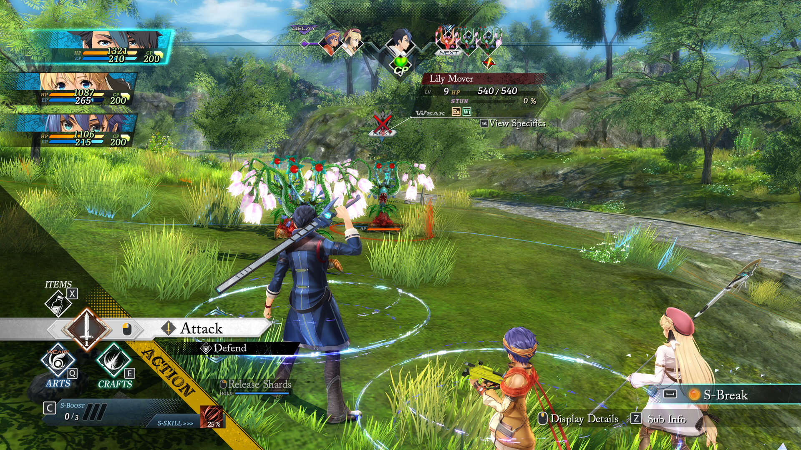

+++
title = "Zenless Zone Zero, The First Descendant : le récap des sorties de la semaine (07/07)"
date = 2024-07-07T08:30:01+01:00
draft = false
author = "Félix"
tags = ["C’est dispo"]
image = "https://nostick.fr/articles/2024/juillet/0707-les-sorties-de-la-semaine/jeu.jpg"
+++

Entre le boulot, les courses et le capharnaüm politique ambiant, vous n’avez peut-être pas eu le temps de vous intéresser aux nouveautés du moment. Qu’à cela ne tienne : voici les sorties de ces derniers jours qui ont retenu notre attention.

## Zen, soyons Zen(less)

L’été bat son plein, ce qui signifie que les sorties intéressantes vont se faire de plus en plus rares sur les prochaines semaines. Signe de cette sécheresse à venir, une des rares nouveautés de la semaine a été ***Zenless Zone Zero***, le dernier gacha des Chinois d’HoYoverse qui se sont fait remarquer avec le sympathique *Genshin Impact*. Exit l’univers fantastique à la *Zelda* vu que ce jeu nous plonge dans un monde dystopique très urbain et coloré, sorte de *Jet Set Radio* aux relents d’*Hi-Fi Rush*. On va donc explorer une grande ville aux murs tagués pour se bastonner à droite, tailler une bavette à gauche, admirant au passage de petites cinématiques format planche de BD. Le jeu alterne des passages d’action-RPG assez classiques avec une partie sociale à la *Persona*. Les tests que j’ai lus sont tous positifs et louent un univers sympa et des personnages attachants. Sans doute pas le GOTY, mais le scénario principal pourra vous occuper gratuitement une dizaine d’heures, *HoYoverse* ayant l’habitude d’y aller mollo sur les microtransactions mis à part si vous tenez absolument à collectionner toutes les waifus. Dispo sur iOS, Android, [PC](https://store.epicgames.com/fr-fr/p/zenless-zone-zero-c7c151) et PS5.

## Le premier qui descend

***The First Descendant*** est sorti cette semaine : il s’agit d’un *looter-shooter* carburant à l’Unreal Engine 5 développé par le studio coréen Nexon, que certains connaissent peut être pour le MMORPG *Mapple Story*. Comme d’hab dans ce genre de jeu il va falloir dézinguer un paquet d’ennemis en solo ou en coop, sauver l’humanité, mais surtout améliorer son équipement avant de repartir à l’assaut. Le gameplay à l’air correct, l'aventure se déroulant dans un univers joli malgré une direction artistique SF très plan-plan. Les tests vont du « c’est OK » à « franchement bof » et les problèmes de lancement ont été nombreux ([chutes de FPS](https://www.ign.com/articles/the-first-descendant-dev-offers-solution-for-frame-rate-drops-delete-and-reinstall-the-game), [serveurs KO](https://www.forbes.com/sites/paultassi/2024/07/03/the-first-descendant-servers-remain-offline-during-a-rough-day-two/), [microtransactions onéreuses](https://nostick.fr/articles/2024/juillet/0307-the-first-descendant-premier-micro-transactions/)…). Bref, un looter-shooter de plus qui n’a pas l’air de particulièrement briller : les fans du genre pourront sans doute attendre patiemment une semaine ou deux le temps de voir comment tout ça se décante. Gratos sur [Steam](https://store.steampowered.com/app/2074920/The_First_Descendant/), également dispo sur PS5 et Xbox.



## Quoi de prévu les 50 prochaines heures ?

On pourrait parler de l’extension *Dawntrail* pour le MMOPG *Final Fantasy XIV*, mais votre temps comme le mien est précieux alors on va plutôt s’intéresser à ***Trails Through Daybreak***, un RPG japonais pur jus de la très longue saga des *[The Legend of Heroes](https://en.wikipedia.org/wiki/The_Legend_of_Heroes)* qui coure depuis plus de 20 ans (et que je ne connaissais pas avant aujourd’hui, comme quoi on en apprend tous les jours). Bonne nouvelle pour les curieux, il s’agit d’un nouvel arc sans trop de liens avec les opus précédents : cela devrait vous permettre de prendre le train en route sans vous taper des heures de lecture sur un obscur wiki de fans. Cet opus sorti il y a déjà 3 ans au Japon nous invite à explorer la république de Calvard et à parcourir son univers Fantasy en compagnie d’un tout nouveau casting. Les graphismes en cell-shading sont très sympas tandis que les combats mélangent tour par tour et temps réel pour une aventure qui dure une cinquantaine d’heures. Les retours sont tous très bons, donc vous ne devriez pas regretter les 60 € demandés [sur Steam](https://store.steampowered.com/app/2138610/The_Legend_of_Heroes_Trails_through_Daybreak/).  C’est malheureusement uniquement en anglais, également disponible sur PlayStation et Switch.

## Les fonds de tiroirs

Comme je vous le disais, on s’est un peu tourné les pouces cette semaine. Il y a bien eu ce jeu d’horreur dans lequel on incarne un micro-ondes appelé ***[Midnight Snack](https://jaime-hernandez.itch.io/midnight-snack)*** qui mérite un (petit) coup d’œil pour son interface originale : on se déplace en tournant les gros boutons du minuteur. Il y a aussi eu [une mise à jour](https://www.gamesradar.com/games/pokemon/this-popular-fan-made-pokemon-emerald-roguelike-is-getting-a-soft-sequel-today-with-gen-9-mons-multiplayer-and-more/) pour **[un roguelike Pokémon](https://github.com/Pokabbie/pokeemerald-rogue/releases)** dont la développeuse n’a visiblement pas été effrayée par les avocats de Nintendo. Le très bon jeu de société **Machi Koro** a eu droit à une adaptation JV sur [Steam](https://store.steampowered.com/app/1969860/MACHI_KORO_avec_tout_le_monde/#app_reviews_hash) et Switch qui pourra faire plaisir aux connaisseurs comme aux novices avec ses graphismes tout mignons. Enfin, Netflix a lancé sur [Android](https://play.google.com/store/apps/details?id=com.netflix.NGP.Minesweeper&hl=en_US&pli=1) et [iOS](https://apps.apple.com/fr/app/d%C3%A9mineur-netflix/id6451006817) sa version 2024 du **Démineur** qui propose, comble de la modernité, des missions quotidiennes. Peut-être l’électrochoc dont l’industrie du JV avait tant besoin.

