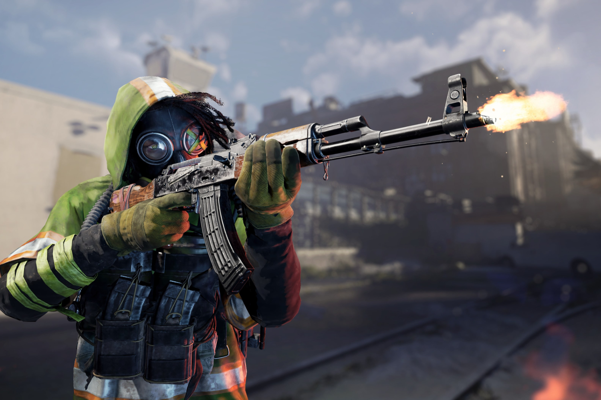

+++
title = "XDefiant : si vous n'aimez pas les bugs, « passez à autre chose »"
date = 2024-07-08T08:40:32+01:00
draft = false
author = "Mickael"
tags = ["Actu"]
image = "https://nostick.fr/articles/vignettes/juillet/xdefiant.jpg"
+++

*XDefiant*, tu l'aimes ou tu te casses. C'est en substance le message d'un des producteurs du jeu, Mark Rubin, qui a tenté un peu maladroitement d'expliquer pourquoi le shooter d'Ubisoft était perclus de bugs. À un joueur qui lui demandait si le titre avait été rushé à cause des grosse sorties à venir, Rubin a [assuré](https://x.com/PixelsofMark/status/1809020713954914444) que non non, mais que le souci avec lequel son équipe doit composer est celui du moteur du jeu.

*XDefiant* repose en effet sur le moteur d'un MMO, pas celui d'un FPS, contrairement à *Call of Duty* ou *Apex Legends*. « *Toute l'infrastructure d'un FPS a donc dû être construite à partir de zéro (…) Nous travaillons au développement d'une toute nouvelle technologie dans un moteur qui a été conçu pour autre chose* », décrit-il. Ça ne veut pas dire que le moteur soit mauvais, bien au contraire, « *mais il nécessite beaucoup de travail, ce qui engendre beaucoup de bugs que les autres moteurs ont déjà corrigés* ».

 

Très bien, voilà pour la tambouille interne et à la limite, les joueurs n'ont pas vraiment à connaitre ce genre de détails : après tout, c'est le boulot d'Ubisoft de s'assurer que le moteur utilisé correspond au type de jeu. Mais Mark Rubin a tout de même tenu à marteler son point : « *Nous ne sommes pas un jeu de tir qui existe depuis 20 ans. Si vous aimez ce que nous essayons de faire, restez avec nous et vous verrez des améliorations et de nouvelles fonctionnalités* ». Et pour ceux qui n'apprécient pas le jeu, « *ce n'est pas grave, vous pouvez passer à autre chose* ».

Voilà qui a le mérite de la clarté et de la franchise, même si c'est dit sur un ton passif/agressif… *XDefiant* est le succès surprise d'Ubisoft : le 21 mai, jour de son lancement, le free-to-play a atteint le million de joueurs uniques… en deux heures et demi ! 48 heures plus tard, il dépassait les 3 millions de joueurs. En juin, il avait cumulé 11 millions de joueurs et ce, malgré des tests pas spécialement emballés.