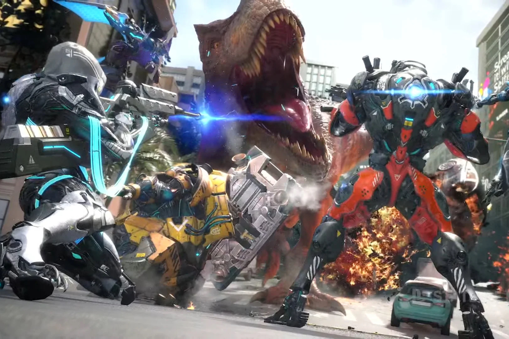
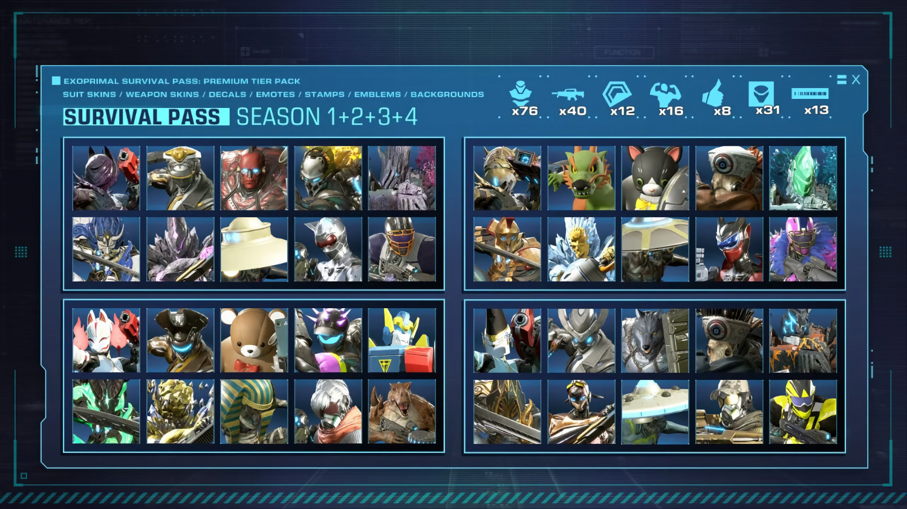

+++
title = "Capcom plante un clou dans le cercueil d'Exoprimal"
date = 2024-07-08T10:47:32+01:00
draft = false
author = "Mickael"
tags = ["Actu"]
image = "https://nostick.fr/articles/vignettes/juillet/exoprimal.jpg"
+++

*Exoprimal* est le vilain petit canard de Capcom, qui a pourtant trouvé la formule magique pour enchaîner les cartons intergalactiques. Sorti il y a un an, le jeu multi PvPvE (faut suivre) avait pourtant tout pour plaire : des armures et des dinos, franchement, je ne sais pas ce qu'il vous faut de plus. Mais manifestement, il manquait à *Exoprimal* un petit supplément d'âme pour qu'il se fasse une place au chaud sur le marché très encombré des jeux de shoot multi.

Capcom a en effet [annoncé](https://info.exoprimal.com/en/pages/other_20240705_001/) la fin du développement de contenus saisonniers, la saison 4 — qui sera livrée le 11 juillet — sera la dernière du genre… et la conclusion du jeu. Même s'il n'y aura plus de saisons supplémentaires, le studio promet d'une part que tous les services en ligne et tous les modes resteront disponibles, et d'autre part que les quatre saisons vont tourner en rotation mensuelle. Par ailleurs, les missions limitées et les événements collaboratifs reviendront chaque semaine.

Bizarrement, le battle pass premium demeure saisonnier : la version premium du Survival Pass de la saison 2 acheté en juillet ne pourra être utilisée qu'en avril, août et décembre, par exemple. Capcom a publié un tableau (!) pour s'y retrouver dans ce bazar. L'éditeur va aussi faire un rabais sur le pass quatre saisons.

Reste à voir maintenant combien de temps Capcom va maintenir les serveurs d'*Exoprimal* en place. Le jeu est régulièrement en promo sur Steam (-67 % pour les soldes en ce moment), mais il est bien difficile de le recommander après cette annonce. Les joueurs ne s'y sont pas trompés : le titre [compte](https://steamdb.info/app/1286320/charts/) moins de 50 joueurs simultané chez Valve, et son plus haut point remonte à il y a 8 mois avec 5 000 joueurs. Le jeu est aussi disponible sur le Game Pass, mais manifestement ça ne l'a pas aidé à attirer les amateurs de chasse aux dinos.