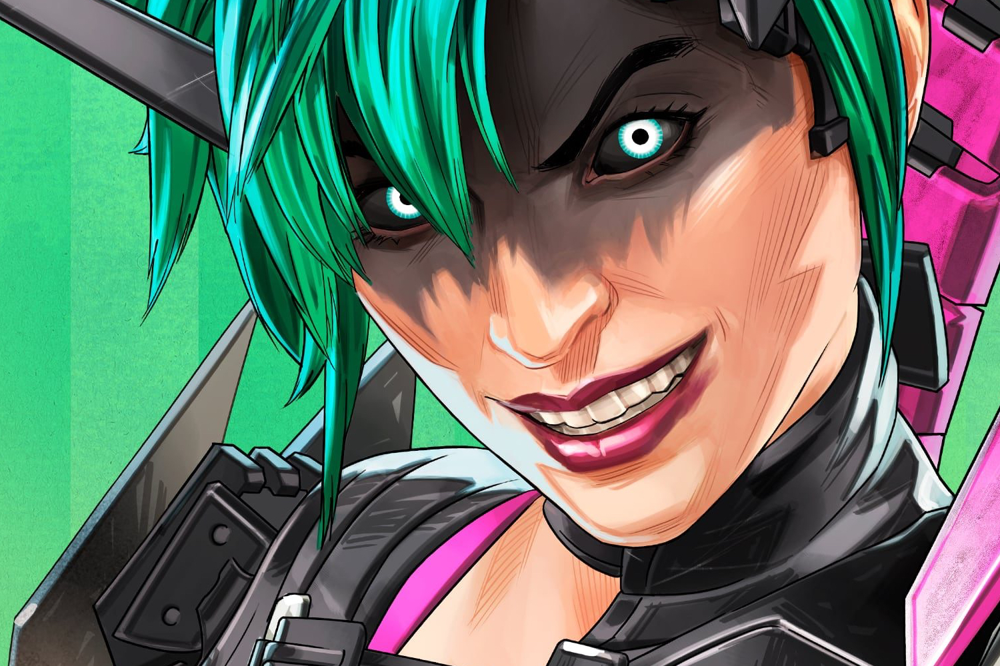
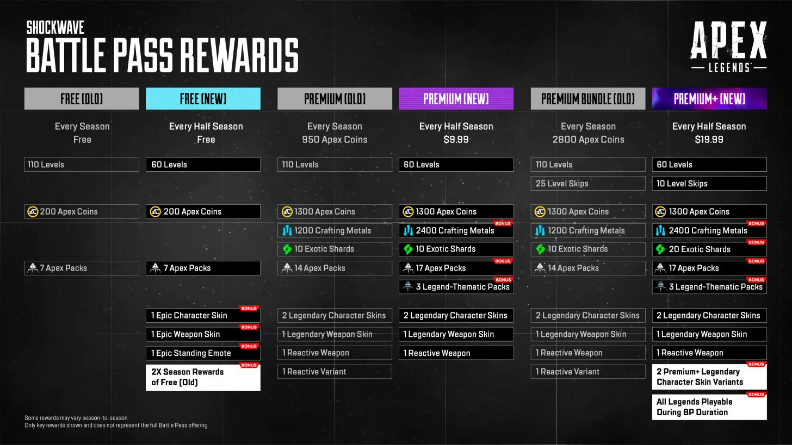

+++
title = "Le nouveau battle pass d'Apex Legends veut le beurre, l'argent du beurre et les fesses du joueur"
date = 2024-07-09T11:05:32+01:00
draft = false
author = "Mickael"
tags = ["Actu"]
image = "https://nostick.fr/articles/vignettes/juillet/apex-legends.jpg"
+++

Respawn a eu la curieuse idée de [changer](https://www.ea.com/games/apex-legends/news/battle-pass-update?isLocalized=true) la structure du battle pass d'*Apex Legends*, et bien évidemment les joueurs ont l'impression assez légitime de se faire tondre un peu plus de laine sur le dos. On passe d'une saison de 110 paliers à un principe de demi-saison contenant 60 paliers. 

Seul hic : ce « demi » battle pass coûte 9,99 $ (des vrais dollars), alors que l'ancien battle pass complet pouvait être acheté 950 Apex Coins, soit à peu près le même prix. Autrement dit, une saison au complet revient à une vingtaine de dollars sonnants et trébuchants, deux fois plus cher qu'avant pour moitié moins de paliers.

Le studio promet que les équipements les plus prestigieux, dont les skins légendaires, pourront être décrochés dans les demi-saisons. En revanche, il faudra les obtenir dans un temps plus court : six semaines au lieu de trois mois ! Pas sûr que les joueurs y gagnent finalement. Quant aux Apex Coins qui restent gagnables en jeu, leur valeur a soudainement chuté… puisqu'ils ne permettent plus d'acheter des battle pass !

« *Chacun de ces changements nous permet de rendre le battle pass plus accessible et plus avantageux pour votre temps et votre argent* », soutient Respawn. On peut comprendre que les joueurs soient lassés de récupérer des items sans intérêt, mais retirer la possibilité d'acheter un battle pass avec des Apex Coins est un peu fort de café.

Cette décision « *n'a pas été prise à la légère* », assure le studio, et elle permet de réduire le prix du battle pass Premium+ à 19,99 $, soit 29 % moins cher que la formule précédente à 2 800 Apex Coins. Voilà qui réchauffera certainement le cœur des joueurs. Histoire de faire passer la pilule, le battle pass gratuit est un peu mieux doté avec des skins supplémentaires.

Cet enrobage sucré de Respawn risque de se transformer en bonbon amer pour le studio. Les joueurs s'organisent sur [Reddit](https://www.reddit.com/r/apexlegends/comments/1dyeic6/how_to_effectively_protest_bp_changes/) pour protester contre ce nouveau système de battle pass, on aura probablement l'occasion d'y revenir.