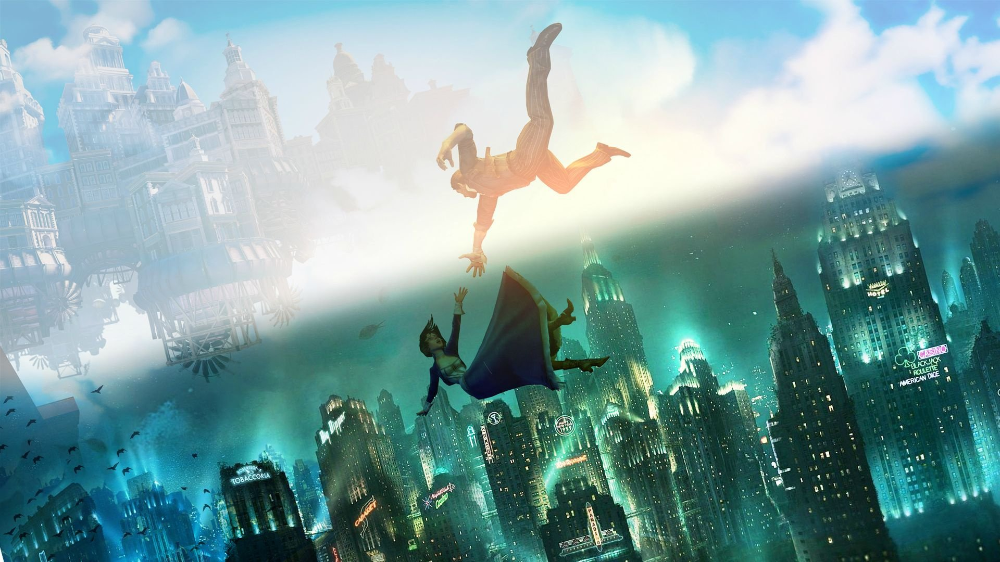

+++
title = "Le studio en charge de Bioshock 4 recrute à tour de bras"
date = 2024-07-09T19:00:00+01:00
draft = false
author = "Félix"
tags = ["Actu"]
image = "https://nostick.fr/articles/vignettes/juillet/original.jpg"
+++

 

Ce n’est pas parce que Ken Levine a plié les gaules pour aller faire son *[Judas](https://nostick.fr/articles/2024/mars/3003_semaine3003/#judas-a-un-petit-quelque-chose-de-bioshock)* dans son coin que la licence *Bioshock* est morte et enterrée. Les équipes du studio Cloud Chamber (propriété de 2K) recrutent [à tour de bras](https://cloudchamberstudios.com/fr-CA/) : des scénaristes, des concepteurs de niveaux, des artistes, des designers… 29 postes sont à pourvoir, ce qui laisse à penser que le projet va passer la seconde et entrer dans une grosse phase de développement. 

Le studio Cloud Chamber est composé de vétérans de la licence ayant travaillé sur les niveaux et le design général de *Bioshock* et *Bioshock Infinite*, ce qui est plutôt encourageant même si on ne sait pas grand-chose du projet pour le moment. [Des rumeurs](https://www.videogameschronicle.com/news/bioshock-4s-setting-and-time-period-have-reportedly-leaked/) datant de fin 2021 évoquaient bien un *Bioshock 4* se déroulant dans une ville en Antarctique pendant les années 60, mais rien ne s’est jamais matérialisé. Les bruits de couloirs voyaient venir un jeu qui ferait le lien avec les précédents opus de la série. Si le pitch est sympa, rien n’est sûr et il n’est pas impossible que les plans aient fortement changé depuis. 

De son côté, le projet *Judas* du nouveau studio de Levine a l’air d’avancer bon train : une première bande annonce [a été dévoilée](https://www.youtube.com/watch?v=T5_r-un--bA) en début d’année. Le joueur se retrouvera bloqué dans un vaisseau spatial géant transportant l’humanité sur une autre planète. L’histoire devrait être un peu moins sur rail et s’adapter dynamiquement aux actions du joueur. Bon cela dit on n’a pas de fenêtre de sortie non plus, mais on croise les doigts. 