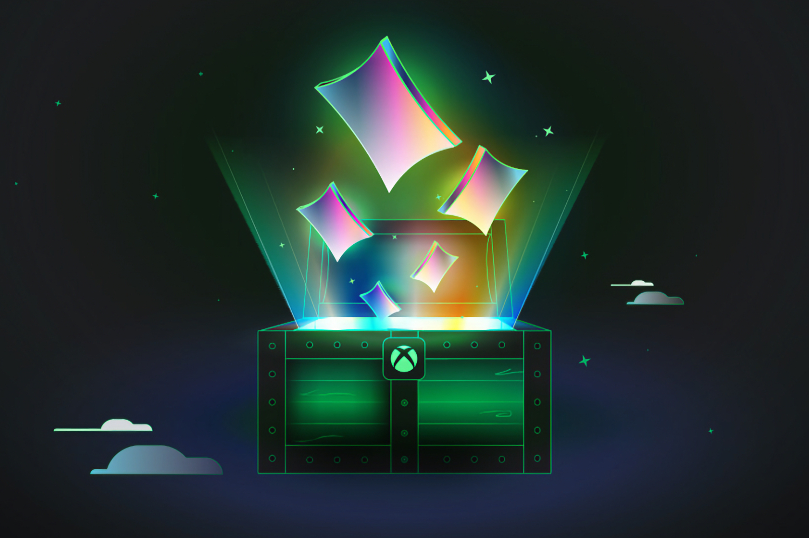
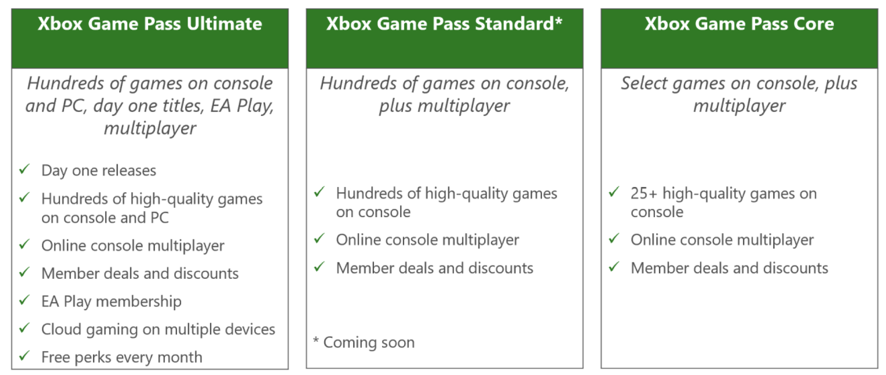

+++
title = "Plus cher, plus compliqué, moins avantageux : la bordélisation du Game Pass"
date = 2024-07-09T22:47:32+01:00
draft = false
author = "Mickael"
tags = ["Actu"]
type = "une"
image = "https://nostick.fr/articles/2024/juillet/0907-game-pass-xbox-bordel-hausse-prix/xbox-game-pass.jpg"
+++

**Hausse des prix généralisée, suppression d'une offre et ajout d'une autre moins avantageuse : c'est le tableau de la future offre Game Pass que Microsoft a concoctée pour rentrer dans ses frais, après l'acquisition maousse costaud d'Activision Blizzard. On essaie d'y voir un peu plus clair dans ce bazar.**

C'était dans l'air : l'achat d'Activision Blizzard allait nécessairement pousser Xbox à revoir les conditions de son Game Pass, dont l'un des atouts majeurs est l'ajout des nouveautés dès le premier jour de leur sortie. Comment conserver une telle offre déjà très avantageuse en y ajoutant en plus les gros titres de l'éditeur ? C'est pourquoi Microsoft a décidé de bousculer sa grille tarifaire, avec pas beaucoup de bonnes nouvelles.

L'offre Game Pass se compose actuellement de quatre abonnements : 

- *Game Pass Core* pour les consoles (6,99 € par mois) ; une formule qui remplace depuis quelques mois l'ancien Xbox Live Gold, dont il a repris le jeu multi. Il offre aussi l'accès à une sélection de 25 jeux.
- *Game Pass PC* à 9,99 € par mois, avec l'accès au catalogue complet du service et aux jeux EA Play ;
- *Game Pass Console* à 10,99 € par mois avec l'accès au catalogue complet du service ;
- *Game Pass Ultimate* à 14,99 €, avec l'accès au catalogue complet du service et aux jeux EA Play, et qui ajoute le service Xbox Cloud Gaming.

À partir d'aujourd'hui, les prix des formules vont augmenter pour les nouveaux abonnés : 

- *Game Pass Core* coûte 69,99 € par an, soit 10 € de plus. Le prix mensuel ne change pas ;
- *Game Pass PC* est à 11,99 € par mois (+2 €) ;
- *Game Pass Ultimate* revient à 17,99 € (+ 3 €).

Ces prix s'appliquent aux nouveaux abonnés dès aujourd'hui, mercredi 10 juillet. À partir du 12 septembre, les tarifs augmenteront pour les membres existants.

Quant au *Game Pass Console*, c'est plus compliqué. Cette offre ne prend plus de nouveaux abonnés, elle sera remplacée « *dans les mois à venir* » (Microsoft n'est pas très précis) par un nouvel abonnement Xbox Game Pass Standard, facturé 14,99 $ par mois (probablement 14,99 €). Si cette formule offre toujours l'accès aux centaines de jeux du Game Pass, le gros changement fondamental est qu'elle n'inclut plus les jeux publiés « day one ».

Autrement dit, les futurs abonnés au *Xbox Game Pass Standard* n'auront pas droit à *Black Ops 6*, *Indiana Jones*, *Fable* et [aux autres jeux annoncés récemment par Xbox](https://nostick.fr/articles/2024/juin/0906-doom-gears-of-war-perfect-dark-xbox-artillerie-lourde/) en même temps que les autres membres Game Pass PC et Ultimate qui en profitent dès le premier jour. Les joueurs sur consoles Xbox devront souscrire à Ultimate, ou attendre gentiment que les jeux atterrissent dans Standard.

En outre, malgré la sévère hausse de prix par rapport au Game Pass Console (+4 € tout de même), les abonnés n'auront pas droit aux jeux EA Play, ni au cloud gaming. Dur à avaler. Mais au bout du compte, tout le monde passe à la casserole avec une augmentation généralisée des tarifs.

Microsoft a mis en ligne une [FAQ](https://www.theverge.com/2024/7/9/24195312/microsoft-xbox-game-pass-ultimate-price-increase-standard-subscription) qui donne de plus amples détails, notamment pour les membres actuels du *Game Pass Console*, qui fort heureusement conservent leur abonnement.

 
