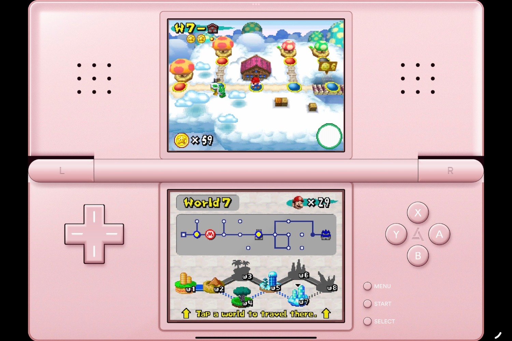
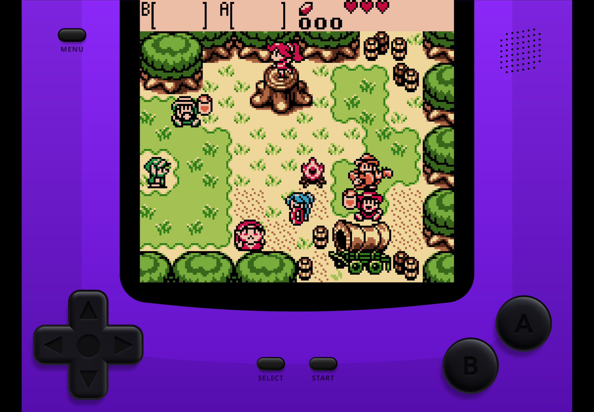
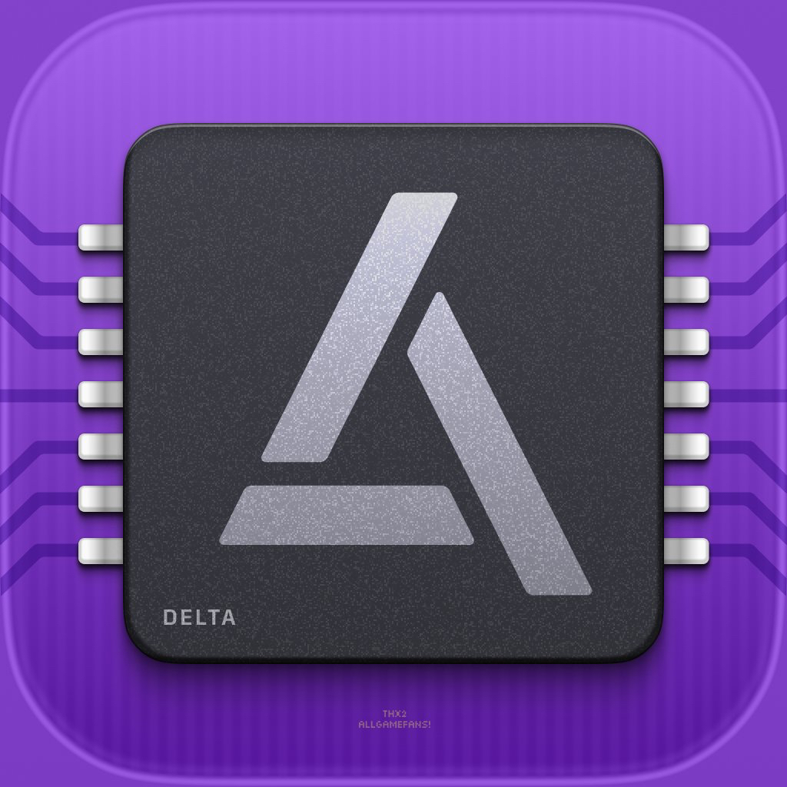

+++
title = "L'émulateur Delta est maintenant compatible avec l'iPad !"
date = 2024-07-10T20:47:32+01:00
draft = false
author = "Mickael"
tags = ["Actu"]
image = "https://nostick.fr/articles/vignettes/nostick.jpg"
+++

 

Delta, l'excellent émulateur de consoles Nintendo, fait le grand saut vers l'iPad ! La version 1.6 de l'application, disponible dans l'AltStore PAL, [apporte](https://fosstodon.org/@altstore/112764037770811929) en effet le support très attendu des tablettes. La mise à jour de Delta sera proposée aussi dans l'App Store en dehors de l'Union européenne, le temps qu'Apple donne son feu vert.

Les jeux Nintendo (ceux que vous possédez bien sûr 👀) seront plus à l'aise sur le grand écran de l'iPad, même si on risque de voir davantage les pixels. Pour l'occasion, toutes les interfaces des consoles ont été redessinées (pour changer l'apparence de l'app, [jetez un œil à notre tuto](https://nostick.fr/articles/2024/juillet/0107-tuto-installer-un-skin-sur-delta/) !).

 

Le développeur Riley Testut ne s'est pas arrêté là. La version pour iPad prend en charge Handoff, on peut facilement basculer une partie de l'iPhone à l'iPad. Delta est aussi compatible avec Split View et cette horreur de Stage Manager. On peut même afficher plusieurs jeux dans autant de fenêtres de l'émulateur.

La difficulté ici, c'est qu'AltStore PAL doit être installé sur la dernière bêta d'iPadOS 18 destinée aux développeurs. La version finale est pour cet automne, mais d'ici peu Apple devrait livrer la première bêta publique qui sera plus stable (même si la bêta 3 pose assez peu de problème). Au passage, AltStore PAL devient donc la première boutique alternative compatible avec l'iPad ! iPadOS fait en effet partie des plateformes qui doivent respecter le règlement sur les marchés numériques (DMA).



Les utilisateurs d'iPhone — ils sont plus de 10 millions ! — ne sont pas oubliés. Delta 1.6 met à jour le core melonDS, qui améliore la compatibilité avec les jeux DS, et ne nécessite plus de s'embarrasser avec des fichiers BIOS. Plusieurs nouveaux raccourcis font leur apparition pour réaliser une sauvegarde rapide (menu + double tap), charger une sauvegarde (menu + appui long), et pour accélérer (menu + balayage horizontal).

 

Enfin, Delta a revu son logo, après des bisbilles avec Adobe qui menaçait d'une plainte… Les notes de version sont à consulter [ici](https://faq.deltaemulator.com/release-notes) (il y a bien d'autres choses !). Et pour installer AltStore PAL et Delta, [direction notre tutotal](https://nostick.fr/articles/2024/avril/1904-comment-installer-et-utiliser-delta/).