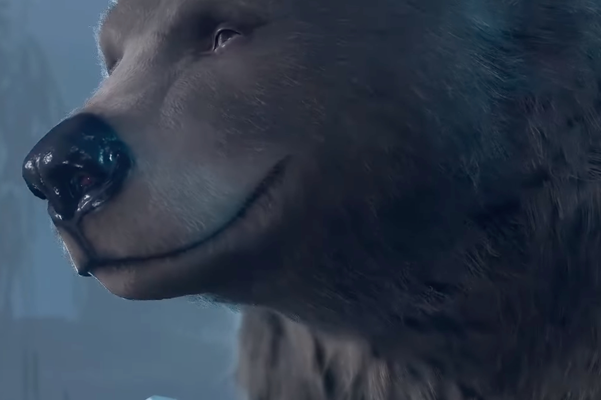

+++
title = "Comment la scène de sexe avec l'ours a façonné la légende de Baldur's Gate 3"
date = 2024-07-12T10:47:32+01:00
draft = false
author = "Mickael"
tags = ["Actu"]
image = "https://nostick.fr/articles/vignettes/juillet/ours-baldurs-gate-3.jpg"
+++

*Baldur's Gate 3* n'aurait probablement pas connu un tel succès — du moins pour son lancement post-bêta — s'il n'y avait pas eu cette histoire de sexe avec un ours. Le jeu de Larian donne en effet l'opportunité unique et sympathique de faire des gros mamours avec un ursidé. Il s'agit en fait d'Halsin, le chef des druides du Bosquet d'Émeraude qui a la capacité de se transformer en toutes sortes de créatures, dont… un ours.

La séquence torride avait été dévoilée par Larian durant un livestream un peu avant le lancement du jeu, et elle a été massivement partagée sur les réseaux sociaux, achevant de forger la légende de *Baldur's Gate 3* ! Il faut dire qu'on ne voit pas souvent ça (attention, c'est NSFW mais rigolo quand même) :



Cette partie de touche-pipi poilue, que peuvent vivre tous les joueurs s'ils le souhaitent (et on sait ce que veulent tous ces coquinous), a eu impact monstre. « *Cette scène est un moment décisif dans l'histoire du jeu* », a [commenté](https://www.gamesradar.com/games/rpg/baldurs-gate-3-writer-labels-halsins-iconic-bear-romance-scene-a-watershed-moment-in-game-history-reveals-the-druid-daddy-wasnt-originally-a-romance-option/) Baudelaire Welch, concepteur narratif principal de BG3 durant une conférence Develop: Brighton. Un « *moment décisif* » pas tellement pour l'histoire du jeu en lui-même, quoique, mais pour la communauté adepte des fanfictions qui gravite autour de *Baldur's Gate* et de *Donjons & Dragons* en général. 

L'objectif du studio était de faire en sorte que cette communauté se sente « *non pas comme une sous-culture, mais comme le public majoritaire auquel on s'adresse dans une scène et dans le jeu en général* » a poursuivi Welch. Beaucoup de joueurs ayant participé à l'accès anticipé de *BG3* imaginaient en plaisantant tout ce qui pourrait arriver avec Halsin. À cette époque, le druide n'avait même pas été envisagé comme option romantique !

Devant l'intérêt des joueurs pour cette possibilité, Larian s'est heureusement penché sur la question. Le studio a offert à ces joueurs « *une scène incroyablement loufoque qui reprend littéralement l'identité et le surnom de la [communauté bear](https://fr.wikipedia.org/wiki/Communauté_bear)* ». 

Il fallait offrir aux joueurs « *quelque chose issu de la tradition du crackfic* », ces histoires délibérément absurdes ou extravagantes qui font partie de l'univers fanfiction, « *ou simplement quelque chose [qui pourrait être issu] de vos délires sur Discord* », ajoute Baudelaire Welch. « *Cela donne l'impression que tout le temps que vous avez passé à plaisanter avec vos amis est validé, reconnu, et combien de jeux vous ont déjà fait ressentir cela auparavant ?* ».

Cette histoire d'ours, clin d'œil assumé à une communauté bien ciblée, n'est qu'un des innombrables éléments constitutifs de l'incroyable richesse de *Baldur's Gate 3* !