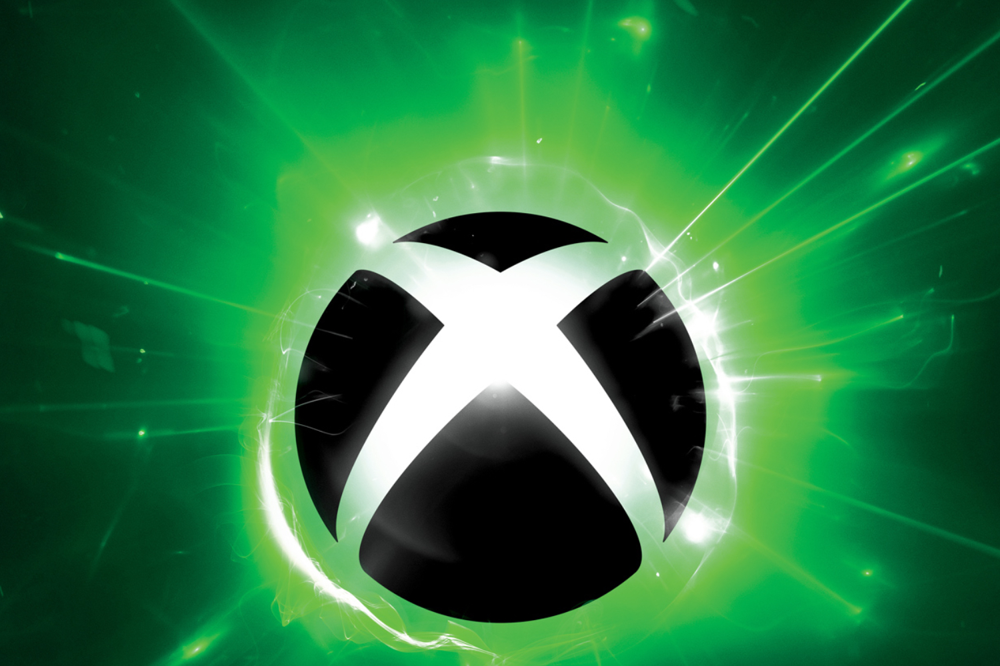

+++
title = "Microsoft ne mettrait plus un rond pour faire la pub de la Xbox en Europe"
date = 2024-07-12T09:50:32+01:00
draft = false
author = "Mickael"
tags = ["Actu"]
image = "https://nostick.fr/articles/vignettes/juillet/xbox-dead.jpg"
+++

La Xbox, on va arrêter de se mentir, [ne se vend pas des masses](https://nostick.fr/articles/2024/mai/1505-bonjour-tristesse-chez-xbox/). Microsoft est complètement largué par Nintendo et par Sony, et ce n'est pas [la future Series X sans lecteur optique](https://nostick.fr/articles/2024/juin/0906-microsoft-revoit-sa-gamme-xbox/) qui va y changer grand chose, alors qu'en face se préparent une Switch 2 et une PS5 Pro. Pourquoi s'entêter ?

C'est pourquoi Xbox aurait tout simplement décidé de couper le budget marketing pour ses consoles en Europe, en Afrique et au Moyen-Orient (EMEA), selon Tom Warren de *[The Verge](https://www.theverge.com/2024/7/11/24196361/microsoft-xbox-no-console-required-notepad)*. Une stratégie actée en mai et enclenchée à l'occasion du nouvel exercice fiscal annuel (il débute le 1er juillet chez Microsoft). Alors attention, l'info n'a pas été confirmée par l'entreprise, mais on peut s'attendre à ne plus voir fleurir de 4 x 3 à la périphérie de nos villes ni de publicités télé à la gloire des Series S et X par chez nous.

Comment ? Qu'est-ce que vous dites ? « *On n'a jamais vu de pub pour les consoles Xbox en Europe ?* » Il faut bien reconnaitre que vous avez raison : pour une raison qui nous échappe, Microsoft n'a jamais cru bon de faire beaucoup d'effort pour promouvoir son matos ici bas. Du coup, le groupe ne risque pas d'économiser grand chose !

Le constructeur devrait aussi allouer moins de stocks de consoles pour l'Europe. En revanche, Microsoft mettrait un peu plus d'argent pour la promo du Game Pass ([avec la hausse des prix, c'est nécessaire](https://nostick.fr/articles/2024/juillet/0907-game-pass-xbox-bordel-hausse-prix/)), du cloud gaming, du jeu PC et des manettes Xbox, toujours sur ces marchés. Les mauvaises langues diront que ça sera une vraie nouveauté : on peut se rappeler et déplorer l'absence quasi-totale de communication autour de *Hellblade II*, la première (et unique) exclusivité « first party » de l'année pour le moment.

Microsoft acte là l'échec de sa plateforme matérielle qui, à l'heure du Game Pass et du jeu en streaming, sonne de plus en plus sans objet. En se repliant sur son marché domestique, c'est comme si le géant de Redmond avait programmé la disparition à terme de la Xbox en tant que console. 

 

Mais ça ne veut pas du tout dire que la marque en elle-même va s'évaporer et que Microsoft lâche le marché du jeu vidéo. Pas après l'acquisition à grands frais d'Activision Blizzard ! Le lancement cette semaine [de l'app Xbox pour les sticks Fire TV d'Amazon](https://nostick.fr/articles/2024/juin/2906-backlog-semaine-epic-mickey-emulation-ps3-palworld/#le-fire-tv-est-une-xbox-comme-une-autre) prouve que les jeux Xbox n'ont plus besoin d'une Xbox. Ce qui est d'ailleurs le message de la publicité d'Amazon ci-dessus…