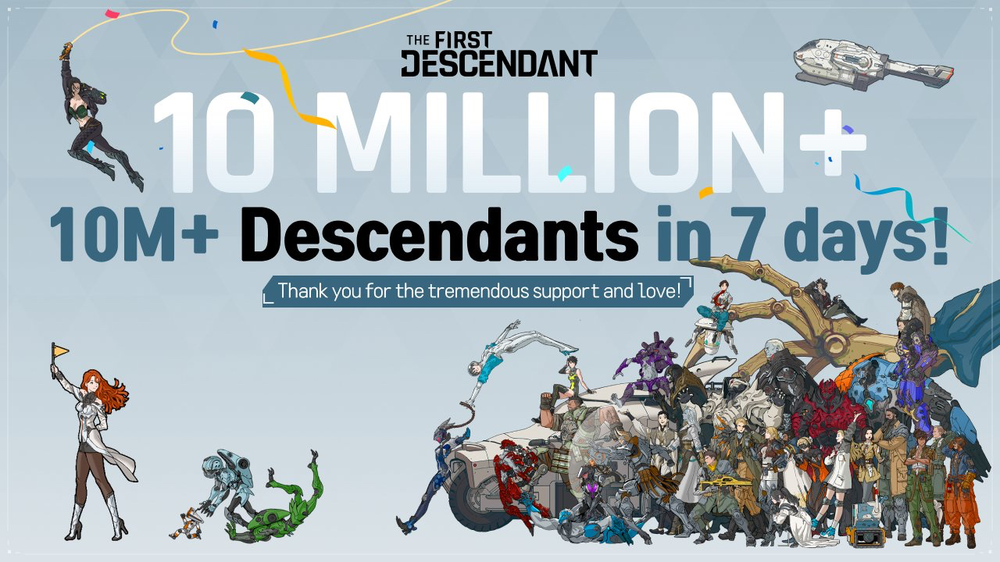

+++
title = "On vide le backlog de la semaine : The First Descendant, Disney Pixel RPG, Hellblade II, Double Dragon, Pool Party"
date = 2024-07-13T07:00:32+01:00
draft = false
author = "Mickael"
tags = ["XXL"]
image = "https://nostick.fr/articles/2024/juillet/1307-backlog-semaine/Disney-Pixel-RPG.jpg"
+++

L’actualité du jeu vidéo ne s’arrête pas à la poignée d’articles publiés sur *Nostick* ! Histoire de rattraper le retard accumulé, voici un retour rapide sur quelques unes des infos les plus importantes (ou insignifiantes) de la semaine.

## 10 millions de joueurs et pas mal de polémiques pour The First Descendant

Les shooters sont un genre qui se plie décidément très bien aux mécanismes du jeu service, enfin, quand ils sont bien fichus (oui c'est toi que je regarde et que je juge, *Suicide Squad*). Prenez *The First Descendant* : bim, durant sa première semaine, le jeu de Nexon a [claqué](https://x.com/FirstDescendant/status/1811716560031215773) les 10 millions de joueurs, ce qui en fait un des cartons de l'année.

Sur Steam, le titre a enregistré un record de 264 800 joueurs en simultané, et *The First Descendant* est aussi dispo sur Xbox et PS5. C'est très bien, mais maintenant le plus difficile commence. Car il va falloir maintenir cette base de joueurs en leur proposant du contenu neuf régulièrement, et continuer à séduire de nouveaux utilisateurs.

Quoi qu'il en soit, c'est une sacré perf' pour un jeu qui [souffre de micro-transactions très agressives](https://nostick.fr/articles/2024/juillet/0307-the-first-descendant-premier-micro-transactions/) et qui n'est pas exempt de bugs. Dernière polémique en date : Nexon ne s'est pas gêné pour « s'inspirer » très fortement de *Destiny 2* pour plusieurs icônes. 



L'éditeur a [admis](https://www.ign.com/articles/the-first-descendant-dev-nexon-promises-to-change-controversial-icons-after-destiny-plagiarism-accusations) que le jeu de Bungie,  « *admiré et respecté* » par l'équipe, a effectivement servi d'inspiration. En ce qui concerne les icônes, des « *ajustements* » vont être apportés, ce qui est le minimum. 

## Flop confirmé pour Hellblade II

*Hellblade II: Senua's Saga*, première exclusivité Xbox de l'année, n'a pas vraiment rencontré le succès et c'est peu de le dire. Le coup de sonde de Circana concernant la vente de jeux vidéo aux États-Unis [donne](https://x.com/MatPiscatella/status/1810414294665986168) le titre de Ninja Theory à la 37e place en mai. Et à la 21e place pour les ventes sur les Xbox Series S/X.

 

Pas vraiment reluisant pour un studio Xbox, mais pas vraiment étonnant non plus. Le classement ne prend pas en compte le Game Pass, où le jeu était disponible dès son jour de lancement. Et puis il faut bien dire aussi que Microsoft n'a fait absolument aucun effort de promotion et de marketing : il fallait suivre l'actualité de près pour savoir que *Hellblade II* était sorti et de quoi il retournait.

Cette deuxième aventure de Senua, très cinématique ([peut-être un peu trop](https://nostick.fr/articles/2024/mai/2705-test-de-senua-saga-hellblade-2/)), est vendue 50 €, un « petit » prix par rapport à d'autres blockbusters. Mais il est vrai aussi qu'on en fait le tour en moins de 10 heures, et je suis généreux.

Souhaitons plus de succès pour les prochains projets de Ninja Theory qui, a priori, est déjà bien occupé et [toujours soutenu par Microsoft](https://nostick.fr/articles/2024/mai/2105-la-sortie-de-hellblade-2-ne-condamne-pas-ninja-theory/).

## Disney Pixel RPG veut vous faire les poches

Disney se lance avec gourmandise dans le monde merveilleux et décomplexé du gacha avec *[Disney Pixel RPG](https://d-rpg.com/fr/)*, un jeu mobile qui sera dispo sur iOS et Android le 9 septembre. Gratuit, bien évidemment, ce jeu de rôle a pour finalité de vous faire cracher du pognac pour obtenir des petits personnages Disney en pixel art. Les drames de la collectionnite aiguë !

L'histoire est un rien méta : une sorte de malware envahit les différents « mondes de jeu » où vivent des héros Disney. Ces univers se retrouvent connectés, quel bazar mes amis, et des persos qui n'auraient jamais dû se rencontrer finissent par frayer ensemble, c'est bien simple, on se croirait dans le NFP. Le joueur va donc devoir mettre un peu d'ordre à travers tous ces mondes, collecter les personnages et combattre des méchants, le tout avec une jouabilité RPG.

Qu'on se rassure, ce n'est pas *Baldur's Gate 3* : déjà, [il n'y aura pas de sexe](https://nostick.fr/articles/2024/juillet/1207-baldurs-gate-3-sexe-ours/) et Disney promet que tous les joueurs s'y retrouveront, y compris ceux qui débutent dans le jeu de rôle. Côté monétisation, il y aura du gacha à fond les ballons pour obtenir des héros Disney (tous attifés dans des styles pixel art plutôt mignons), on pourra même en envoyer quelques uns en mission pour récupérer des matériaux.

On peut préco dès maintenant sur l'App Store et le Play Store, ce qui permettra au passage de gratter de la monnaie du jeu en avance (indispensable pour ouvrir la loop box des persos).

## Double Dragon revient (encore) !

Un dragon, déjà, c'est super costaud. Mais deux dragons, alors, imaginez ?! C'est pourquoi *Double Dragon* est une franchise increvable qui connait régulièrement des revivals plus ou moins inspirés. Le dernier du genre, *Double Dragon Gaiden* sorti l'an dernier a joué la carte du roguelike, mais bof sinon.

Séchez vos larmes, amis fans. Un nouveau titre *DD* est [prévu](https://www.gematsu.com/2024/07/double-dragon-revive-announced-for-ps5-xbox-series-ps4-xbox-one-and-pc) pour 2025 : *Double Dragon Revive* ! C'est cette fois Arc System Works qui s'y colle, avec un jeu « en 3D » pour PS4/PS5, Xbox One/Series, PC… mais pas Switch. Du moins, la console de Nintendo n'apparaît pas dans la liste, mais il est probable que le studio sortira son titre sur la Switch 2.

Malgré des graphismes 3D (faut-il comprendre « pas en pixel art » ?), ce nouvel opus du brawler séminal conservera son système de jeu classique, c'est à dire en scrolling 2D car on n'a jamais fait rien de mieux. Arc System Works promet aussi qu'on retrouvera tous les combattants de la saga, avec des contrôles optimisés et plusieurs niveaux de difficulté. Voilà, on n'en saura pas plus… à part ce qui a été [publié](https://x.com/HD_Kirin/status/1811053726884614371) par *Famitsu* cette semaine !

## Pool Party, le Smash de Riot Games, tombe à l'eau

Avoir des titres comme *League of Legends* et *VALORANT* au catalogue ne suffit pas, Riot Games en veut toujours plus et comment en vouloir au studio à l'origine de l'excellente série animée *Arcane* et qui fait chauffer pour 2025 le jeu de baston *[2XKO](https://2xko.riotgames.com/en-us/)*. Et de baston, il en est aussi question dans cette [indiscrétion](https://www.readergrev.com/p/riot-games-pool-party-canceled-smash-melee) : Riot aurait annulé le développement d'un jeu de bagarre inspiré par *Super Smash Bros. Melee* !

 

À l'instar de *2XKO*, ce jeu baptisé en interne *Pool Party* devait se dérouler dans l'univers de *League of Legends*, autrement dit on y aurait retrouvé des héros bien connus. Riot voyait dans ce titre une opportunité bien spécifique : prendre la place de *Smash* sur la scène esport. Nintendo est notoirement connu pour sa frilosité, et même son attitude hostile envers les joueurs esport et tout l'écosystème autour de son jeu.

Sortir quelque chose de proche, en collant au plus près des mécanismes de *Smash* mais avec les héros de *LoL* avait donc du sens… jusqu'à ce que ne soit plus le cas. Selon Mikhail Klimentov, une équipe de 70 à 80 personnes planchaient sur ce *Pool Party* qui a été annulé fin mai. La moitié environ aurait été assignée à d'autres projets, une dizaine d'entre eux a été mis à la porte.

L'annulation du jeu aurait été prise après une réévaluation de l'envie des joueurs pour un concurrent de *Smash*. La direction a vu la cagade autour de *MultiVersus*, qui a connu un succès monstre avant de se ratatiner (à tel point que Warner Bros. a suspendu le titre avant de le relancer). *Pool Party*, qui n'entretenait aucun rapport avec *2XKO*, était prévu pour être un jeu hardcore digne de figurer au palmarès de l'EVO, le grand tournoi annuel des amateurs de bourre-pifs virtuels.

Riot Games a simplement confirmé que plusieurs projets étaient en développement, et que des annulations arrivaient plusieurs fois chaque année. 

## Dans le reste de l'actu déchaînée

- *XDefiant*, succès surprise de l'année pour Ubisoft, est bourré de bugs. Un responsable de l'éditeur a rappelé la dette technique du shooter multi, et si vous n'aimez pas ça, [vous pouvez toujours jouer à autre chose.](https://nostick.fr/articles/2024/juillet/0807-xdefiant-bugs-autre-chose/)
- Après des débuts très difficiles et un soft reboot, *Final Fantasy XIV* connait le succès depuis dix ans. Et Square Enix a bien l'intention de ne pas se reposer sur ses lauriers avec [une version mobile dans les tuyaux.](https://nostick.fr/articles/2024/juillet/0807-final-fantasy-xiv-mobile/)
- Capcom a tenté l'aventure du PvPvE avec le shooter *Exoprimal*, mais la sauce n'a pas pris (et pourtant y a du dino !). L'éditeur a annoncé la fin du contenu inédit, mais laisse les serveurs en ligne. [Jusqu'à quand ?](https://nostick.fr/articles/2024/juillet/0807-exoprimal-capcom-cercueil/)
- Mal lancé sur PC, *Cities: Skyline 2* ne sera pas dispo sur consoles en octobre. Le city builder n'est définitivement pas prêt et cette fois, l'éditeur Paradox ne s'avance pas sur une date. [C'est à lire par ici.](https://nostick.fr/articles/2024/juillet/0907-city-skyline-2-consoles-report-jours-meilleurs/)
- Le studio Respawn a revisité le battle pass d'*Apex Legends* cette semaine et le moins qu'on puisse dire, c'est que les changements ne sont pas en faveur des joueurs et de leur portefeuille. [Découvrez pourquoi par là.](https://nostick.fr/articles/2024/juillet/0907-battle-pass-apex-legends-respawn/)
- Les joueurs PC désespérés de voir débarquer un jour *Bloodborne* (une exclu PS4 de FromSoft) n'ont plus à pleurer auprès de Sony : ils vont pouvoir se tourner vers l'émulation ! [C'est prometteur.](https://nostick.fr/articles/2024/juillet/0907-bloodborne-pc-emulateur/)
- Le développement de *Bioshock 4*, annoncé il y a des lustres, est toujours en cours et le studio Cloud Chamber a besoin de bras ! [Allez postuler par ici.](https://nostick.fr/articles/2024/juillet/0907-bioshock-4-recrute-tour-de-bras/)
- C'est la grosse actu de la semaine et celle qui fait le moins plaisir : Microsoft a augmenté les prix du Game Pass et ajouté un palier pas top pour les consoleux. [Pas sûr qu'il s'agisse d'une bonne nouvelle.](https://nostick.fr/articles/2024/juillet/0907-game-pass-xbox-bordel-hausse-prix/)
- Ne vous endormez pas sur *Pokemon Sleep* ! Enfin si, vu que c'est le but du jeu, mais heu… enfin bref. C'est encore un carton pour les petites créatures, [comme vous le découvrirez par ici.](https://nostick.fr/articles/2024/juillet/1007-pokemon-sleep-100-millions-de-dollars/)
- Nintendo tease un jeu d'horreur pour les plus de 18 ans. Oui, on a du mal à y croire mais hé, tout finit par arriver, [comme cette actu.](https://nostick.fr/articles/2024/juillet/1007-whoiselmio-nintendo-tease-des-trucs-chelous/)
- Delta, le fameux émulateur Nintendo pour iPhone, est (presque) disponible sur iPad ! Il est encore un peu compliqué d'y jouer, mais [c'est en bonne voie.](https://nostick.fr/articles/2024/juillet/1007-emulateur-delta-compatible-ipad/)
- Et pourquoi pas Sonic dans un jeu de rôle ? C'est le rêve du patron de la Sonic Team, et ça n'a tellement rien de farfelu qu'un tel jeu a déjà existé ! [Plus d'explications par ici.](https://nostick.fr/articles/2024/juillet/1107-sonic-rpg-sega/)
- Xbox a augmenté les prix du Game Pass, mais pour faire passer la pilule on pourrait bien avoir droit à *Call of Duty: Modern Warfare 3* sur le service. Il s'agit d'une rumeur, mais [elle est crédible.](https://nostick.fr/articles/2024/juillet/1107-call-of-duty-modern-warfare-3-game-pass/)
- Il y aura bien un *Planet Coaster 2*, et mieux encore, le simulateur de parc d'attractions déboulera bientôt. [À découvrir par ici.](https://nostick.fr/articles/2024/juillet/1107-planet-coaster-2-plongera-dans-le-grand-bain-cet-automne/)
- Microsoft ne faisait pas vraiment la pub de la Xbox en Europe, hé bien ça ne va pas s'arranger [à en croire cette rumeur.](https://nostick.fr/articles/2024/juillet/1207-microsoft-xbox-pub-europe/)
- Bande de coquinous, évidemment que la scène de sexe avec l'ours vous a émoustillés dans *Baldur's Gate 3* ! [Vous n'êtes pas les seuls.](https://nostick.fr/articles/2024/juillet/1207-baldurs-gate-3-sexe-ours/)
- Qui n'a jamais eu envie de créer un jeu d'action ? Grâce au bien nommé *Action Game Maker*, Gotcha Gotcha Games va vous donner l'opportunité d'accomplir ce grand rêve. [Plus de détails ici.](https://nostick.fr/articles/2024/juillet/1207-apres-rpg-maker-voici-action-game-maker/)