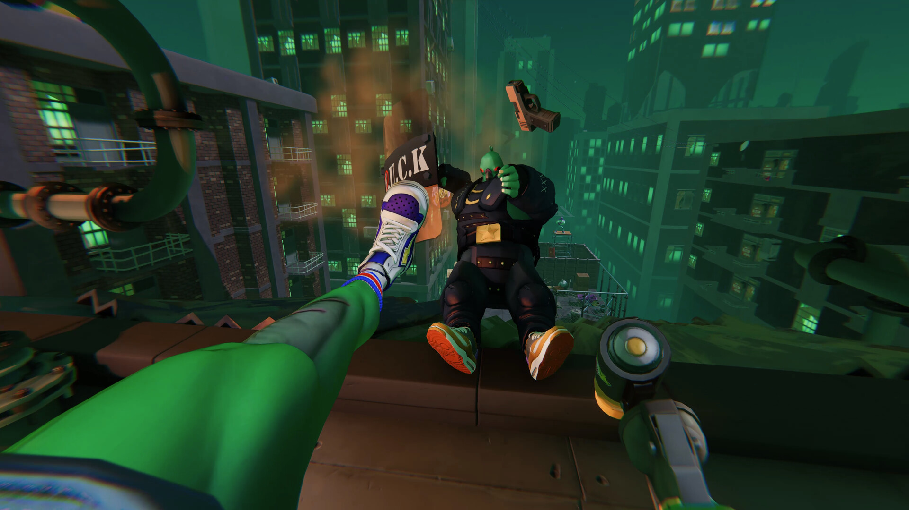

+++
title = "Anger Foot, Once Human : le récap des sorties de la semaine (14/07)"
date = 2024-07-14T08:00:01+01:00
draft = false
author = "Félix"
tags = ["C’est dispo"]
image = "https://nostick.fr/articles/2024/juillet/1407-anger-foot-once-human-sorties-de-la-semaone/anger.jpg"
+++

Entre le boulot, les courses et les derniers préparatifs pour votre cosplay de Freezer à la Japan Expo, vous n’avez peut-être pas eu le temps de vous intéresser aux nouveautés du moment. Qu’à cela ne tienne : voici les sorties de ces derniers jours qui ont retenu notre attention.

## Devolver met un coup de pied dans la fourmilière

Bon, on ne va pas se mentir : c’est toujours pas la folie côté sorties en ce moment. Le gros morceau de la semaine était ***Anger Foot***, le dernier Devolver dans lequel on va dégommer un grand nombre d’ennemis à coup de pied en vue FPS. Le scénario est simple : on vous a volé vos baskets (forcément) et il va falloir partir à la recherche de 4 paires dans autant de quartiers différents. Ça a l’air bordélique avec une ambiance bien punk rigolote et des boss originaux. Clairement on n’est pas là pour l’histoire ou les personnages, mais bien pour tataner frénétiquement sur une bande-son mélangeant funk et hip-hop. J’y ai joué vite fait, c’est des niveaux assez courts qu’on recommence immédiatement en mourant, un peu à la *Hotline Miami* en 3D. Ça réussit bien à se renouveler d’après les tests que j’ai lus, qui pointent tout de même quelques petits défauts. Si vous cherchez un défouloir bien bourrin, ça vaut sans doute les 25 balles demandées [sur Steam](https://store.steampowered.com/app/1978590/Anger_Foot/). 

## Si c’est gratuit…



La grosse sortie free-to-play de la semaine c’est évidemment ***‌Once Human***, un jeu de survie multijoueur en monde ouvert « *dans un étrange futur post-apocalyptique* ». Comme d’hab dans ce genre de titre il va falloir explorer, looter, se construire une base et accepter un paquet de quêtes incitant à tuer plein de trucs. Les screens promotionnels montrent un univers un poil plus original que d’habitude et les premières reviews étaient sympa, mais le jeu se fait actuellement review-bomber à cause de ses condition d’utilisation assez invasive niveau données personnelles. Les Chinois de NetEase ont pondu [une FAQ](https://www.oncehuman.game/news/update/20240710/40780_1166424.html) dans la panique, mais le mal est fait et le jeu affiche désormais des critiques « moyennes » sur Steam. C’est quand même dans le top 10 des titres des plus joués sur la plateforme en ce moment, donc ça peut mériter un téléchargement avec un mail bidon. Dispo sur [Steam](https://store.steampowered.com/app/2139460/Once_Human/), Epic et sur [iOS](https://apps.apple.com/fr/app/once-human/id1573906210)/Android à la rentrée. 

## Vise la lune, en cas d’échec, tu atterriras sur consoles

Les consoleux ont eu le plaisir de voir arriver sur leurs machines ***Lifeless Moon***, un petit projet qui a l’air sympathique (et dispo [sur PC](https://store.steampowered.com/app/1147330/Lifeless_Moon/) depuis quasiment un an). Il s’agit d’un jeu de plateforme 3D proposant de chausser les Moon Boot® d’un astronaute en mission sur la Lune. Évidemment il y a un twist : le joueur se retrouve dans une étrange ville désertique qu’il va falloir explorer à grand coup de jetpack. On nous promet quelques puzzles, un scénario sympa et surtout un univers mystérieux faisant parcourir un tas d’environnements plus bizarres les uns que les autres. Il s’agit de la suite de *Lifeless Planet*, qui avait été bien accueilli à l’époque. Les critiques sont assez bonnes, donc ça pourra sans problème vous occuper un week-end. C’est vendu 13 € sur [Xbox](https://www.xbox.com/fr-BE/games/store/lifeless-moon/9P3R8QDNVKL7) et [PlayStation](https://store.playstation.com/en-us/concept/10010085).



## En rab

Nos amis les weebs sont à la fête cette semaine. Pensez donc, en plus de la Japan Expo, le légendaire visual-novel **Muv-Luv** et sa suite **Muv-Luv Alternative** sont arrivés [sur Switch](https://www.nintendo.com/fr-fr/Jeux/Jeux-a-telecharger-sur-Nintendo-Switch/Muv-Luv-Remastered-2601145.html) cette semaine ! Apparemment il s’agit d’une référence du genre, qui commence comme une comédie romantique avant de se transforment en « *montagnes russes à travers les profondeurs du désespoir* » avec un « *grand final de science-fiction aux proportions épiques* » (??). Pour la culture vidéoludique, on va dire, et l’arrivée d’une version Switch est pas mal étant donné que la machine se porte bien à ce type de jeu ou il n’y a que des JPG statiques à afficher. Japonaiseries toujours avec **Princess Maker 2 Regeneration**, un remaster d’une simulation de vie japonaise dans lequel on doit « *élever [la] fille que les étoiles [nous] ont offerte* ». Écoutez apparemment [c’est très connu](https://en.wikipedia.org/wiki/Princess_Maker_2) donc ça pourra plaire aux fans de jeux rétro, mais le portage n’apporte visiblement pas grand-chose et est quand même vendu [40 balles](https://store.steampowered.com/app/2311530/Princess_Maker2_Regeneration/), donc bon. Moins niche, Sony a ouvert [la bêta](https://www.playstation.com/fr-fr/games/concord/) de son shooter ***Concord*** à tous les joueurs et Nintendo à ajouté le basket à ***Switch Sports***.

")