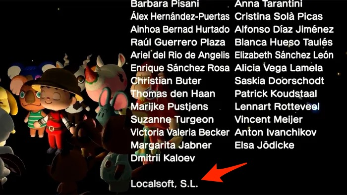

+++
title = "Nintendo oublie les traducteurs de l'ombre"
date = 2024-07-14T08:47:32+01:00
draft = false
author = "Mickael"
tags = ["Actu"]
image = "https://nostick.fr/articles/vignettes/juillet/switch-nintendo.jpg"
+++

")

Si les jeux publiés par Nintendo sont reconnus pour une chose, au-delà de la qualité (en général) de la réalisation, du gameplay ~~ou des prix honteux des remakes~~, c'est bien leur localisation. La traduction est habituellement aux petits oignons, du travail d'orfèvre réalisé par une équipe de spécialistes en interne, mais aussi par des sous-traitants. 

Nintendo fait souvent affaire avec Localsoft ou Keywords, des entreprises qui sont remerciés dans les crédits des jeux… mais pas les traducteurs en eux-mêmes, privés de toute mention. Les traducteurs travaillant directement pour le constructeur sont eux bel et bien cités dans les génériques.

Et c'est un problème pour bon nombre de ces traducteurs, souvent des Freelance, qui ne peuvent pas se prévaloir d'avoir bossé sur le dernier *Zelda* ou *Paper Mario*. Pire encore, ils doivent signer des contrats de non divulgation d'une durée de dix ans (!), ce qui leur interdit de parler de leur travail avec Nintendo (ou des studios first party) avec leurs amis, leur famille, et des clients potentiels. 

Ne pas pouvoir ajouter le dernier gros hit de Nintendo à leur CV  ni même prouver leur participation au travail de localisation, parfois pendant des mois (puisque leurs noms n'apparaissent pas au générique !) est une vraie injustice pour ces traducteurs. Certains d'entre eux s'en [plaignent](https://www.gamedeveloper.com/production/nintendo-s-systemic-policy-of-miscredting-is-harming-external-translators) vertement chez *GameDeveloper.com*.

« *C'est la politique de Nintendo de ne pas inclure le nom des traducteurs des agences externes dans les crédits de leurs jeux, ce qui nous interdit également de mentionner ces titres dans nos CVs* », confirme ce traducteur ayant bossé pour Localsoft. Nintendo n'est cependant pas le seul à blâmer dans cette histoire : en fait, les sous-traitants et les studios se renvoient la balle.

« *Il est presque impossible pour les traducteurs de s'opposer à cette structure* », déplore l'un d'entre eux. « *Quiconque essaie se retrouvera sur liste noire (…) C'est un secteur où prendre un congé annuel peut vous priver de plusieurs mois de travail. Personne ne se soucie de ce que nous pensons parce qu'il n'y a littéralement rien que nous puissions faire à ce sujet, et cela même si nous étions prêts à sacrifier notre gagne-pain pour le bien commun* ».

Au bout du compte, à part faire du bruit dans les médias pour obtenir une malheureuse mention dans un générique est la dernière solution qu'il reste à ces traducteurs de l'ombre. Et pour ne rien arranger, Nintendo a dans ce domaine encore resserré les boulons récemment, en ne communiquant plus l'identité des studios qui développent les jeux pour son compte. Désormais, il faut aller tout au bout du jeu pour savoir qui l'a conçu…