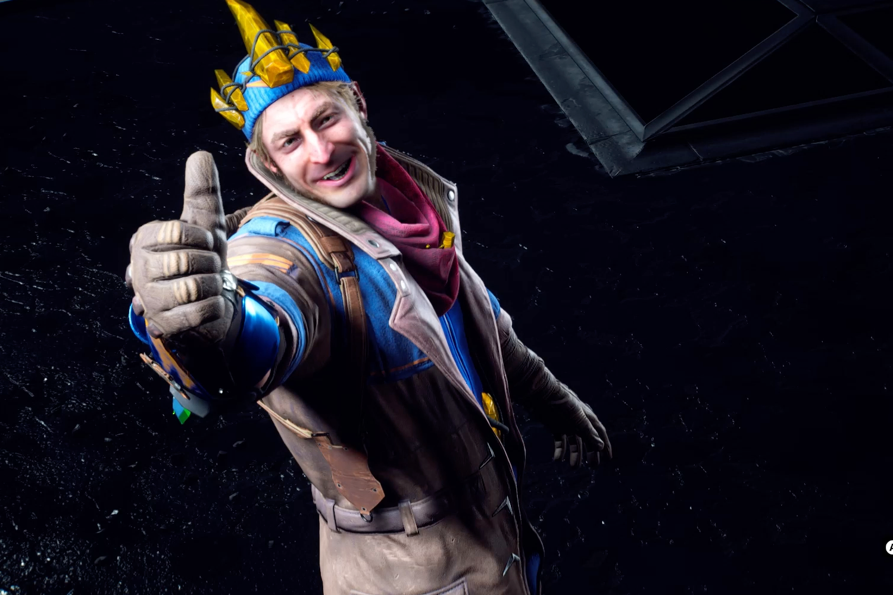
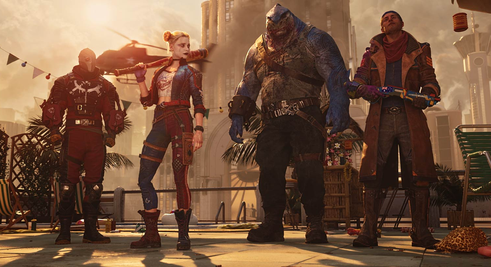
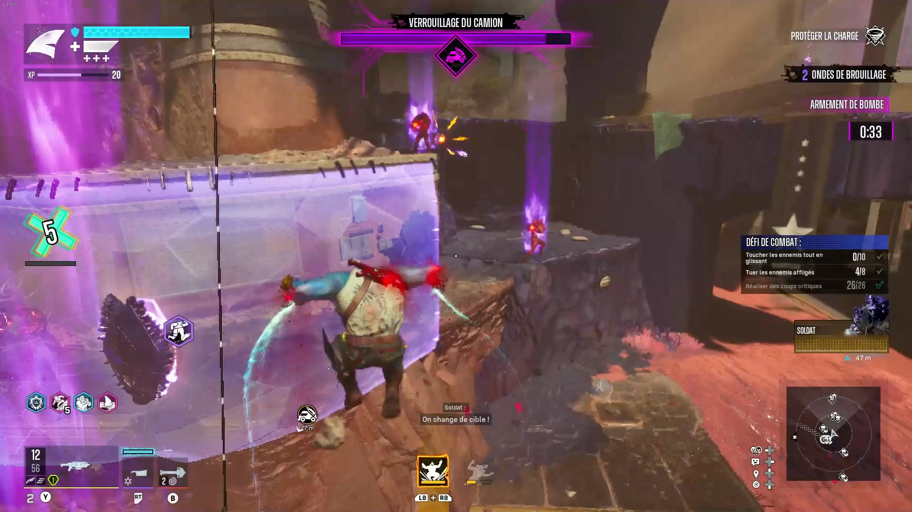
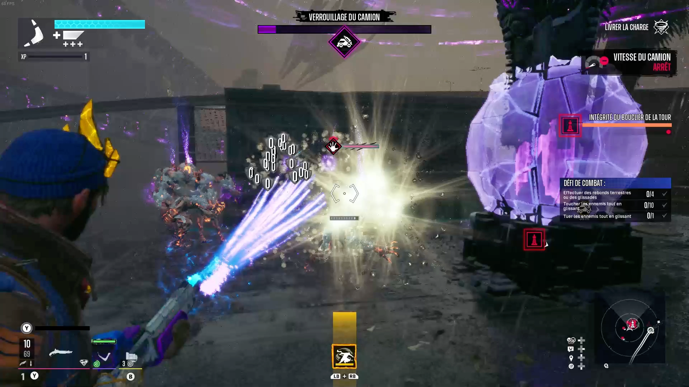
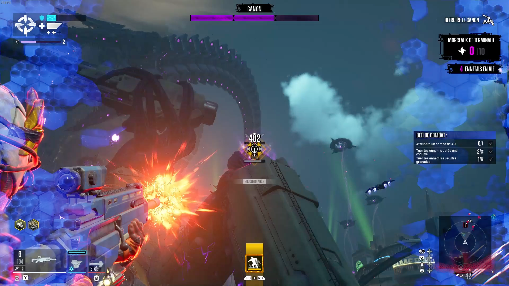
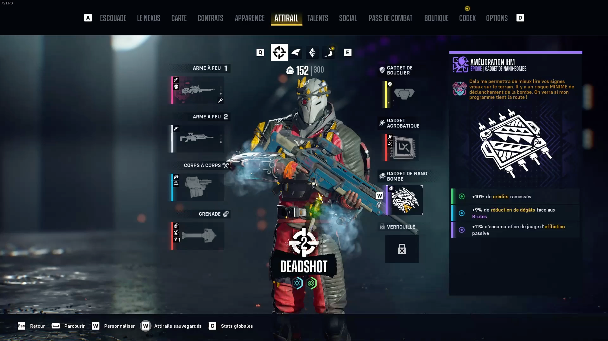
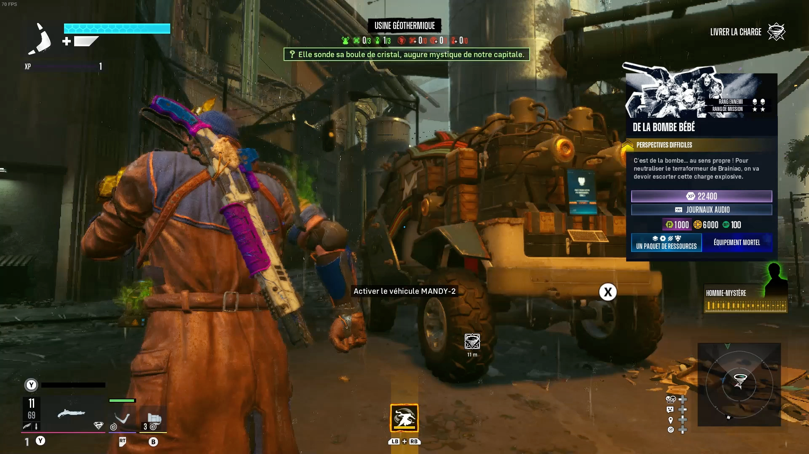
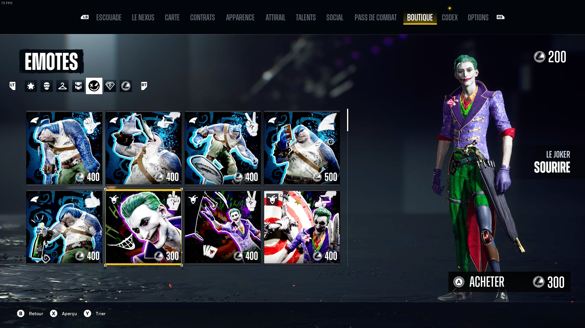
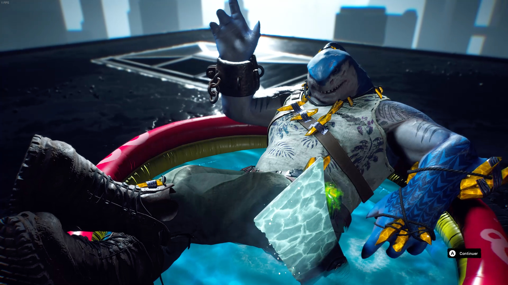

+++
title = "Test de Suicide Squad: Kill the Justice League, des cinématiques de riches pour un jeu très pauvre"
date = 2024-07-15T10:47:32+01:00
draft = false
author = "Mickael"
tags = ["Test"]
type = "une"
image = "https://nostick.fr/articles/vignettes/nostick.jpg"
+++

**Ne nous racontons pas de bêtises : en règle générale, l'habitude est de zapper les cinématiques pour aller plus vite dans le jeu. Il y a un gros problème quand c'est l'inverse qui se produit et malheureusement, c'est le cas dans *Suicide Squad: Kill the Justice League*.**

Quelle mouche a piqué Rocksteady ? Le studio britannique, connu et révéré par des millions de joueurs grâce à la saga *Batman: Arkham*, s'est lancé la fleur au fusil dans la conception d'un shooter infusé au jeu service. Très, très loin des bases qui ont fait le succès des jeux *Batman*.

Ce développement débuté fin 2016 est soutenu par la maison-mère Warner Bros., sans doute pour capitaliser sur le succès incompréhensible du premier (et très mauvais) film *Suicide Squad* sorti la même année. Une gestation émaillée de problèmes et de retards en tout genre, ce qui n'est pas inédit pour un blockbuster dont le budget, inconnu, doit se compter en centaines de millions de dollars… [Cette histoire a été retracée depuis](https://nostick.fr/articles/2024/juin/0606-suicide-squad-pas-enterre-rocksteady/), en partie, et on n'a certainement pas fini d'en entendre parler.

Mais le jeu en lui-même, que vaut-il ? À l'occasion des soldes Steam (pas fou), je me suis offert l'objet du délit. Un cas fascinant de jeu-Frankenstein mal rapiécé, où les coutures des versions abandonnées en chemin se voient dans tous les coins.

## Suicide Squad: Kill the Justice League, ça parle de quoi ?

Au tour des super-vilains de seconde zone de briller ! Harley Quinn, Deadshot, King Shark et cette nouille de Captain Boomerang sont appelés à la rescousse pour remettre de l'ordre dans Metropolis. Il se trouve que la cité de Superman a été envahie par Brainiac qui transforme les habitants en monstres-soldats, et corrompt les héros de la Justice League, des événements qui se déroulent cinq ans après *Batman: Arkham Knight*.

Cette équipe de bras cassés n'a pas vraiment le choix : elle a été enrôlée par une redoutable Amanda Waller chargée de sauver la ville. Histoire de s'assurer de l'obéissance de nos amis castagneurs, elle les force dans une séquence assez drôle à s'injecter une microbombe dans le cou. Si jamais il leur venait l'idée de s'échapper, la directrice de l'A.R.G.U.S (aucun rapport avec des bagnoles) n'aurait qu'à appuyer sur un bouton et pouf, la tête.

Dans cette aventure, nos quatre antihéros lourdement armés vont rencontrer et combattre Flash, Superman, Batman, ou encore Green Lantern qui ne sont plus en possession de leurs moyens… mais qui demeurent extrêmement dangereux. Par un effet de miroir inversé, les alliés de nos justiciers malgré eux seront des vilains, comme le Pingouin, Poison Ivy ou encore Lex Luthor (et même plusieurs versions de Lex Luthor, mais chut).

L'histoire est digne d'un comics décérébré pas très finaud, mais l'humour et les vacheries entre camarades confèrent au jeu (et aux cinématiques) beaucoup de capital sympathie. Mention spéciale à Boomerang, dont la répartie et le bagout sont rafraîchissants. L'histoire réserve aussi quelques surprises, comme la mort de personnages adorés de tous, ce qui est inattendu. Mais comics oblige, personne ne disparait jamais vraiment…

## Comment ça se joue ?

*Suicide Squad* est un jeu de tir à la troisième personne qui se joue aussi bien en solo qu'à 4 joueurs en coop. Le joueur incarne un des quatre marlous de la Team Force X, chacun ayant un système de mobilité bien à lui. Deadshot possède un jetpack, Boomerang un système de téléportation à courte distance, Harley utilise un grappin et un drone piqués à Batman, et King Shark peut compter sur ses sauts impressionnants.

Tout le monde aura sa petite préférence, je suis assez fan de King Shark par exemple, mais la téléportation de Boomerang peut se montrer assez efficace. En revanche, le système de Harley m'a toujours paru très compliqué pour ce que c'est, tandis que les déplacements en jetpack de Deadshot ne sont pas très précis et lui donnent une espèce de « mollesse » aérienne.

Pour le reste, le gameplay est sensiblement identique d'un héros à un autre, les déplacements étant à peu près la seule chose qui différencie la jouabilité des personnages…  et c'est un sérieux problème. Rocksteady a décidé de tout miser sur les flingues, alors qu'en vérité dans l'équipe, seul Deadshot est réellement le spécialiste du genre. King Shark est un gros balaise avec des espèces de faucilles, Harley a son marteau et Boomerang ses… boomerangs. Autrement dit, des armes de mêlée ou à courte portée.

Alors bien sûr qu'il va y avoir de la baston collée-serrée, mais très clairement la prime est aux fusils, armes de poing, grenades et autres mitrailleuses en tout genre dont la variété et la quantité font tourner la tête. Les armes blanches peuvent certes être améliorées ou échangées contre des versions plus puissantes, mais on sent que la priorité a été donnée aux armes à feu.

Voilà bien un un des péchés originels du jeu. Autant les bastons en mêlée peuvent être amusantes et percutantes, autant jouer du flingue n'a que très peu d'intérêt. Le pire étant les batailles contre les boss : tous doivent être combattus à bonne distance. Il est quasiment impossible d'aller au contact pour foutre une bonne raclée à Flash ou à Green Lantern, à moins d'un coup de bol. Quel dommage !

Après quelque temps passé avec chacun des membres de la Suicide Squad, on choisit son préféré et ce n'est pas vraiment la peine d'en changer en cours de jeu (même si c'est possible et même recommandé pour améliorer les stats). Ils finissent en effet tous par se ressembler alors qu'il aurait fallu les utiliser avec leurs capacités propres : King Shark est clairement un as de la mêlée, alors pourquoi ne pas en avoir fait un espèce de tank hyper costaud aux coups lents mais ravageurs ? Deadshot serait plus à son aise en tant que sniper, Harley dans un rôle type rogue aux mouvements très rapides, et Boomerang comme un équilibre entre tout ça.

Mais non. En dehors des flingues, point de salut.

## Qu’est-ce qui est bien ?

*Suicide Squad* a de bons moments… qui sont rarement dans le jeu en lui-même. Il faut souligner ici la qualité des cinématiques, le travail des acteurs, le doublage, le soin apporté aux animations… Tout concourt à raconter une histoire qui mériterait probablement un jeu plus abouti et plus riche. À tel point que si on enchaîne les missions, c'est surtout pour voir ce que va raconter la prochaine cinématique !

La subjectivité d'un test de jeu vidéo n'empêche pas d'être honnête de temps en temps : les premiers moments du jeu sont assez réjouissants. La prise en main des héros, l'apprentissage de leurs capacités, les mouvements spéciaux dont ils disposent (ils ne sont pas très nombreux, hélas), tout cela est bien amené et laisse espérer de grandes choses… Un espoir qui s'éteint bien vite devant la monotonie de ce qui est proposé (on y reviendra).

Un autre point intéressant : entre les mouvements aériens de ses antihéros et leur capacité à grimper aux buildings, *Suicide Squad* est un jeu à la verticalité affirmée. Il y a quelque chose du *Spider-Man* d'Insomniac ici, en moins virtuose certainement, et dans une map moins grande que celle de New York. Mais au moins, on prend de la hauteur.

## Qu’est-ce qui est moins bien ?

La monotonie des missions et des activités est certainement ce qui leste *Suicide Squad* avec des semelles de plomb. On se lasse rapidement de sauver des flics ou des hommes de main pour les ramener dans un bus volant (bizarrement, il faut les rapetisser comme des Pokémon dans une pokéball ?!). Ou encore de voler d'un endroit à un autre pour zigouiller les mêmes monstres qui menacent un allié. Ou encore escorter un véhicule. Surtout que les bestioles à dessouder se ressemblent toutes avec leurs armures bizarrement violettes.

Alors évidemment, il y a des nuances, parfois les ennemis ne sont sensibles qu'aux grenades ou aux critiques (ce qui est bien casse-pied, merci beaucoup), parfois on peut piloter un véhicule volant. En dehors des missions, il est possible de tomber sur le poil d'ennemis positionnés sur les toits, mais ça n'apporte pas vraiment plus de variété. 

On peut s'arrêter de temps en temps pour résoudre un mystère du Riddler, mais il suffit de viser l'endroit recherché. Les séquences avec Batman sont un peu plus intéressantes, elles se jouent dans la pénombre avec un homme chauve-souris vraiment vénère, mais il n'y en a que deux (des séquences, pas des Batman. Quoique).

Si Suicide Squad se déroule dans un monde ouvert, les baston ont lieu dans des arènes aux murs virtuels. On comprend la logique, mais ça enferme un jeu qui a pourtant besoin de respirer. Rocksteady a aussi eu la main très, très lourde sur les splashs de couleur et les trucs qui font bam partout sur l'écran. C'est bien simple, il arrive assez souvent qu'on ne sait plus où on habite.

*Suicide Squad* étant un jeu service, il comporte de nombreux systèmes pour améliorer son perso et ses armes. Tous les poncifs du genre y passent : arbres de compétences, boosts d'affixes, ajouts d'effet à certains types d'armes, battle pass bien sûr, recherche d'équipements légendaires… Le jeu contient un grand nombre de « monnaies » qu'on obtient au fil des missions, et qui servent à déverrouiller de nouveaux trucs et bidules. 

Une boutique permet d'acheter des skins et le battle pass premium, mais je ne vois pas pourquoi quiconque aurait envie d'y dépenser quoi que ce soit. S'il n'est pas vraiment nécessaire de grinder comme un fou pour venir à bout de la campagne qui dure une quinzaine d'heures (moins si vous ne trainez pas trop en chemin, et beaucoup beaucoup moins si vous zappez les cinématiques, mais vous avez tort). En revanche, le endgame nécessitera de se frotter encore et encore aux mêmes missions pour récolter une ressource spécifique nécessaire pour battre tous les Brainiac qui vous barreront la route.

Le hic, c'est que le jeu est tellement répétitif qu'il parait complètement insensé de persévérer après la campagne.

## C’est oui ou c’est non ?

Quelque part sous *Suicide Squad: Kill the Justice Squad*, il a dû se cacher un bon jeu à un moment donné. Du moins, il y a avait quelques idées potentiellement amusantes : les traversées dynamiques, les combats percutants au cours à corps, le fonctionnement en coop… Mais ce ne sont pas trois bonnes idées et demi et de belles cinématiques qui suffisent pour faire un jeu digne du statut (bien écorné désormais) de Rocksteady. Ce n'est même pas suffisant pour un looter shooter convenable…

*Suicide Squad* ne vaut certainement pas son prix d'origine, et à peine le tarif en soldes sur Steam. Je m'en veux même de ne pas avoir attendu les Prime Days d'Amazon pour le [gratter gratos](https://primegaming.blog/celebrate-prime-day-2024-with-suicide-squad-kill-the-justice-league-chivalry-2-and-rise-of-the-23c94a652992) ! Malgré tout, les premières heures ne sont pas si repoussantes et si les cinématiques ne sont pas suffisantes pour sauver les meubles, au moins elles donnent l'impression que le studio s'est donné u mal. C'est vraiment peu.

 
