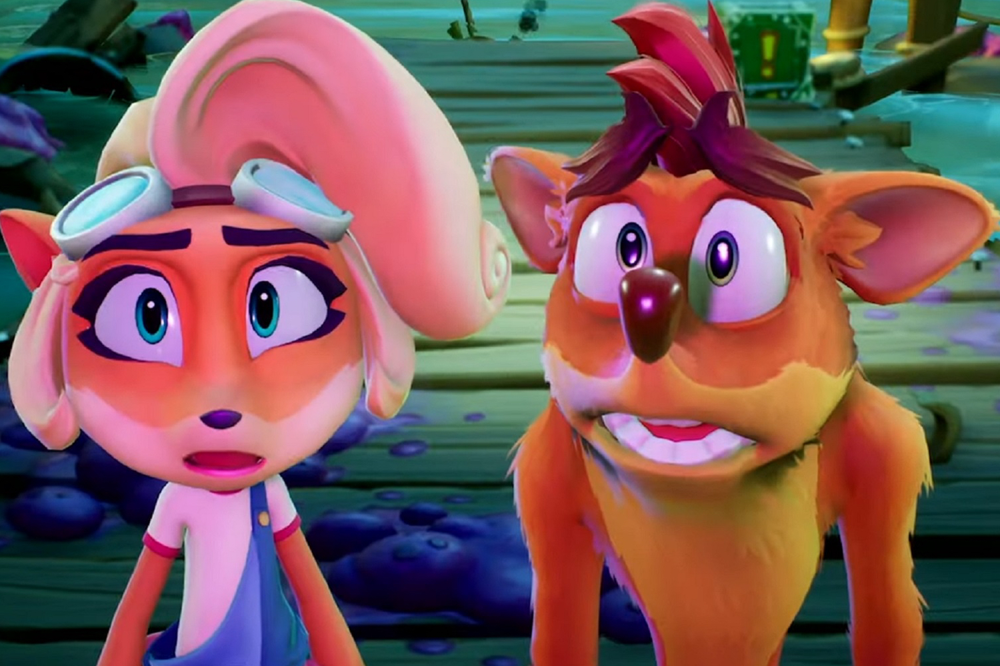

+++
title = "Crash Bandicoot 5 aurait été annulé"
date = 2024-07-16T09:47:32+01:00
draft = false
author = "Mickael"
tags = ["Actu"]
image = "https://nostick.fr/articles/2024/juillet/1607-crash-bandicoot-5-annule/crash-bandicoot-5-annule.jpg"
+++

 

Implacable, terrible logique : après *Crash Bandicoot 4: It’s About Time*, il devait forcément y avoir un 5e épisode des aventures du marsupial sauteur. Mais quatre années après la sortie de cet opus plutôt bien reçu, les fans n'ont plus rien à se mettre sous la dent. Et il leur faudra attendre encore un moment, voire jusqu'à la fin des temps : *Crash 5* aurait été purement et simplement annulé.

L'info [provient](https://x.com/FromHappyRock/status/1811954427525272049) de Nicholas Kole, un illustrateur ayant travaillé avec Toys for Bob, le studio propriété d'Activision (qui a depuis repris son indépendance) à qui l'on doit la *N. Sane Trilogy* et *It's About Time*. L'artiste planchait sur un mystérieux « projet Dragon » en développement depuis ces trois dernières années auprès d'un studio anonyme, jusqu'à l'annulation récente du jeu en gestation. Et ce malgré des tentatives de le sauver en interne.

Pressé de questions, l'artiste a a fini par révéler que ce fameux projet [n'était pas](https://x.com/FromHappyRock/status/1812001224641900677) un jeu *Spyro* (ce qui avait du sens au vu du nom), et pas non plus *Crash 5*, mais d'un projet encore différent. Et si l'on comprend bien le fil de la discussion, ce qui n'est pas forcément le plus facile, il a entendu dire que ce 5e épisode de *Crash Bandicoot* avait été annulé lui aussi.

Pour résumer : le « projet Dragon » et *Crash 5* ont été [annulés](https://x.com/FromHappyRock/status/1812003288193335509), quant à *Spyro* le mystère reste entier. Aux dernières nouvelles, [Toys for Bob travaille pour le compte de Xbox](https://nostick.fr/articles/2024/mars/2403_spyrothedragon/) sur un nouveau jeu… qui pourrait être un nouveau volet de *Spyro* ! Ah, faut suivre.

Quant à l'ami Crash, on devrait le retrouver dans le Game Pass très bientôt : il se murmure en effet que [la trilogie serait dans les tuyaux du service](https://nostick.fr/articles/2024/juillet/0307-crash-bandicoot-spyro-tony-hawk-game-pass/).