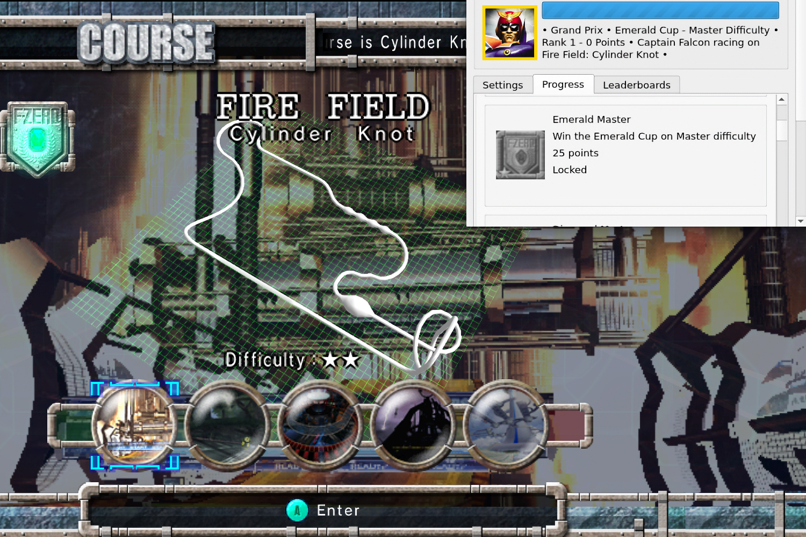
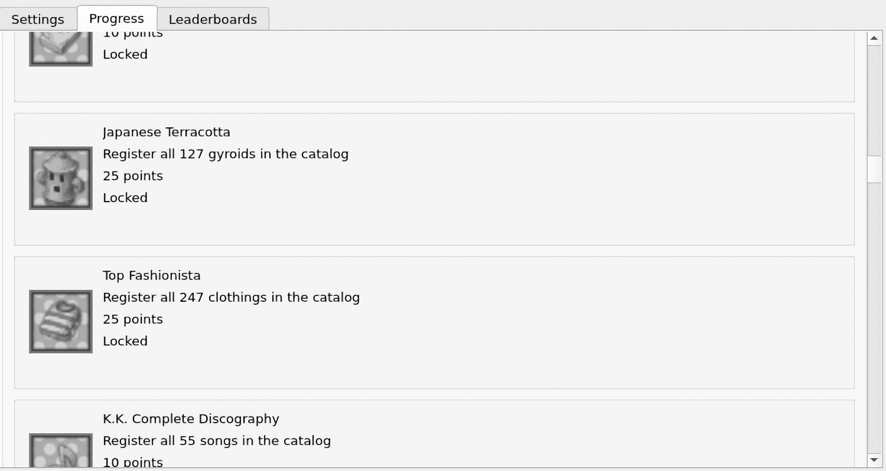

+++
title = "L'émulateur Dolphin fait le plein de trophées pour des tas de jeux GameCube"
date = 2024-07-16T14:47:32+01:00
draft = false
author = "Mickael"
tags = ["Actu"]
image = "https://nostick.fr/articles/vignettes/nostick.jpg"
+++

 

Les dinguos des trophées risquent de ne pas trop trouver le sommeil dans les prochains jours ou semaines, puisque l'émulateur Dolphin [intègre](https://fr.dolphin-emu.org/blog/2024/07/15/unlocked-retroachievements-come-dolphin/) désormais RetroAchievements ! Cela signifie que des milliers de succès sont maintenant à décrocher dans plus de 100 jeux GameCube, et ça n'est qu'un début.

Des trophées peuvent être obtenus dans *Metroid Prime*, *Super Smash Bros. Melee*, *Super Mario Sunshine*, *Zelda: The Wind Maker* ou encore *Star Fox Assault*. Et dans plein d'autres classiques (et aussi dans des bouses obscures, mais il faut de tout pour faire un monde). RetroAchievements est géré par une communauté de passionnés de jeux rétro qui s'amusent à créer des succès en tout genre.

Pour participer à la chasse, rien de plus simple : il faut se créer un compte sur le site de RetroAchievements ([ici](https://retroachievements.org/)), puis s'y connecter dans Dolphin qui accueille une nouvelle fenêtre Achievements, dans les outils. Au lancement d'un jeu compatible, la liste des trophées va apparaitre et… c'est à vous de jouer. Chaque succès représente un certain nombre de points, en fonction de leur difficulté : certains sont très faciles à décrocher et d'autres sont réservés aux joueurs hardcore à tendance masochiste.

 

Quand on débarque dans une zone du jeu où un trophée peut être obtenu, une petite icône prend place en bas à droite. Il est possible en tout temps de jeter un œil sur la liste. RetroAchievements a bien fait les choses : deux modes sont disponibles pour déverrouiller les succès ; le premier en utilisant les fonctions d'aide de Dolphin (sauvegardes rapides, retour en arrière…), le second sans aucune aide. Dans ce dernier cas, les succès seront encadrés d'un élégant liseré doré, ce qui est la classe tout de même.

Et si tout cela ne suffisait pas, l'intégration de RetroAchievements apporte aussi à Dolphin des classements qui opposent les meilleurs temps et meilleurs scores des joueurs partout dans le monde. Va vraiment falloir prouver que vous êtes le meilleur à *Double Dash*…

Le support des RetroAchievements dans Dolphin se limite aux jeux GameCube, mais la prise en charge de la logithèque Wii est dans les tuyaux. Par ailleurs, seule la version PC de l'émulateur — Dolphin 2407-68, à télécharger [ici](https://dolphin-emu.org/download/) — a droit à cette nouveauté ; la mouture pour Android pose encore des problèmes mais les développeurs promettent compatibilité RetroAchievements dans l'avenir (ils ne savent simplement pas quand). 