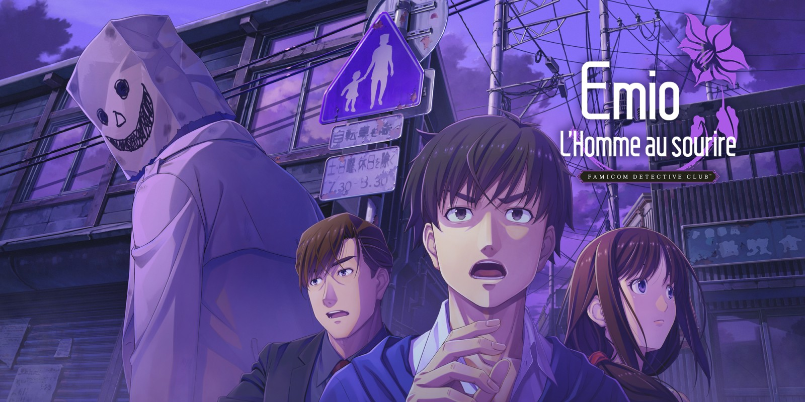
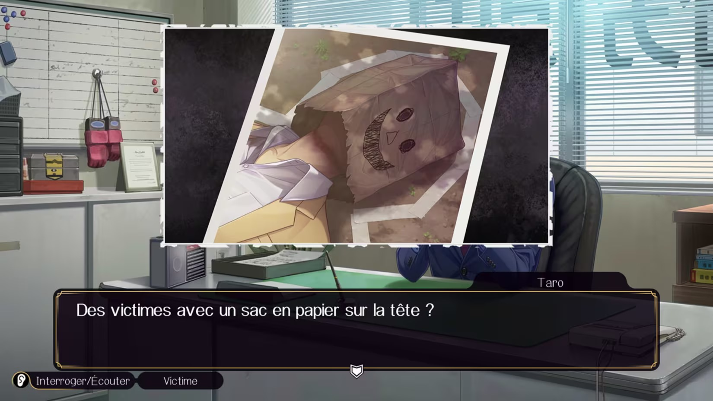

+++
title = "Emio – L'Homme au sourire : le troisième opus de la saga Famicom Detective Club sortira le 29 août"
date = 2024-07-17T19:00:32+01:00
draft = false
author = "Félix"
tags = ["Actu"]
image = "https://nostick.fr/articles/2024/juillet/1707-emio-lhomme-au-sourire/emio.jpg"
+++ 

Vous vous souvenez du teaser bizarre qu’a balancé Nintendo [la semaine dernière](https://nostick.fr/articles/2024/juillet/1007-whoiselmio-nintendo-tease-des-trucs-chelous/) avec un mec en trench et un sac en papier sur la tête ? Contrairement à ce que l’on pouvait croire, il ne s’agira pas d’une nouvelle licence horrifique mais d’un troisième opus pour la très sympathique saga de jeux d’enquêtes *Famicom Detective Club*. Baptisé *Emio – L'Homme au sourire*, cette nouvelle aventure est signée par le papa de la série Yoshio Sakamoto, que l’on connait surtout comme étant l’un des principaux créateurs de *Metroid*.

*Famicom Detective Club* est un duo de visual novel initialement sorti à la fin des années 80. Si les jeux ont pas mal marqué les esprits au Japon, ils n’ont jamais été adaptés en français ou en anglais. Après avoir laissé la série au placard pendant de nombreuses années, Nintendo a du jour au lendemain sorti [un gros remake sur Switch](https://www.nintendo.com/fr-fr/Jeux/Jeux-a-telecharger-sur-Nintendo-Switch/Famicom-Detective-Club-The-Missing-Heir-Famicom-Detective-Club-The-Girl-Who-Stands-Behind-1923576.html) en 2021 apportant de nouveaux graphismes, des doublages et une traduction. La nouvelle a surpris plus d’un fan de cette licence oubliée, qui vont sans doute tomber de leur siège en apprenant qu’un nouvel opus va débarquer plus de 30 ans plus tard.

 

*Emio – L'Homme au sourire* promet de flirter avec le surnaturel : l’enquête va porter sur un mystérieux homme apparaissant devant les jeunes filles en pleurs pour « *leur offrir un sac en papier en échange de leur vie* ». Le protagoniste devra enquêter sur cette légende urbaine et sur une série de meurtre lui ressemblant étrangement. Yoshio Sakamoto nous annonce « *l’apogée de la série* » et une fin qui restera dans les mémoires.

Si vous n’y avez pas joué, je vous recommande chaudement le remake des deux premiers *Famicom Detective Club* : ce sont des jeux aux intrigues très sympas qui se prêtent bien à une session le soir au fond du lit la lumière éteinte. Les jeux accusent tout de même leur âge avec certaines mécaniques un peu datées, mais les chouettes graphismes et les multiples twists aident à faire passer la pilule. Ils ne sont malheureusement disponibles qu’en anglais, en japonais et en chinois, mais l’histoire peut se suivre avec un niveau collège. On regrettera cependant le tarif musclé [de 60 €](https://www.nintendo.com/fr-fr/Jeux/Jeux-a-telecharger-sur-Nintendo-Switch/Famicom-Detective-Club-The-Missing-Heir-Famicom-Detective-Club-The-Girl-Who-Stands-Behind-1923576.html) pour un jeu vendu uniquement en dématérialisé se bouclant en une vingtaine d’heures (et jamais en promo).

Le troisième opus sortira le 29 août et aura étonnamment droit à une traduction française ainsi qu'à [une version boîte](https://x.com/NintendoFrance/status/1813570608304660603). Le tarif est ici aussi salé, Nintendo demandant 50 € pour une seule aventure. Contrairement aux deux premiers, le jeu est interdit aux moins de 18 ans : l’affaire sera sans doute plus trash qu’à l’accoutumée. Les fans peuvent commencer à jeter un œil à la rubrique « Bureau du commissariat » de [la page du jeu](https://www.nintendo.com/fr-fr/Jeux/Jeux-Nintendo-Switch/Emio-L-Homme-au-sourire-Famicom-Detective-Club-2615498.html), où Nintendo devrait dévoiler quelques éléments d’ici la fin de l’été.