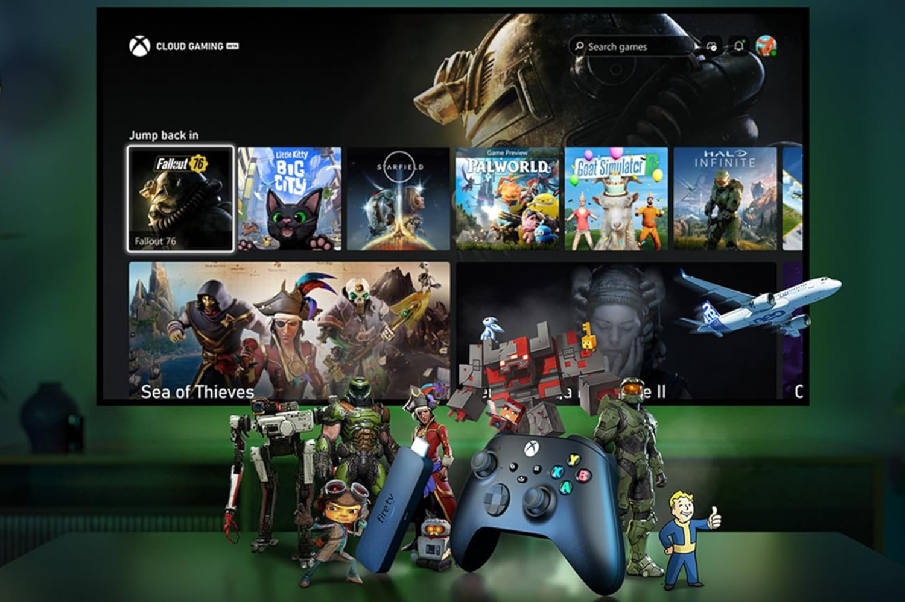
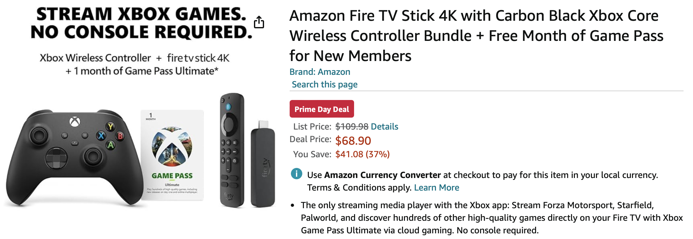

+++
title = "Pas de Xbox ? Pas de problème pour Microsoft et Amazon"
date = 2024-07-17T08:00:32+01:00
draft = false
author = "Mickael"
tags = ["Actu"]
image = "https://nostick.fr/articles/vignettes/juillet/xbox-bundle.jpg"
+++

Les consoles Xbox n'ont plus trop l'air d'intéresser Microsoft, qui se préoccupe bien davantage de Game Pass et de rentabiliser ses jeux sur un maximum de plateformes. D'ailleurs, le constructeur a parait-il [coupé les budgets pub en Europe et ailleurs dans le monde pour les consoles](https://nostick.fr/articles/2024/juillet/1207-microsoft-xbox-pub-europe/), ce qui ne changera pas fondamentalement les choses vu le peu de promotion qu'on voit habituellement pour le matos.

 

Microsoft préfère mettre le paquet ailleurs, par exemple sur l'application Fire TV qui permet d'accéder au Xbox Cloud Gaming sur les sticks TV d'Amazon. Il y a eu une publicité (ci-dessus) on ne peut plus claire sur le fait qu'il n'y a pas besoin de Xbox pour jouer aux jeux Xbox. 

Voici la deuxième couche : à l'occasion des Prime Days, Amazon et Xbox [vendent](https://www.amazon.com/Amazon-Fire-Stick-Wireless-Controller/dp/B0D5LKQHNN/) (aux États-Unis et au Canada) un pack comprenant un stick Fire TV, une manette et un mois de Game Pass Ultimate à partir de 68,90 $. C'est une réduction de 41 $ sur la somme des deux appareils, la manette coûtant habituellement 59,99 $ et le Fire Stick 4K (le modèle de base) 49,99 $.

C'est surtout le slogan qui interpelle : pour streamer des jeux Xbox, « *aucune console requise* ». D'ici à penser que la Xbox est complètement passée de mode, voire obsolète, il n'y a plus qu'un pas… Le plus étonnant, c'est que ce bundle n'est pas disponible en France ni en Europe. Ça finira peut-être par arriver.