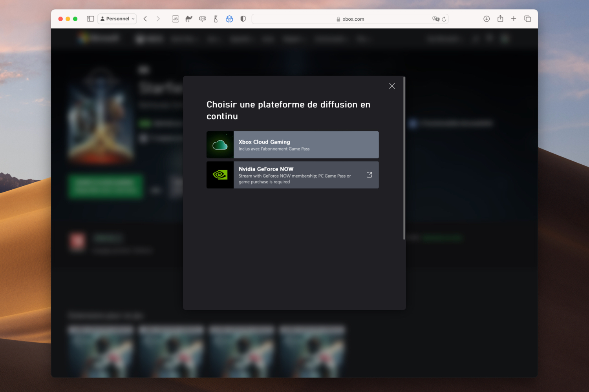

+++
title = "Xbox Cloud Gaming ou GeForce NOW ? Microsoft donne le choix"
date = 2024-07-18T10:30:32+01:00
draft = false
author = "Mickael"
tags = ["Actu"]
type = "telex"
+++

Microsoft est prêteur. Sur sa boutique de jeux, le bouton « Jouer à Cloud Gaming » liste désormais GeForce NOW, en plus du Xbox Cloud Gaming. Jusqu'à présent, seul le service maison était proposé. Bien sûr, pour profiter du jeu en streaming de Nvidia, il faut y être abonné (et posséder le jeu). Malheureusement, il ne s'agit pas d'un lien profond : cliquer sur GeForce NOW renvoie simplement sur la page d'accueil du service.

Cette ouverture à la concurrence au niveau du cloud gaming ne tombe pas du ciel : les deux entreprises ont signé un accord de 10 ans durant lesquels Nvidia peut diffuser les jeux Xbox sur GeForce NOW, une des conséquences de l'acquisition d'Activision. Et c'est tant mieux : les titres streamés depuis GeForce NOW sont de bien meilleure qualité que depuis le Xbox Cloud Gaming — pour peu évidemment qu'on bénéficie de l'abonnement RTX 4080.