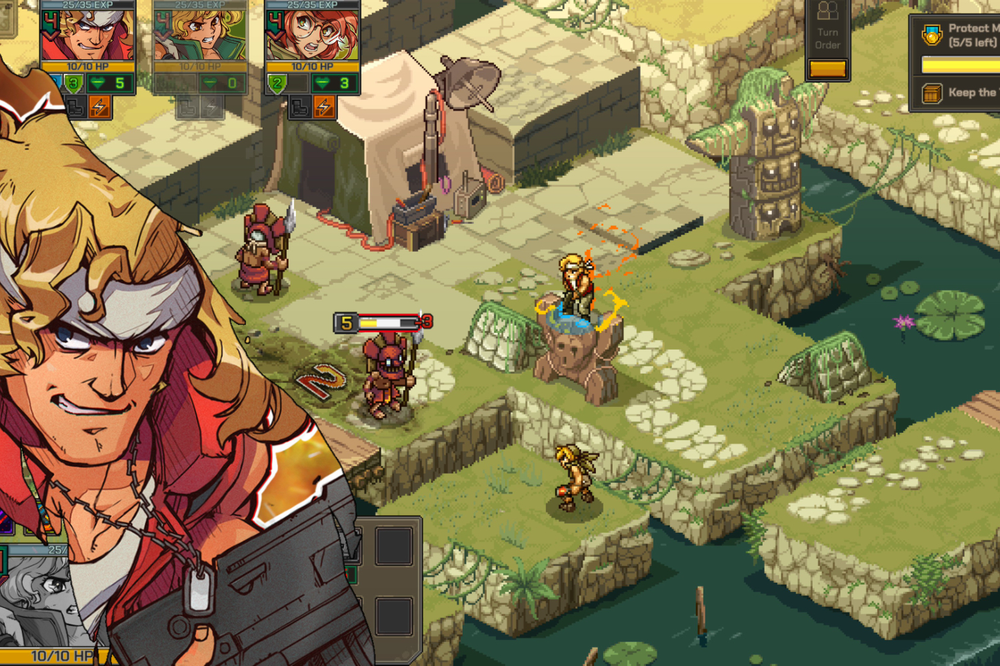

+++
title = "L'héritage de SNK dans Metal Slug Tactics"
date = 2024-07-18T08:00:32+01:00
draft = false
author = "Mickael"
tags = ["Trailer"]
image = "https://nostick.fr/articles/2024/juillet/1807-metal-slug-tactics-heritage-snk/metal-slug-tactics.jpg"
+++

Ne cherchez pas le jeu de l'automne, ce sera indéniablement *[Metal Slug Tactics](https://metalslugtactics.com)* ! Développé par les *frenchies* de Leikir et édité par Dotemu, le titre puise évidemment abondamment dans l'univers du shoot de SNK, mais en version tactique au tour par tour et en 3D isométrique. Un mariage qui n'a pas la force de l'évidence au premier abord, mais le cocktail s'annonce tout aussi détonnant que le jeu d'arcade dont il s'inspire.

 

Histoire de faire monter la sauce, Dotemu a produit une vidéo sur l'héritage de *Metal Slug* qui met en scène quelques uns des vétérans de SNK ayant créé la franchise. Le document d'un peu plus de 8 minutes plonge dans l'histoire du jeu et rebondit en France, avec ce *Metal Slug Tactics* respectueux des visuels et de l'état d'esprit des titres originaux, tout en en chamboulant complètement les règles. Il sortira sur PC, Switch, PS4/5 et Xbox One/Series S/X,