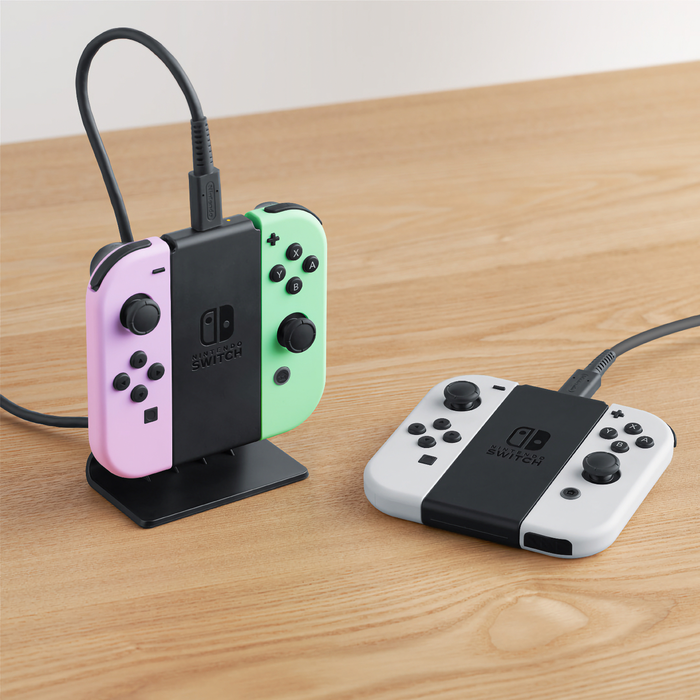
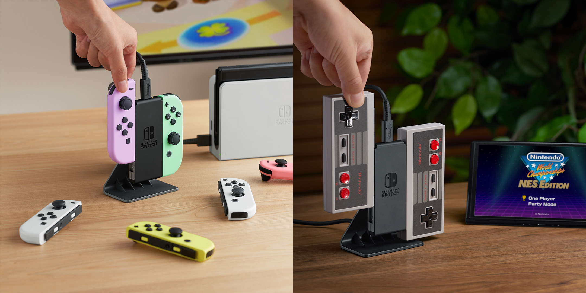

+++
title = "Nintendo sort l'accessoire ultime pour les Joy-Con, 7 ans trop tard"
date = 2024-07-18T11:44:32+01:00
draft = false
author = "Mickael"
tags = ["Actu"]
type = "telex"
+++ 

7 ans et demi après le lancement de la Switch, Nintendo [lance](https://x.com/NintendoFrance/status/1813846179634975220) enfin (!) une station de recharge pour Joy-Con. Avouez, il était temps ! Les manettes peuvent évidemment se recharger en les branchant sur la console, mais il existe bien d'autres solutions tierces. Nintendo arrive donc un peu tard sur ce marché mais hé, mieux vaut tard…

Cette station, qui saura aussi remplumer les batteries des manettes NES du Switch Online, pourra également faire office de support pour pouvoir jouer avec les deux Joy-Con connectés, de la même manière qu'avec l'espèce de truc en plastique que Nintendo refile dans la boîte de la Switch. Le tout sortira le 17 octobre, à un prix non annoncé en France ; au Japon, le bidule sera vendu 3 300 yens, soit quelque chose comme 20 €.