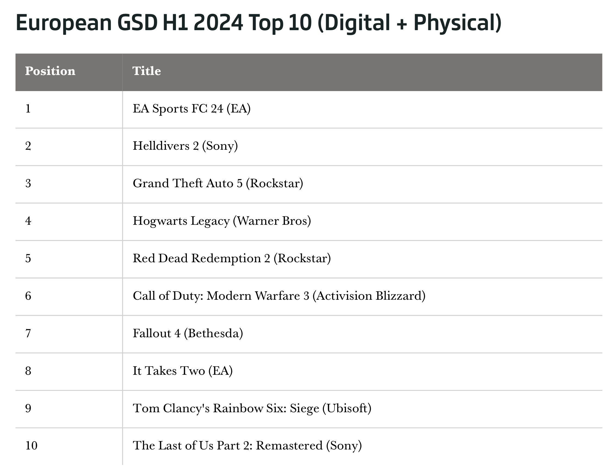

+++
title = "80 millions de jeux vendus en Europe oklm"
date = 2024-07-19T10:47:32+01:00
draft = false
author = "Mickael"
tags = ["Actu"]
image = "https://nostick.fr/articles/vignettes/juillet/switch-nintendo-ventes-jeux-europe.jpg"
+++

") 

Même si l'industrie fait la tronche et licencie à tour de bras, les joueurs sont toujours au rendez-vous et achètent toujours autant de jeux. C'est le cas en Europe, selon les chiffres de GSD [dévoilés](https://www.gamesindustry.biz/european-game-sales-down-just-16-during-the-first-half-of-2024-european-monthly-charts) par *GameIndustry.biz* : durant les six premiers mois de l'année, 80 millions de jeux PC et consoles ont été vendus sur le vieux continent.

Un volume impressionnant, d'autant plus qu'il n'est en baisse que de 1,6 % par rapport au premier semestre 2023, une période tranquille durant laquelle une poignée de petits petits jeux indés était sortie : *Hogwarts Legacy*, *The Legend of Zelda: Tears of the Kingdom*, *Diablo IV* et *Star Wars Jedi: Survivor* ! Les six premiers mois de 2024 ont été un peu plus calmes, ce qui n'a pas empêché les jeux de trouver preneurs.

Les données de GSD prennent en compte les ventes physiques dans tous les marchés européens, ainsi que les ventes numériques des principaux éditeurs, mais pas tous. Il manque ainsi au lot les ventes réalisées par *Palworld*, qui a dépassé les 20 millions de copies dans le monde. Il est donc possible que les résultats de ce premier semestre dépassent en réalité ceux de l'an dernier.

Par contre, au niveau du chiffre d'affaires sonnant et trébuchant, il ne faut pas s'attendre à un miracle : la plupart des jeux étaient vendus comparativement moins chers que les AAA de l'an dernier (les revenus ont plongé de 30 % au Royaume-Uni).

En juin, 11,3 millions de jeux ont été écoulés, soit 19 % de moins d'une année sur l'autre. Il faut dire que juin 2023 avait été bien chargé, entre *Diablo IV* et *Final Fantasy 16*.  Nintendo a placé la seule nouveauté mensuelle avec *Luigi's Mansion 2 HD* qui se place à 7e place… avec uniquement les ventes physiques, et alors que le jeu est sorti le 27 juin !

Au rayon des ventes de matos, et plus particulièrement de consoles, on fait moins les fiers à bras. Car si les jeux se vendent toujours beaucoup, c'est moins le cas des consoles : 2,2 millions d'unités ont été écoulées, soit 24 % de moins que durant les six premiers mois de 2023. La PS5 accuse une baisse de 16 %, la Switch de 32 %, et les Xbox Series S/X de 37 %.

Tous les constructeurs ont des nouveautés dans leurs tuyaux : PS5 Pro chez Sony, Switch 2 chez Nintendo, et une Xbox Series X sans lecteur optique chez Microsoft. Ce dernier devrait d'ailleurs [réduire la voilure au niveau de la promo de ses consoles](https://nostick.fr/articles/2024/juillet/1207-microsoft-xbox-pub-europe/), ce qui ne va certainement pas aider les ventes.