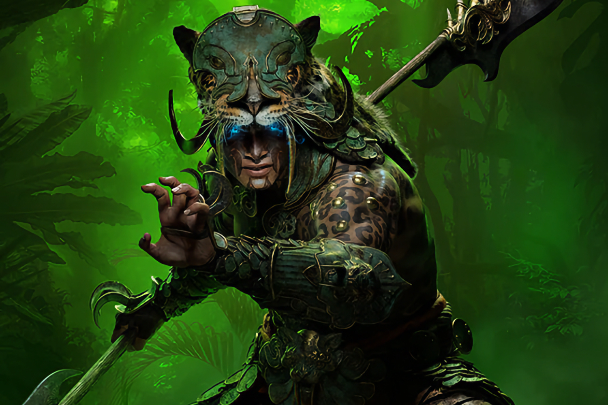

+++
title = "Diablo IV : la nouvelle classe sacresprit a la classe"
date = 2024-07-19T08:00:32+01:00
draft = false
author = "Mickael"
tags = ["Trailer"]
image = "https://nostick.fr/articles/vignettes/juillet/diablo-4-sacresprit.jpg"
+++

Pour la première classe inédite en 10 ans, les petits gars de *Diablo IV* se devaient de faire les choses bien. Et tout à porte à croire qu'ils n'ont pas loupé le coche ! La nouvelle classe sacresprit annonce du lourd, et pas seulement parce qu'il faudra acheter l'extension « Vessel of Hatred » pour en profiter. 

La classe sacresprit s'articule autour de quatre Esprits Gardiens, qui sont autant d'animaux sacrés offrant chacun des pouvoirs spécifiques. Le jaguar provoque des dégâts enflammés et un gain de rapidité ; l'aigle balance des éclairs et réduit le temps de recharge de l'esquive ; le gorille améliore la défense et les dommages physiques ; le mille-pattes empoisonne les ennemis et améliore la guérison passive.

 

La classe est conçue pour être flexible : on pourra ainsi choisir un esprit principal et lui adjoindre des compétences provenant d'autres esprits. Et si vous ajoutez à cela le loot habituel et les innombrables possibilités de customisation des armes, de leurs affixes, et des capacités, il y a largement de quoi voir venir. Les possibilités de build ont l'air très riches, sans doute trop pour l'embrasser tout d'un coup, mais les joueurs finiront bien par maîtriser leur sacresprit !

Le DLC « [Vessel of Hatred](https://diablo4.blizzard.com/fr-fr/vessel-of-hatred) » ouvrira aussi une toute nouvelle carte, Nahantu, et une nouvelle histoire à la recherche de Neyrelle. Il sera dispo le 8 octobre pour une quarantaine d'euros.