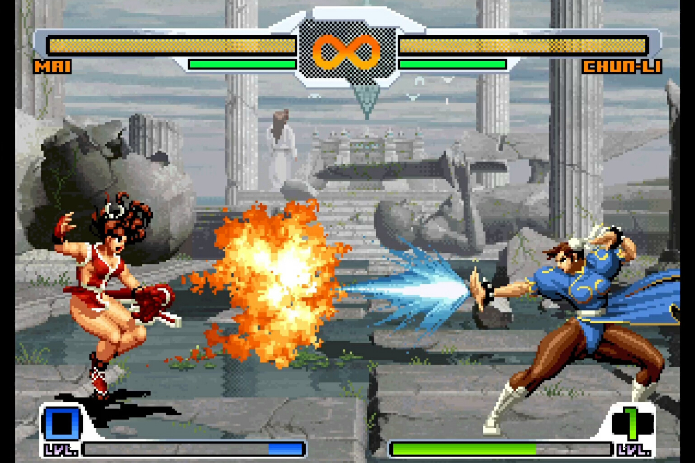

+++
title = "SNK vs. Capcom SVC Chaos : c'est la grande bagarre qui redémarre"
date = 2024-07-20T19:47:32+01:00
draft = false
author = "Mickael"
tags = ["C'est Dispo"]
image = "https://nostick.fr/articles/2024/juillet/2007-snk-vs-capcom-svc-chaos--grande-bagarre/snk-vs-capcom.jpg"
+++

L'EVO, la grande bagarre annuelle entre amateurs de jeux de baston, bat son plein actuellement à Las Vegas et les éditeurs en profitent pour balancer des nouveautés parfois inattendues. Comme SNK, qui vient de mettre en ligne sur Steam *SNK vs. Capcom SVC Chaos* ([20 balles](https://store.steampowered.com/app/2442380/SNK_VS_CAPCOM_SVC_CHAOS/)) ! La version PS4 et Switch[^1] arrivera le 22 juillet, ainsi que sur GOG.

Ce titre sorti en 2003 sur Neo Geo fait partie de la famille élargie des jeux de bagarre opposant les petits gars de Capcom aux combattants d'autres univers. Développé par SNK (et pas par Capcom), *SVC Chaos* est le troisième volet dans la série, et le deuxième développé par le studio nippon, le premier ayant été *SNK vs. Capcom: The Match of the Millennium*… sur la Neo Geo Pocket Color !

 

Le jeu compte un roaster impressionnant de 36 combattants piochés chez *Street Fighter*, *The King of Fighters*, *Mega Man*, *Darkstalkers*… Le portage intègre aussi les deux persos secrets de la borne d'arcade, la très peu vêtue Athena et Red Arremer, qui pour le coup sont jouables immédiatement. Et bien sûr, le jeu multi avec rollback est de la partie. Il y a même un système d'affichage des hitbox pour savoir où frapper précisément.

Il ne reste plus qu'à connaitre la date de lancement de la compile *Marvel vs Capcom Fighting Collection Arcade Classics* pour que notre bonheur soit complet. Allez Capcom !

[^1]: Et toujours que dalle pour la Xbox, [va falloir prendre l'habitude](https://nostick.fr/articles/2024/juin/2006-capcom--moteur-porter-marvel-vs-capcom-xbox/) !