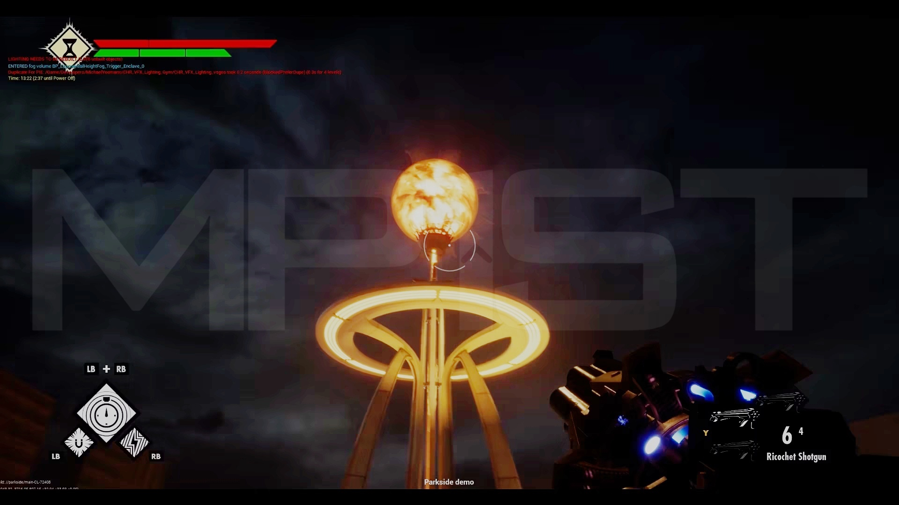
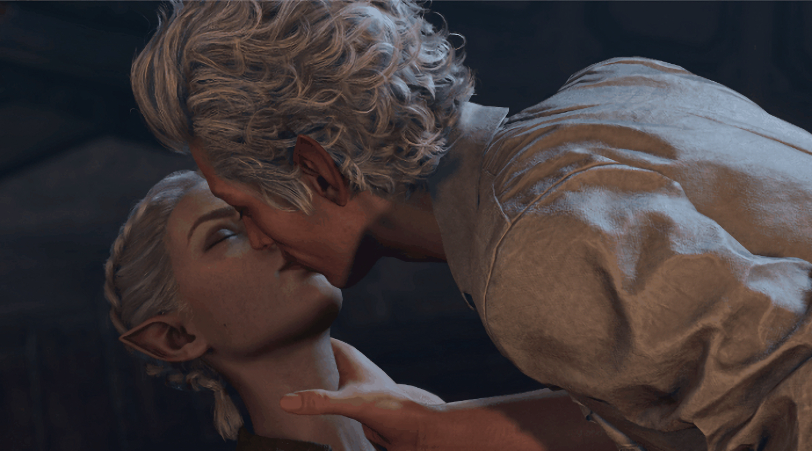
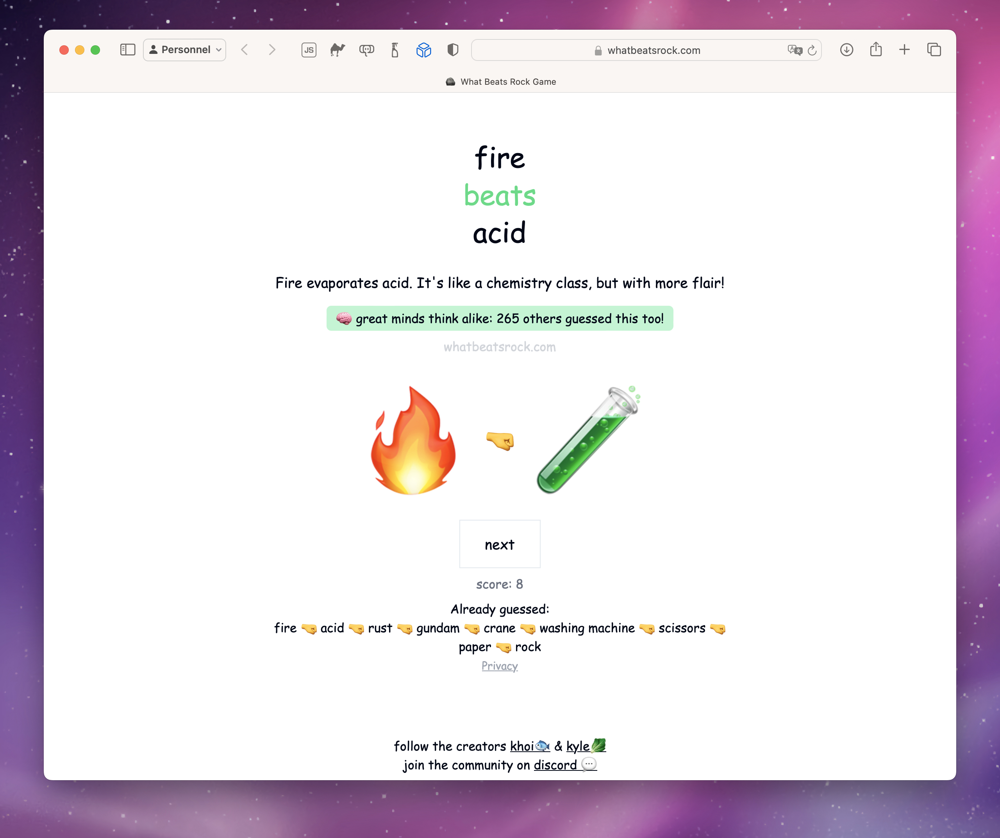

+++
title = "On vide le backlog de la semaine : BioShock 4, Baldur's Gate 3, Resident Evil 7…"
date = 2024-07-20T07:15:32+01:00
draft = false
author = "Mickael"
tags = ["XXL"]
image = "https://nostick.fr/articles/vignettes/juillet/halo-tv-show.jpg"
+++

L’actualité du jeu vidéo ne s’arrête pas à la poignée d’articles publiés sur *Nostick* ! Histoire de rattraper le retard accumulé, voici un retour rapide sur quelques unes des infos les plus importantes (ou insignifiantes) de la semaine.

## L'image de la semaine : BioShock 4

On n'est pas près de mettre les mains sur *Bioshock 4*, vu que le studio Cloud Chamber en est toujours à [recruter des développeurs et des artistes](https://nostick.fr/articles/2024/juillet/0907-bioshock-4-recrute-tour-de-bras/). Mais une image [publiée](https://mp1st.com/news/report-bioshock-4-screenshot-surfaces-giving-us-look-early-look-at-ui-shotgun-and-more) par *MP1ST*, et provenant a priori d'une vidéo de travail appartenant à un artiste de 2K (maison mère de Cloud Chamber) donne un tout petit peu de grain à moudre.

Selon le site, l'image est tirée d'une démo de « Parkside » datant de 2021. Parkside, c'est aussi le nom de code du jeu tel qu'il a été révélé fin 2021. Le titre en lui-même avait été annoncé deux ans plus tôt, ce qui commence à faire un peu long, surtout que 2K n'a donné absolument aucun détail depuis. L'image en elle-même n'est pas très riche en indiscrétions, si ce n'est que les visuels semblent prometteurs.

*Bioshock 4* se déroulerait dans une cité en Antarctique durant les années 60. À part ça, on peut s'attendre à ce que cet opus ait des liens avec les trois autres volets, mais ça ne va pas tellement plus loin.

## Ça fait envie : Baldur's Gate 3

Le patch 7 de *Baldur's Gate 3* déboulera en septembre, les joueurs-aventuriers sont sur le qui-vive car Larian a bourré la mise à jour de contenus et de nouveautés. Il y a d'abord les outils de modding pour faire du jeu tout ce qui nous passe par la tête (je vous vois 👀 les coquinous), mais ce n'est pas tout.

Le studio [annonce](https://store.steampowered.com/news/app/1086940/view/4240783699885624491) aussi un mode split screen dynamique qui permettra à deux joueurs en coop de se retrouver sur le même écran quand ils sont côte à côte ; de nouvelles cinématiques ont été ajoutées pour les joueurs ayant choisi le chemin primesautier du Dark Urge ; des améliorations pour les animations faciales des personnages quand ils s'embrassent (c'est important !)…

La liste des changements et des améliorations est absolument démente, et donc à tout ça s'ajoute la boîte à outils pour modeler *BG3* à son image. Et contrairement à ce que Larian avait laissé supposer, le patch 7 ne sera pas la fin du support officiel : « *nous avons encore des choses dans notre chapeau, dont beaucoup de fonctions réclamées par la communauté comme le cosplay et un mode photo* » (enfin !).

## Ça fait pas super envie : les prix des remakes Nintendo

Ce n'est pas la première fois et probablement pas la dernière qu'on râle sur les prix pratiqués par Nintendo, mais à l'occasion de [la présentation cette semaine d'*Emio – L’Homme au sourire*](https://nostick.fr/articles/2024/juillet/1707-emio-lhomme-au-sourire/), troisième volet inattendu de la saga *Famicom Detective Club*, on s'est rappelé que les remakes Switch des deux précédents opus étaient vendus dans un pack vendu la bagatelle de 60 €.

Alors certes, il y a eu un boulot de nettoyage et de remise au goût du jour. Mais 60 balles pour deux jeux NES sortis en 1988 et archi-rentabilisés depuis 36 ans, c'est un peu fort de café ! Et malheureusement, Nintendo a bien senti que la fibre nostalgique pouvait rapporter gros : les remakes de *Luigi's Mansion 2 HD*, *Paper Mario : La Porte Millénaire*,  *Another Code: Recollection* ou encore *Super Mario RPG* n'ont pas tellement plus à offrir que leurs versions originales, si ce n'est des graphismes au goût du jour et une jouabilité optimisée pour la Switch. Et pourtant, Nintendo les facture plein pot…

L'entreprise a parfois des petites gênes, comme pour *Mario vs. Donkey Kong* ou *Pikmin 1 + 2* vendus 50 €, ce qui reste cher payé. On a pourtant cru que Nintendo avait trouvé le bon équilibre avec *Metroid Prime Remastered*, un remaster grandiose d'un jeu d'exception, vendu 40 € « seulement ». On ne sait pas ce qui était passé par la tête du constructeur, mais en tout cas il s'est probablement dit que ce n'était [pas assez cher, mon fils](https://www.youtube.com/watch?v=ywzTcsnMqrc).

## Le chiffre de la semaine : 2 000

2 000, c'est le nombre de joueurs qui ont dépensé une vingtaine d'euros pour acheter le portage de *Resident Evil 7* sur leurs iPhone, iPad et Mac ! Et *MobileGamer.biz*, qui a [analysé](https://mobilegamer.biz/under-2000-people-have-paid-to-play-resident-evil-7-on-ios-estimates-say/) les chiffres de vente depuis le lancement du jeu le 2 juillet, précise que cette estimation est « *généreuse* »… Capcom aurait gagné la somme mirobolante de 28 140 $, et c'est sans compter la commission de 30 % empochée par Apple.

 

Les résultats de *RE7* ne font que confirmer la stratégie mal embouchée d'Apple sur les jeux AAA pour ses appareils : ça ne marche pas, [ni pour Capcom, ni pour Ubisoft, ni pour personne](https://nostick.fr/articles/2024/juin/2606-gros-jeux-iphone-strategie-apple-flop/). À part peut-être Apple, qui peut parader pendant les keynotes avec de gros jeux sous le bras (et continuer à signer des chèques pour que les éditeurs continuent de faire le boulot de portage).

À la décharge de *RE7*, le jeu n'est pas non plus tout récent puisqu'il est sorti en 2017, et qu'il est vendu sur l'App Store plus cher que les autres versions (pas sûr qu'un prix plus bas aurait aidé, cela dit). Et puis pour y jouer dans de bonnes conditions, il faut un iPhone 15 Pro ou 15 Pro Max, ou encore un iPad ou un Mac équipé d'une puce M1. Sans oublier une manette…

Le prochain rendez-vous va être intéressant à suivre, puisque *Assassin’s Creed Shadows* est prévu sur Mac et iPad (mais pas sur iPhone) en même temps que les autres plateformes, le 15 novembre.

## On n'a pas eu le temps cette semaine mais on pense à eux

 

*Splitgate 2* est prévu l'année prochaine. Suite du FPS sorti en 2019 qui a été un énorme carton à l'époque (plus de 20 millions de copies), ce nouvel opus développé par 1047 Games a été conçu avec l'Unreal Engine 5 en conservant le même principe : un mélange de shoot et de *Portal*. Et le tout s'annonce plutôt sexy !

 

*Forestrike* est le prochain jeu Devolver, et généralement ça suffit pour en faire un hit. Si on veut entrer dans le détail, c'est un jeu de bagarre dans lequel on voit l'avenir avant de taper les méchants, ce qui permet d'anticiper la baston et préparer sa stratégie pour en finir au plus vite. Sortie prévue en 2025.

Pas besoin d'une console ou d'un super PC de la mort pour s'occuper de longues heures. Un simple navigateur web suffit, ouvert sur le site *[What beats rock?](https://www.whatbeatsrock.com)*. C'est un chifoumi qui dérape très vite dans le portnawak : après avoir épuisé les solutions pierre papier ciseaux, il va falloir trouver autre chose. Et ça peut aller assez loin dans le délire…

## osef

Paramount+ a [annulé](https://deadline.com/2024/07/halo-canceled-paramount-plus-1236014917/) la série télé *Halo* après deux saisons nulles.

## Dans le reste de l'actu déchaînée

- Nintendo file décidément un mauvais coton : non seulement le constructeur ne donne plus les noms des studios responsables de ses jeux *first party*, mais en plus il « oublie » de remercier les traducteurs freelance qui participent de son succès partout dans le monde. [C'est mal, Nintendo !](https://nostick.fr/articles/2024/juillet/1507-nintendo-tradcteur-ombre/)
- Toujours à la pointe de l'actualité, *Nostick* vous a proposé un test de *Suicide Squad: Kill the Justice League*. Et sans surprise, c'est quand même pas super bien même si tout n'est pas à jeter. [C'est à lire par ici.](https://nostick.fr/articles/2024/juillet/1507-test-suicide-squad-kill-the-justice-league/)
- Les récompenses pour *Baldur's Gate 3* sont tellement nombreuses que les cérémonies perturbent le bon fonctionnement de Larian ! [Un problème de riche à découvrir par là.](https://nostick.fr/articles/2024/juillet/1607-larian-recompenses-baldurs-gate-3/)
- Les joueurs nostalgiques de l'ère bénie de la GameCube pourront relancer une petite partie de leurs jeux préférés : de nouveaux succès sont en effet à décrocher grâce à l'émulateur Dolphin. [Petit shoot rétro dans cette actu.](https://nostick.fr/articles/2024/juillet/1607-emulateur-dolphin-trophees-jeux-gamecube/)
- Ça fait mal à entendre, mais il faut se préparer au pire : il n'y aura probablement pas de Cash Bandicoot 5 ! Mais comment donc et pourquoi ça ? [Début de réponse par ici.](https://nostick.fr/articles/2024/juillet/1607-crash-bandicoot-5-annule/)
- Si les gachas c'est votre truc, alors *Neverness to Everness* ne s'annonce pas si mal ! [Premier trailer à voir dans cette actu.](https://nostick.fr/articles/2024/juillet/1607-gacha-chinois-gta/)
- Microsoft glisse de plus en plus la Xbox sous le tapis pour mieux faire la promo du Game Pass. [Illustration encore une fois par ici.](https://nostick.fr/articles/2024/juillet/1707-xbox-probleme/)
- Le développement de *The Witcher 4* avance, mais ça ne veut pas dire pour autant qu'on pourra bientôt retrouver l'ami Geralt au pays des streams. [Et pour savoir pourquoi, direction cette actu.](https://nostick.fr/articles/2024/juillet/1704-pas-demain-la-veille-quon-pourra-jouer-a-the-witcher/)
- Ouf ! Tous les joueurs pourront accéder à la bêta du multi de *Call of Duty: Black Ops 6*, ce qui était jusqu'à présent réservé aux joueurs PlayStation. [Plus d'infos par ici.](https://nostick.fr/articles/2024/juillet/1707-call-of-duty-black-ops-6-beta-multi/)
- Délicatement galbée, le cul de cette manette Xbox édition spéciale *Deadpool* attire l'œil et les mains baladeuses. [Ça se voit par là.](https://nostick.fr/articles/2024/juillet/1707-xbox-deadpool/)
- *Metal Slug Tactics* sera le jeu de cet automne à n'en point douter. Vous serez convaincu vous aussi [en cliquant par ici.](https://nostick.fr/articles/2024/juillet/1807-metal-slug-tactics-heritage-snk/)
- Nintendo a pris 7 ans et demi pour lancer l'accessoire ultime pour la Switch. [Mieux vaut tard que jamais.](https://nostick.fr/articles/2024/juillet/1807-nintendo-accessoire-joy-con/)
- *No Man's Sky* ne cesse de s'améliorer gratuitement, et la dernière mise à jour le confirme encore une fois. [La tête dans l'espace, c'est par là.](https://nostick.fr/articles/2024/juillet/1807-temps-est-bon-ciel-est-bleu-nms/)
- Une nouvelle classe dans *Diablo*, ça n'arrive pas tous les jours. Pour l'occasion, Blizzard a mis le paquet avec la classe sacresprit [à découvrir par là](https://nostick.fr/articles/2024/juillet/1907-diablo-4-sacresprit-classe/).
- La crise économique, le fascisme rampant, le réchauffement climatique… Pas facile de vivre au milieu de tout ça. Heureusement, il y a les jeux vidéo et il s'en est beaucoup vendu au premier semestre en Europe ! [La preuve par ici.](https://nostick.fr/articles/2024/juillet/1907-80-millions-jeux-vendus-europe/)