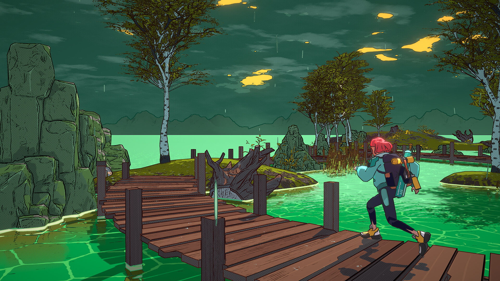
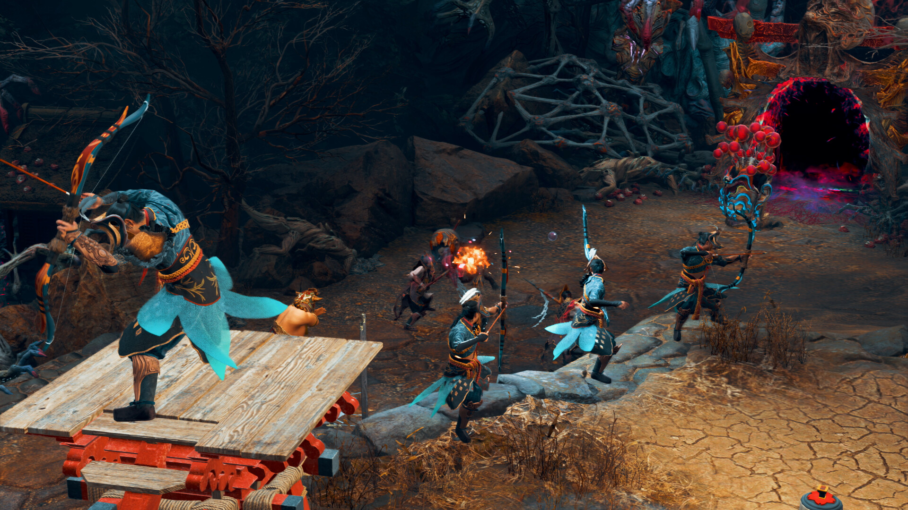

+++
title = "Dungeons of Hinterberg, Kunitsu-Gami - Path of the Goddess : le récap des sorties de la semaine (21/07)"
date = 2024-07-21T08:00:01+01:00
draft = false
author = "Félix"
tags = ["C’est dispo"]
image = "https://nostick.fr/articles/2024/juillet/2107-dungeons-of-hinterberg-kunitsu/rando.jpg"
+++

Entre le boulot, les courses et les derniers préparatifs pour cette semaine de vacances à Palavas (vous êtes juilletiste de père en fils), vous n’avez peut-être pas eu le temps de vous intéresser aux nouveautés du moment. Qu’à cela ne tienne : voici les sorties de ces derniers jours qui ont retenu notre attention.

## Donjons et flocons

Cette semaine est sorti le visiblement très sympathique ***Dungeons of Hinterberg***, qui a globalement réussi à convaincre la critique. On y incarne une jeune avocate en burnout qui part se ressourcer dans un village perdu des Alpes. Au programme : snowboard et tyrolienne dans les montagnes le matin, exploration de donjons l’après-midi et discussions avec les gens du hameau le soir, le tout avec de jolis graphismes en cell-shading. Les puzzles semblent sympas, les combats satisfaisants et le côté social suffisamment bien écrit pour que les dialogues ne tournent pas à la corvée. À tester si le [trailer](https://www.youtube.com/watch?v=Gpe3C_INDuY) vous intrigue, ça a l’air mignon tout plein et parfait pour décompresser après une journée de boulot. 30 € sur [Steam](https://store.steampowered.com/app/1983260/Dungeons_of_Hinterberg/), aussi dispo sur Xbox et via le Game Pass.

## Marche à l'ombre

On a aussi vu arriver cette semaine le très joli ***SCHiM***, sur lequel je m’étais enthousiasmé [il y a déjà 3 mois](https://nostick.fr/articles/2024/avril/schim-passera-de-lombre-a-la-lumiere-le-18-juillet/), bon sang que le temps passe vite. Il s’agit d’un jeu de plateforme relax dans lequel on incarne une sorte de grenouille dans des environnements urbains au style dessin animé. Votre personnage ne peut se déplacer que dans l’ombre des éléments du niveau (voitures, passants, mobiliers…), et il faut donc trouver un moyen de progresser : faire bouger un objet, créer un embouteillage pour remonter une rangée de voitures, etc. Le jeu a un aspect puzzle-game qui n’a pas totalement convaincu les testeurs, regrettant un côté répétitif passé l’émerveillement des débuts. Au vu du tarif musclé de 25 € [sur Steam](https://store.steampowered.com/app/1519710/SCHiM/), on va patiemment attendre une promo. D’ici là  vous pouvez tester la démo histoire de voir ce que ça vaut.



## La salsa du démon

Si je vous dit que le nouveau jeu de Capcom s’appelle ***Kunitsu-Gami: Path of the Goddess***, vous imaginez : un jeu d’aventure à la *Okami* ? Un *souls* asiatique ? Un énième RPG nippon ni mauvais ? Perdu ! Il s’agit d’un OVNI mélangeant action et stratégie dans un style semblable au tower-defense qui se rapproche d'un *Brutal Legend*. De ce que j’ai compris, on incarne un guerrier qui doit faire le ménage sur une montagne corrompue habitée par des démons. Cela passe par des séances de gestion le jour histoire de récupérer des ressources et des villageois afin de se défendre des attaques de monstres nocturnes. C’est très tactique étant donné qu’il faut planifier tout un tas de trucs, mais on peut aussi directement contrôler son guerrier pour aller bastonner quelques démons. Le jeu baigne dans une ambiance de mythologie japonaise qui a l’air sexy, bien que le scénario ne soit clairement pas le fort du jeu (la narration est vite mise de côté pour se concentrer sur le gameplay). À voir si ce cocktail très particulier vous intéresse, mais si c’est le cas, les premiers tests sont plutôt bons. Comptez [50 boules](https://store.steampowered.com/app/2510710/KunitsuGami_Path_of_the_Goddess/) sur PC (une démo est [dispo](https://store.steampowered.com/app/2842890/KunitsuGami_Path_of_the_Goddess__Demo/)), sachant que c’est aussi dispo via le Gamepass et sur consoles.

## Dans de Bō draps

Vous avez retourné l’excellent *[Nine Sols](https://nostickreloaded.substack.com/i/145196909/entre-tradition-et-modernite)* et êtes en manque de metroidvania avec un petit renard qui dégomme des monstres dans de jolis décors asiatiques dessinés à la main ? Peut-être devriez-vous vous pencher sur ***Bō: Path of the Teal Lotus***, qui a exactement le même concept. Comme d’hab on va explorer une grosse carte en 2D pour débloquer des objets permettant d’accéder à de plus en plus d’endroits. L’ambiance japonaise est visiblement très réussie, le jeu s’appuyant sur le folklore de l’archipel pour ses différents mondes et personnages. Les tests décrivent un titre qui ne cherche pas à réinventer la roue et qui ne mise pas sur une difficulté trop élevée, ce qui pourrait vous intéresser si *Nine Sols* vous avait largué (c’est mon cas). À essayer si vous n’avez pas fait une overdose de metroidvania ces dernières semaines, d’autant plus que c’est vendu seulement 20 € sur [PC](https://store.steampowered.com/app/1614440/Bo_Path_of_the_Teal_Lotus/) comme sur consoles et Switch. 



## Les autres trucs chouettes de la semaine

On a eu de quoi faire ces jours-ci. Le sympathique studio Annapurna Interactive a lancé ***Flock***, son étrange jeu multi où chaque joueur incarne un « berger volant » en charge d’un troupeau de créatures cheloues. C’est conceptuel et vendu 20 € [sur Steam](https://store.steampowered.com/app/1472930/Flock/) et consoles, mais si vous cherchez un jeu chill dans la même veine que *Journey* ça devrait faire le taf. **Gestalt: Steam & Cinder** est un petit metroidvania très joli qui pourra visiblement vous occuper une dizaine d’heures [pour 20 €](https://store.steampowered.com/app/1231990/Gestalt_Steam__Cinder/). Apparemment c’est pas le GOTY mais si vous êtes client du genre c'est pas une mauvaise pioche. Sur Switch, Nintendo a sorti sa compilation ***[World Championships: NES Edition](https://www.nintendo.com/fr-fr/Jeux/Jeux-Nintendo-Switch/Nintendo-World-Championships-NES-Edition-2569575.html)*** dans laquelle il faut speedruner un paquet de jeu NES : sympa, mais je sais pas si c’est 30 € sympa. Terminons en évoquant ***Nobody Wants to Die***, un polar dans un futur dystopique qui a l’air pas mal du tout avec une bonne atmosphère cyberpunk et des graphismes à l’Unreal Engine 5. Si vous cherchez un jeu de détective dans une ambiance *Blade Runner* qui dure cinq-six heure c’est parfait, d’autant plus que c’est pas très cher ([25 balles](https://store.steampowered.com/app/1939970/Nobody_Wants_to_Die/) sur PC et consoles).