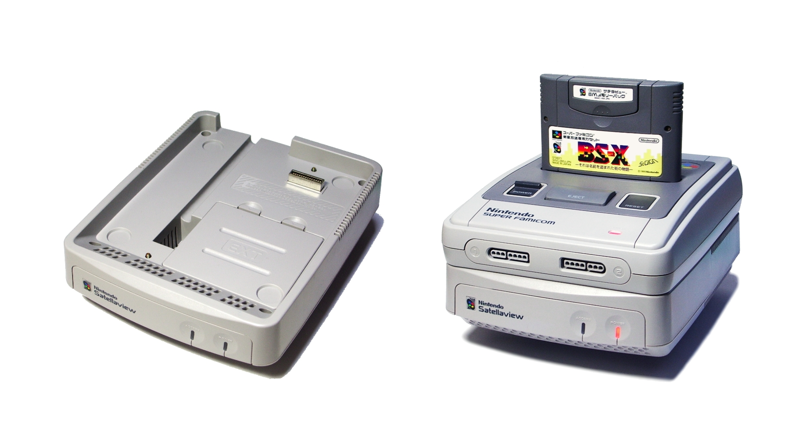
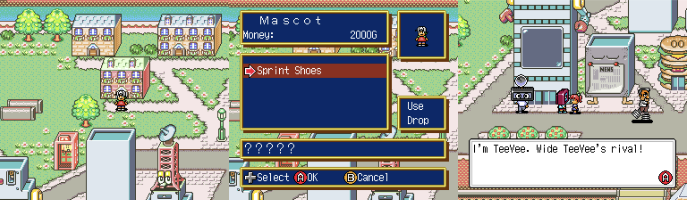
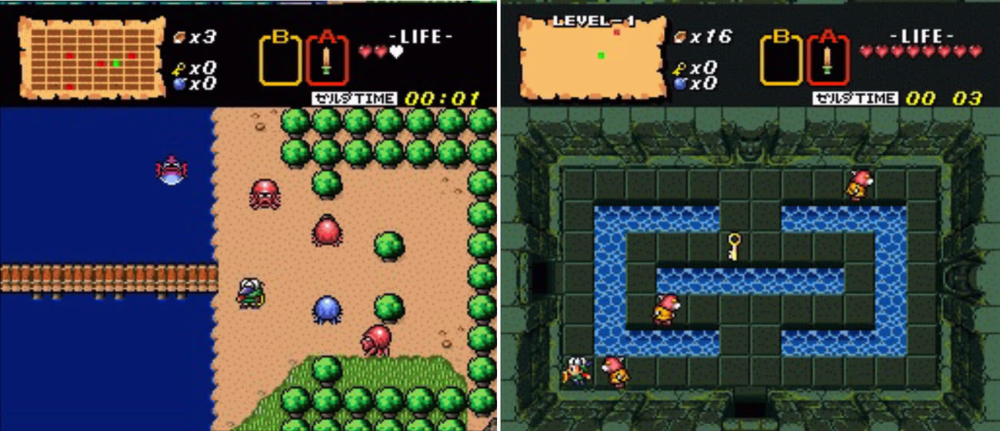
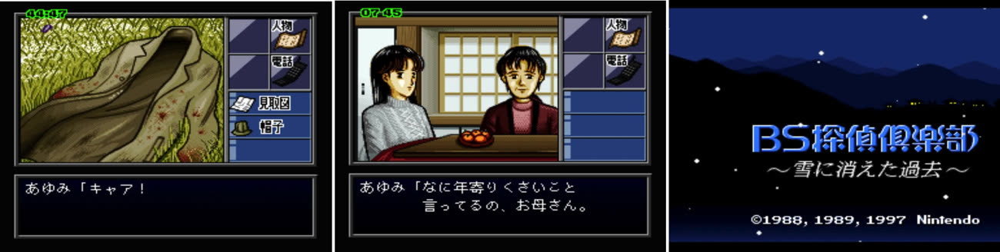
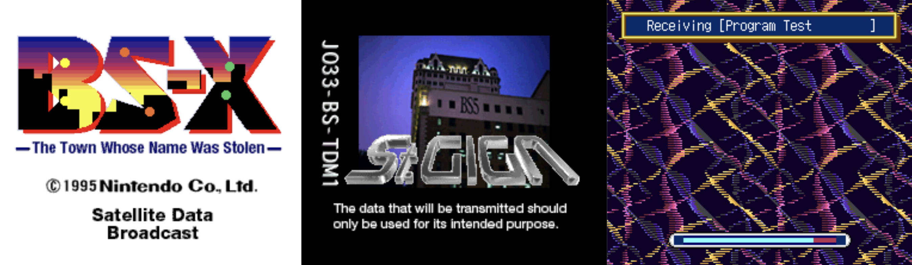

+++
title = "Satellaview : la console par satellite oubliée de Nintendo"
date = 2024-07-22T10:00:01+01:00
draft = false
author = "Félix"
tags = ["XXL"]
type = "une"
image = "https://nostick.fr/articles/2024/2207-sattelaview-console-oubliee-nintendo/Satellaview.png"
+++ 

Il y a peu, Nintendo a [annoncé](https://nostick.fr/articles/2024/juillet/1707-emio-lhomme-au-sourire/) un troisième opus à sa sympathique saga *Famicom Detective Club*. Le créateur de la série Yoshio Sakamoto a expliqué à l’occasion d’une interview promotionnelle qu’il s’agissait du « *premier nouveau jeu de la série depuis 30 ans* »… ce qui est faux : il y a déjà eu un troisième opus sur Satellaview, une console sortie à la fin des années 90 au Japon que Nintendo semble avoir complètement oubliée. Petite rétrospective sur cette machine au concept novateur qui permettait de télécharger des jeux par satellite sur laquelle ont été proposés des *Zelda* et *Super Mario* introuvables aujourd'hui. 

Tout commence en 1993 alors que Nintendo décide d’investir dans St.Giga, une entreprise japonaise spécialisée dans la diffusion radio par satellite. Son idée ? Lancer un accessoire via lequel les propriétaires de SNES pourraient télécharger des jeux, la technologie s’appuyant sur le réseau en place de St.Giga. Ainsi est née la Satellaview, qui n’est donc pas une console à proprement parler mais plutôt une sorte de gros modem venant se clipser sous la SNES. Il ajoutait 1 Mo d'espace de stockage et 512 Ko de RAM, en plus de fournir le nécessaire pour une connexion satellite.



Le GamePass avant l’heure ? Pas loin ! Au détail près que tout était gratuit une fois la Satellaview achetée, Nintendo n’ayant pas mis en place de système d’abonnement. Dans le carton était inclus une cartouche deux-en-un : la première venait s’insérer normalement dans la Super Nintendo tandis que la seconde était une sorte de carte mémoire réinscriptible sur laquelle venait se télécharger les jeux et données diffusées par le service. Dans l’idée, c’est un peu comme un linker DS avec sa carte SD.

Lancer la cartouche de base (appelée « BS-X ») faisait apparaître le joueur dans une espèce de grosse ville à la *Pokémon* remplie de PNJ à qui on pouvait parler pour essayer de résoudre un mystère global, à savoir retrouver le nom de la ville. Il n’y avait pas de combat et tout tournait autour des dialogues, le créateur du jeu ayant expliqué chercher à émuler l’ambiance de la série *Twin Peaks* qui cartonnait à l’époque.

Cette ville était prétexte à donner vie à une sorte de menu principal pour la Satellaview. Les différents immeubles pouvaient être visités, permettant de télécharger différents médias : un musée avec d’anciens jeux vidéo, un bâtiment des stars pour suivre l'actu des *idols*, une zone d’évènement spécial… Le joueur disposait de sa propre maison pour sauvegarder, et l’intrigue avançait surtout en papotant à droite à gauche. L’idée était de modifier l’histoire au fil de l’évolution du service, mais d’après les témoignages, le fil principal n’a jamais obtenu de conclusion et a même été redémarré en cours de route.

En plus de ça, les propriétaires de Satellaview pouvaient télécharger des jeux ! Et pas de petits titres, mais des noms connus comme Zelda ou Mario. On y trouvait notamment une version revisitée du premier *The Legend of Zelda*, dans laquelle le joueur incarnait son avatar de BS-X. Il y a également eu plusieurs jeux *F-Zero* ainsi qu'une suite à *Super Mario Bros. 2* appelée *BS Super Mario USA*. Plusieurs développeurs tiers comme Squaresoft, ASCII ou Chunsoft ont aussi lancé des jeux pour la plateforme. S'il y a eu pas mal de remakes et de versions revues d'autres jeux (*BS Super Mario USA* se base sur les niveaux de *SMB2* avec un nouveau scénario), il y a aussi eu de nombreux titres originaux.

Certains jeux étaient proposés en version « Soudlink », c'est à dire en direct avec un véritable doublage : les joueurs devaient s’organiser pour être devant la TV au bon moment pour en profiter. C’est comme cela qu’a été diffusé le troisième opus de Famicom Detective Club. En pratique, le joueur avait quelques moments de liberté pour enquêter, mais suivait globalement une histoire sur rail qui avançait toute seule afin que les dialogues restent synchro avec le flux satellite.

Nintendo a bien soutenu la Satellaview pendant 3 ans avant de jeter l’éponge en 1998, la situation financière de St.Giga n’étant pas au beau fixe tandis que l’entreprise n’avait  pas réussi à obtenir une licence gouvernementale de diffusion numérique par satellite. Big N a arrêté de fournir des jeux en 1999, et le service s’est éteint à l’été 2000 après avoir misé pendant quelques mois sur des rediffusions. 

L’archivage de jeux Satellaview est particulièrement compliqué : certains titres bénéficiaient d'une partie audio diffusée par satellite, impossible à préserver mis à part si un joueur de l’époque l’a enregistré en bonne qualité. Les jeux standards sont finalement des jeux SNES classiques, mais encore faut-il les trouver. La carte mémoire de la Satellaview était régulièrement effacée pour laisser place à de nouveaux jeux, et le seul espoir des amateurs est donc de mettre la main sur une cartouche d’époque contenant un titre n’ayant pas encore été archivé. 

Si vous voulez essayer par vous-même, [le BS-X Project](https://project.satellaview.org/bsx_what.htm) est une initiative de fans pour recréer le menu-RPG de la cartouche de base du Satellaview en anglais. L'émulation pure et dure peut demander un peu de bidouille pour les ROM n’ayant pas été patchées par des fans, d’autant plus que certaines ROM brutes ne fonctionnent pas. La console n’étant jamais sortie du Japon, la barrière de la langue va vite se manifester mis à part sur les quelques titres ayant été traduits par des fans. 

Si vous voulez creuser le sujet, la plupart des informations de cet article viennent [d’une chouette rétrospective](https://www.timeextension.com/features/the-incredible-story-of-satellaview-nintendos-satellite-modem-snes-add-on) du site TimeExtension, qui contient également des extraits de magazine de l’époque et des bouts d’interview. Nintendo Dojo a [une grosse série](https://www.nintendojo.fr/articles/editos/satellaview-bs-the-legend-of-zelda-ancient-stone-tablets) sur le sujet en français avec [des tutos](https://www.nintendojo.fr/articles/editos/satellaview-comment-y-rejouer-aujourdhui) sur comment émuler tout cela en 2024. Le site français GameForever [a dédié un article](https://www.gameforever.fr/bszelda.php) aux Zelda de la Satellaview. Et Nintendo ? Mis à part un remake [d'un jeu](https://en.wikipedia.org/wiki/Fire_Emblem%3A_Mystery_of_the_Emblem) *Fire Emblem* sur DS en 2011, l'entreprise ne mentionne quasiment jamais la console. Peut être qu'elle s'en fiche, peut être qu'il y a des complications légales à cause des doublages de l'époque réalisés par des personnalités. En attendant que Nintendo ne se décide à ouvrir ses archives, le temps presse pour les archivistes : les cartouches subissent mal le choc des années, et certaines ont déjà commencé à pourrir…

