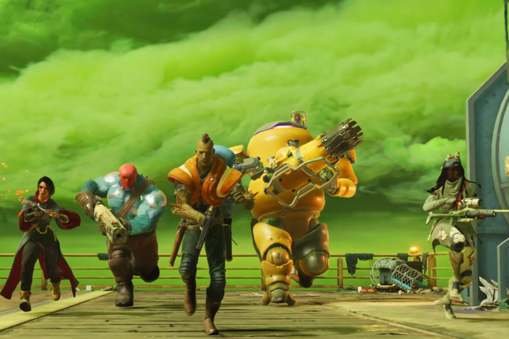
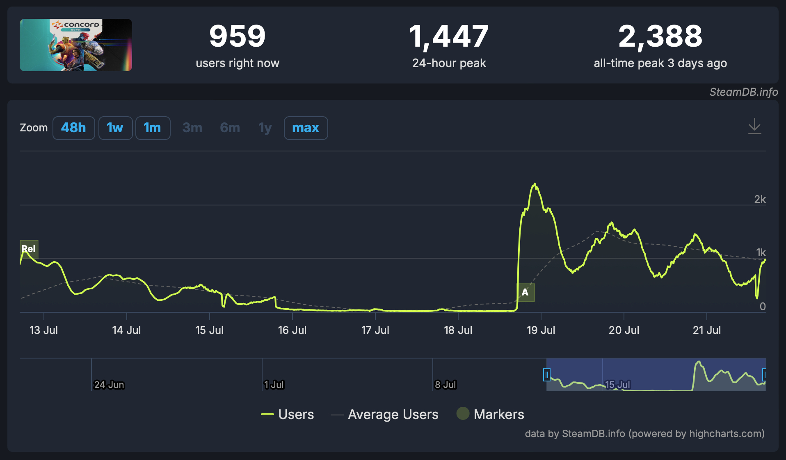

+++
title = "Ça s'annonce compliqué pour Concord"
date = 2024-07-22T08:47:32+01:00
draft = false
author = "Mickael"
tags = ["Actu"]
image = "https://nostick.fr/articles/vignettes/juillet/concord-beta.jpg"
+++

*Concord* ne se présente pas tout à fait comme Sony l'aurait espéré. Le shooter 5v5 était jouable en bêta ouverte et gratuite tout ce week-end, et si on ignore les résultats sur PlayStation, Steam peut nous renseigner sur l'engouement des joueurs PC. Et ça n'est pas spécialement encourageant !

À en croire [SteamDB](https://steamdb.info/app/3011460/charts/), le pic de joueurs connectés s'est élevé à 2 388 après le lancement de la bêta jeudi dernier ; sur les quatre jours de la bêta, la moyenne tournait plutôt sous les 1 000 joueurs. Et les chiffres pour la première bêta fermée (accessible uniquement à ceux ayant préco) n'ont pas été plus glorieux avec un pic à 1 100 joueurs.

Pas top pour cette grosse franchise financée par Sony, qui s'était offert les développeurs du studio Firewalk l'an dernier. Le constructeur a une poignée de semaines pour faire monter la mayonnaise, *Concord* devant sortir le 23 août. Mais disons que ça n'a pas l'air de se présenter sous les meilleurs auspices, vu la manière dont Sony a orchestré le lancement du jeu.

Une partie des fans hardcore de PlayStation n'apprécie pas vraiment le pivot de leur constructeur préféré vers le jeu service, alors que la plateforme a bâti sa domination sur les titres AAA solo avec expérience cinématique. Néanmoins, la réception critique initiale de *Concord* a été relativement positive, et Sony peut toujours espérer un miracle à la *Helldivers 2* qui a rencontré un énorme succès surprise dans un créneau proche.

On en est encore loin et ces deux périodes de bêta tiédasses vont peut-être pousser PlayStation à quelques ajustements. S'il est trop tôt pour parler de report du lancement pour serrer quelques boulons, *Concord* pourrait peut-être revoir son prix à la baisse (actuellement 40 €) au moins pour son lancement, car le risque existe que personne ne veuille acheter un tel jeu alors qu'on peut jouer gratuitement à *Overwatch*…