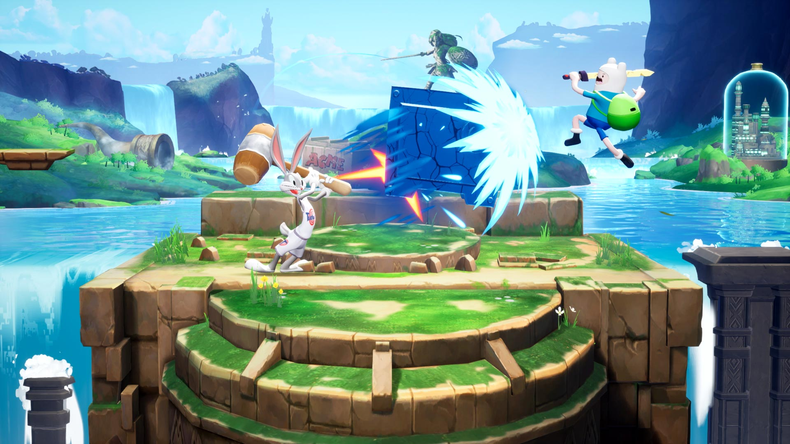

+++
title = "Warner Bros. Games avale le studio à l'origine de MultiVersus"
date = 2024-07-23T08:14:32+01:00
draft = false
author = "Mickael"
tags = ["Actu"]
type = "telex"
+++ 

Je serais Player First Games, je me méfierais un peu du nouveau boss. Le studio à l'origine du jeu de bagarre *MultiVersus* a en effet été [avalé](https://www.businesswire.com/news/home/20240722944100/en/Warner-Bros.-Games-Acquires-Player-First-Games) par Warner Bros. Games, oui, la même boîte qui est en passe de gagner le trophée peu envié de [pire entreprise au monde](https://nostick.fr/articles/2024/mars/warnerbros/). En même temps, cette acquisition avait du sens, sachant que ce clone de *Smash* oppose des personnages célèbres issus des différents univers WB.

Les cofondateurs Tony Huynh et Chris White conservent leurs postes au sein de la structure, ce qui devrait permettre d'éviter le pire (comme WB en a l'habitude) pendant un petit moment. Cette annonce intervient alors que *MultiVersus*, relancé en mai dernier, a droit aujourd'hui à sa saison 2.