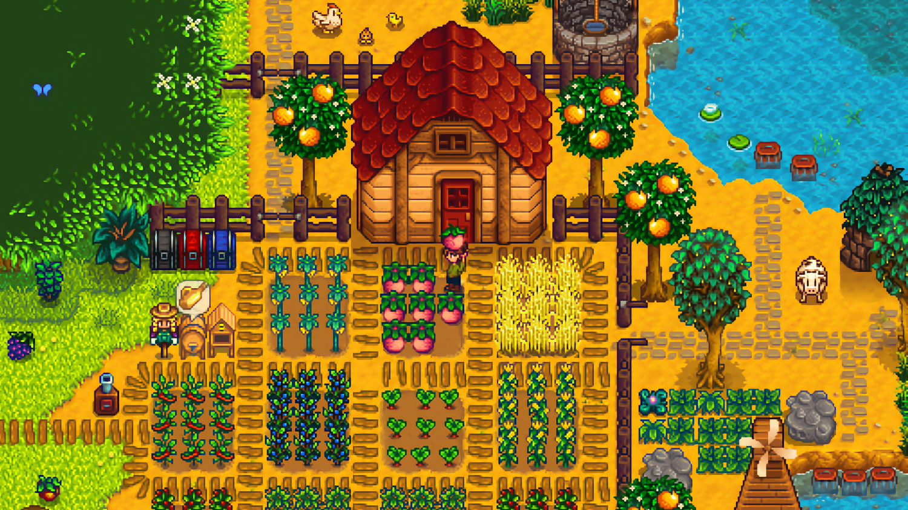

+++
title = "Tous les DLC de Stardew Valley seront gratuits, pour toujours et à jamais"
date = 2024-07-23T17:44:32+01:00
draft = false
author = "Mickael"
tags = ["Actu"]
type = "telex"
+++ 
Croix de bois, croix de fer, si je mens je vais en enfer ! Eric Barone, alias ConcernedApe, le développeur de *Stardew Valley*, a assuré que jamais au grand jamais, il ne ferait payer un DLC ou une mise à jour de son jeu. Jamais ! Et il invite quiconque à faire une capture d'écran de son [message](https://x.com/ConcernedApe/status/1815278461269000401) — sur cette merde de Twitter, malheureusement — pour lui faire honte le jour où il changera d'avis.

*Stardew Valley* a été lancé en 2016, hé oui déjà, et le jeu de gestion/aventures a été mis à jour un nombre incalculable de fois, pour pas un rond de plus. Une nouvelle version 1.6 pour consoles et mobiles est d'ailleurs dans les tuyaux mais toujours en développement.