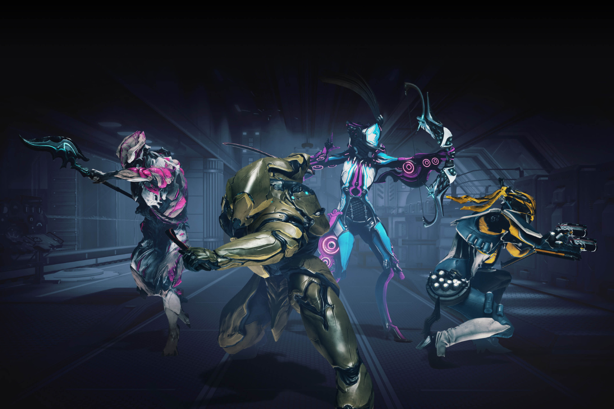

+++
title = "Le cri du cœur du boss de Warfare aux éditeurs de jeux service : n'abandonnez pas trop vite !"
date = 2024-07-23T14:31:32+01:00
draft = false
author = "Mickael"
tags = ["Actu"]
image = "https://nostick.fr/articles/vignettes/juillet/warframe.jpg"
+++

Le paradis du jeu service est jonché des cadavres des titres qui ont échoué à devenir aussi gros que *Fortnite* ou *Overwatch 2*. On ne compte plus les tentatives ratées ces dernières années : qui se rappelle encore de *Knockout City* ? De *Babylon's Fall*, de *Crossfire X* ou encore d'*Anthem* ? Et le même destin attend *Suicide Squad* — en attendant, peut-être, que [le couperet tombe sur le cou délicat de *Concord*](https://nostick.fr/articles/2024/juillet/2207-concord-playstation-flop/), qui sait.

Malgré tout, les éditeurs de free-to-play ont tort de ne pas soutenir leurs jeux service : « *Ils pensent que la sortie est décisive, mais ce n'est pas le cas. Ils ont les moyens financiers pour être persévérants, mais ils ne le sont jamais* », [déplore](https://www.videogameschronicle.com/news/big-publishers-eject-too-soon-from-live-service-titles-says-warframe-boss/) Steve Sinclair, le CEO de Digital Extremes, au site *VGC*. « *Ça sort, ça ne fonctionne pas et ils l'abandonnent* », résume celui qui a lancé *Warframe*.

Il est malheureux de consacrer autant de temps à développer des technologies et à bâtir une communauté, et « *à cause des coûts élevés* », les dirigeants prennent peur et lâchent l'affaire. Des jeux qui ont pourtant un « *potentiel énorme* », mais qui sont abandonnés trop tôt, selon lui. Au delà des pertes financières, ce sont derrière les équipes qui ont planché sur les jeux qui trinquent.

Évidemment, il est plus facile de faire la leçon quand on a soi-même un jeu service qui paie les factures, comme c'est le cas de *Warframe* : le titre sorti en 2013, un des premiers représentants du genre, est devenu une institution avec sa convention annuelle, ses millions de joueurs et ses mises à jour régulières. Néanmoins, il est difficile de lui donner complètement tort : ces jeux sont soutenus par des groupes qui ont les moyens de perdre un peu d'argent avant de trouver la bonne formule.

Les premiers mois de *Sea of Thieves* ou même de *Fortnite* n'ont pas été de tout repos pour Rare et Epic. Et pourtant, ce sont devenus des exemples à suivre pour toute l'industrie.