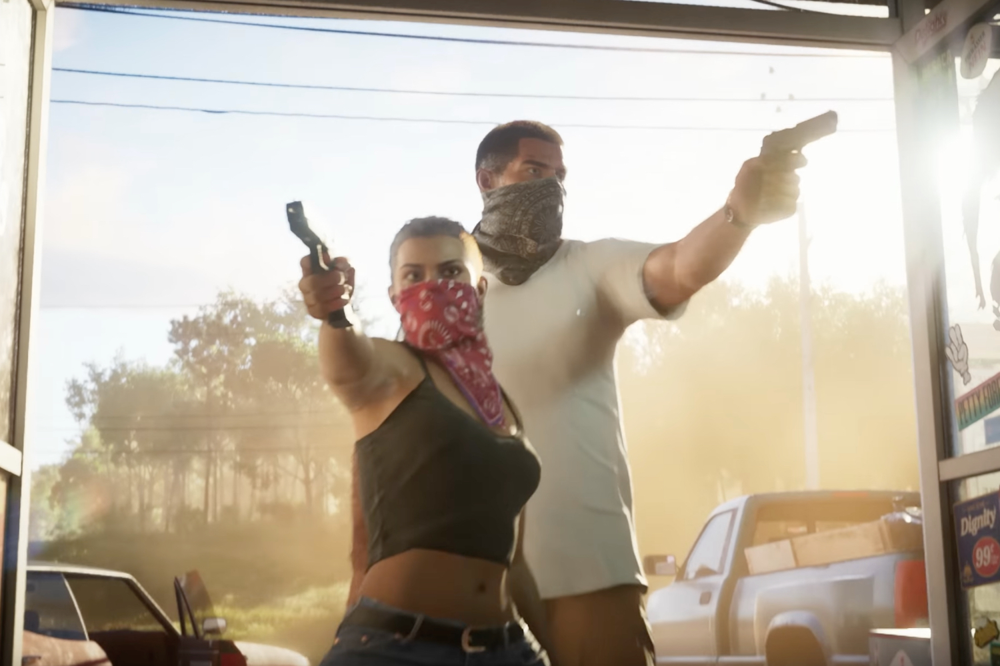

+++
title = "L'éditeur de GTA VI a peur du review bombing"
date = 2024-07-24T08:45:32+01:00
draft = false
author = "Mickael"
tags = ["Actu"]
image = "https://nostick.fr/articles/vignettes/GTA.jpg"
+++

La pratique du review bombing, c'est à dire des joueurs qui se plaignent dans les commentaires de Steam, est une arme à double tranchant. Elle permet aux joueurs de dire à un éditeur, de manière parfois très franche et très crue, qu'il se fiche de leur tronche à cause d'un prix trop élevé, de microtransactions abusives ou encore pour une obligation stupide du genre connexion au PSN obligatoire. [Comme ça a été le cas pour *Helldivers 2*.](https://nostick.fr/articles/2024/mai/0505-sony-fait-plonger-helldivers-2-en-enfer/)

Mais d'un autre côté, c'est aussi la voie royale aux incels et autres déficients du bulbe pour se plaindre qu'un des héros du jeu est gay ou pas dans la norme — pour rester chez PlayStation, *The Last of Us 2* et *Horizon Forbidden West: Burning Shores* ont fait l'objet de telles attaques hors sol.

Mais dans un cas comme dans l'autre, les éditeurs n'aiment pas le review bombing, qui souvent porte sur un aspect anecdotique du jeu, voire totalement exogène, mais qui peut entacher durablement sa réputation… et faire perdre des ventes. Take-Two Interactive, la maison-mère de Rockstar qui se prépare au déferlement *GTA VI*, ne dit pas autre chose dans un document envoyé au gendarme de la Bourse US. Les entreprises cotées, comme c'est le cas ici, sont tenues de décrire aux actionnaires les risques qui pèsent sur leur activité.

« *Obtenir et maintenir des notes élevées pour nos jeux sur les plateformes tierces sur lesquelles nous opérons est important car cela aide à attirer les joueurs vers nos jeux* », [explique](https://www.gamefile.news/p/take-two-review-bombs-gta-nfl-2k) l'éditeur. Une baisse des notes ou « *des critiques négatives* » rendent les jeux « *plus difficiles à trouver ou à recommander* »et entraîner « *une perte de joueurs et de revenus, des coûts publicitaires et marketing supplémentaires, et porter atteinte à notre réputation.* »

Take-Two a déjà essuyé des campagnes de review bombing : le portage de *GTA V* sur la PS5 et Xbox Series S/X avait été abattu en plein vol par des joueurs mécontents de l'absence de nouveautés. La version Switch et PS4 de *Read Dead Redemption* en a pris plein la tronche parce qu'il ne s'agissait pas d'un remaster…
 
Avec [*GTA VI* qui se profile à l'automne 2025](https://nostick.fr/articles/2024/mai/1605-gta-vi-cest-pour-lautomne-2025/), l'éditeur se prépare au pire. Il se trouve déjà des idiots qui ne supportent pas qu'on puisse incarner un personnage féminin, imaginez vous ça…