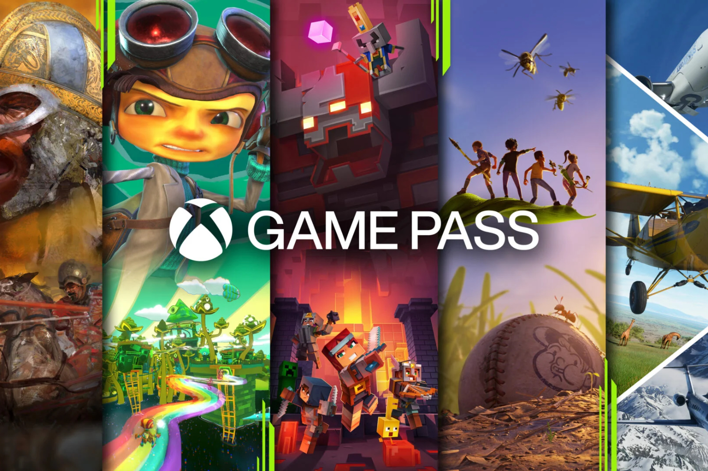

+++
title = "Vous reprendrez bien encore plus de formules différentes du Game Pass"
date = 2024-07-24T12:47:32+01:00
draft = false
author = "Mickael"
tags = ["Actu"]
image = "https://nostick.fr/articles/vignettes/nostick.jpg"
+++

 

Même Microsoft le martèle : [plus besoin de s'embêter avec une Xbox](https://nostick.fr/articles/2024/juillet/1707-xbox-probleme/) pour pouvoir jouer à des jeux Xbox ! Le Xbox Cloud Gaming peut remplacer tout ce bazar, enfin, si vous avez à la maison une bonne connexion Wi-Fi et de quoi faire rouler l'application dédiée (elle est disponible depuis peu pour les Fire TV d'Amazon). Et évidemment, il faut aussi banquer pour un abonnement Ultimate, dont [le prix est passé récemment à 18 € par mois](https://nostick.fr/articles/2024/juillet/0907-game-pass-xbox-bordel-hausse-prix/).

Microsoft pourrait cependant abaisser le coût du ticket à son service de jeux en streaming. Selon des [indiscrétions](https://www.windowscentral.com/gaming/xbox/whats-next-for-xbox-game-pass-tiers-and-return-of-family-plan) de *Windows Central*, l'entreprise travaille à une formule uniquement dédiée au Xbox Cloud Gaming, « *relativement abordable* » (moins de 10 € ?). En plus de l'accès au catalogue du Game Pass, les abonnés pourraient acheter des jeux Xbox qui ne sont pas inclus dans la plateforme, pour pouvoir y jouer en streaming.

Cette fonction, semblable à ce que proposait feu Stadia (ou GeForce Now, dans un sens), serait en développement depuis des années. Tout comme d'autres idées qui traînent dans le grand chapeau de Microsoft, comme une formule « famille » pour le Game Pass ! Testée dans une poignée de pays en 2022 et 2023 au prix de 25 $, cette offre pourrait revenir sur la table à un tarif plus élevé : il avait été considéré comme « *trop généreux* » par les éditeurs.

Enfin, l'hypothèse d'un abonnement Game Pass moins cher financé par la pub ne serait plus dans la boucle, même si Microsoft s'y est intéressé à un moment donné. S'il est toujours bon d'avoir le choix, multiplier les formules achèvera de brouiller complètement l'image du Game Pass qui, à l'origine, partait d'une idée très simple : un « Netflix du jeu » avec en plus des nouveautés disponibles dès le jour de leur sortie.

Entre le Game Pass Core, le Game Pass PC, le Game Pass Ultimate et le futur Game Pass Standard, chacun ayant des prestations bien différentes qui ne se recoupent pas forcément, il y a déjà de quoi y perdre son latin.