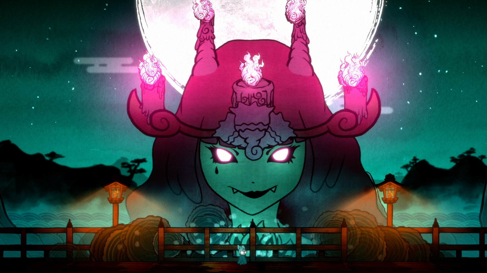

+++
title = "Coup de hache dans les effectifs de Humble Games, pas de changement pour Humble Bundle"
date = 2024-07-24T10:15:32+01:00
draft = false
author = "Mickael"
tags = ["Actu"]
type = "telex"
+++

Nouvelle coupe claire pour l'industrie du jeu vidéo, qui [fauche](https://x.com/sweetpotatoes/status/1815817188286009617) cette fois les effectifs de Humble Games : 36 salariés ont été licenciés du studio qui édite des jeux indépendants. Ziff Davis, la maison mère de l'entreprise, assure qu'il ne s'agit pas d'une fermeture, mais d'une « restructuration » due à des conditions économiques difficiles pour le secteur. Les projets passés et actuels, ainsi que les sorties à venir, ne sont pas touchés par ce coup de hache (mais on se demande bien qui va bien pouvoir les soutenir).

Humble Games compte dans son catalogue des titres comme *Stray Gods*, *Signalis* ou encore le tout récent *Bo: Path of the Teal Lotus*. Et si le nom du studio vous dit quelque chose, c'est parce qu'il est lié à Humble Bundle, le service d'offres groupées de jeux bien connu pour ses promotions et également propriété de Ziff Davies. La restructuration de l'un n'aura pas d'impact sur l'activité de l'autre (enfin, si tout va bien).