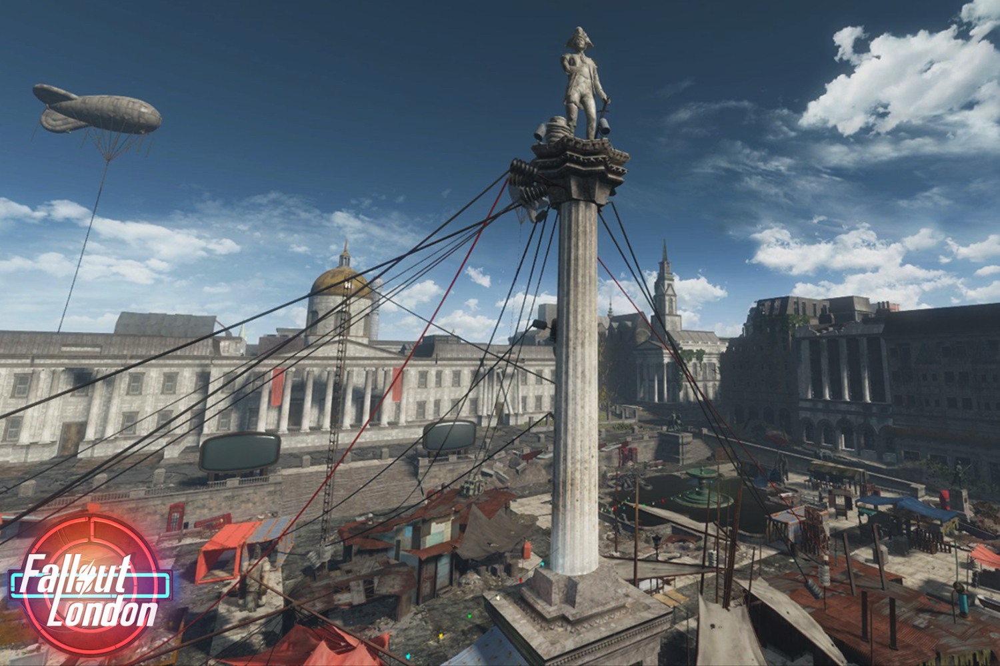

+++
title = "Fallout: London déchaîne enfin l'apocalypse à Londres"
date = 2024-07-25T10:47:32+01:00
draft = false
author = "Mickael"
tags = ["Actu"]
image = "https://nostick.fr/articles/2024/juillet/2507-fallout-london-apocalypse-londres/fallout-london.jpg"
+++

À moins qu'une guerre nucléaire n'anéantisse soudainement l'humanité, c'est aujourd'hui que sort *[Fallout: London](https://fallout4london.com)* ! Ce mod de *Fallout 4*, que l'on pourrait plutôt qualifier d'extension tellement les changements apportés sont énormes, se déroule donc dans un Londres post-apo, dans une histoire qui se déroule en 2237, soit entre les événements de *Fallout 1* et *Fallout 2*.

Le mod, développé par la Team FOLON, est en gestation depuis 2019. Le boulot réalisé est impressionnant : la taille de la map est équivalente à celle de *Fallout 4* ! Après s'être extirpé d'un labo, le joueur devra composer avec les factions qui tentent de contrôler Londres, dans un univers en pleine décomposition. 

 

Et les développeurs ont mis les petits plats dans les grands : il s'agit d'une toute nouvelle quête accompagnée d'une musique originale, avec de nouveaux personnages, des armes inédites, et des voix originales comme celle de Neil Newbon qui a officié dans *Baldur's Gate 3*, et même celle de John Bercow, l'ancien président de la Chambre des communes, équivalent anglais du président du perchoir de l'Assemblée !

Après des années d'attente et plusieurs reports, *Fallout: London* sort donc ce jeudi 25 juillet, comme l'a [confirmé](https://www.inverse.com/gaming/fallout-london-bethesda-mod-tomorrow) le patron du projet, Dean Carter (à moins d'une attaque nucléaire, donc). 

Le jeu aurait dû arriver le 23 avril dernier, mais Bethesda a eu l'idée de mettre en ligne le même jour une mise à jour de *Fallout 4* qui a malheureusement cassé le mod. Il a fallu serrer quelques boulons en urgence, ce qui explique aussi pourquoi *Fallout: London* ne pourra pas s'installer sur la version Steam — à moins de restaurer le jeu dans sa version d'avant la mise à jour… Le plus simple est encore de passer par l'édition GOTY distribuée par [GOG.com](https://www.gog.com/en/game/fallout_4_game_of_the_year_edition).

Quant à savoir quand sortira un nouveau volet de *Fallout* « officiel », la patience est de mise : le grand patron du studio, Todd Howard, a fait savoir que *Fallout 5* ne tombera pas avant *Elder Scrolls VI*, et ce dernier n'est pas prévu avant plusieurs années ! Néanmoins, Microsoft a probablement envie de surfer sur le succès de la série télé : un autre studio maison pourrait plancher sur un nouveau volet de la saga entre temps, comme ça avait été le cas pour *Fallout: New Vegas* développé par Obsidian.