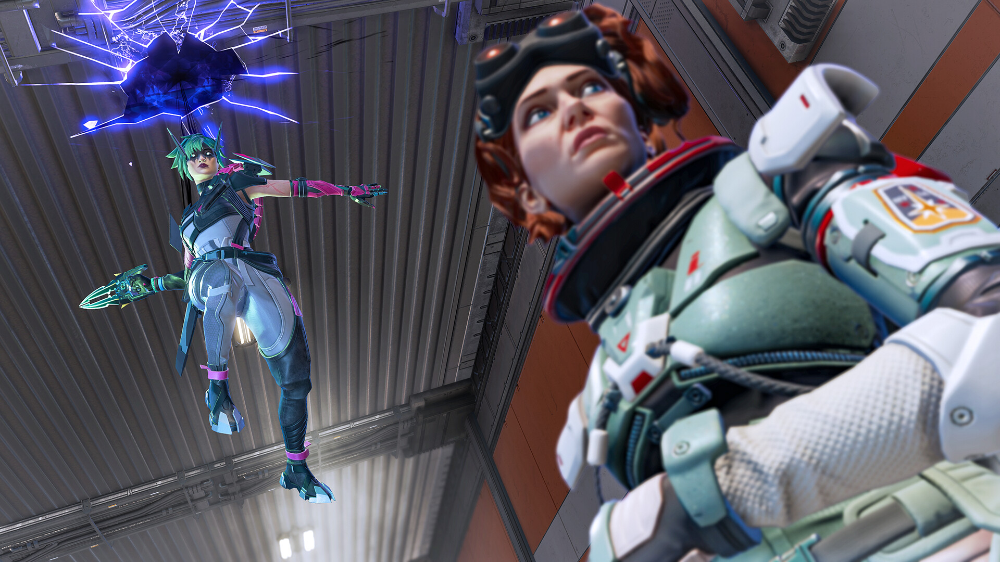
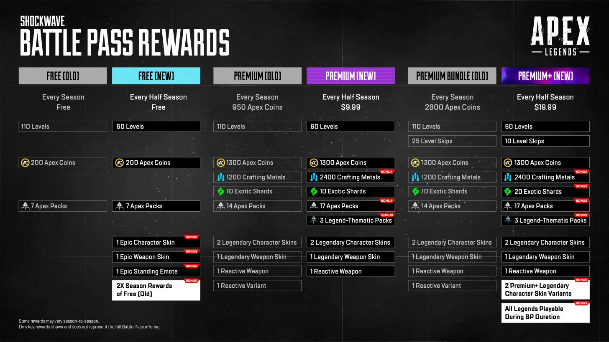

+++
title = "Les joueurs ont fait plier Respawn, qui change (à nouveau) le battle pass d'Apex Legends"
date = 2024-07-25T08:00:32+01:00
draft = false
author = "Mickael"
tags = ["Actu"]
image = "https://nostick.fr/articles/2024/juillet/2507-joueurs-plier-respawn-battle-pass-apex-legends/apex-legends1.jpg"
+++

 

Des vertus du review bombing. [Les éditeurs n'aiment pas l'avalanche de mauvaises notes](https://nostick.fr/articles/2024/juillet/2407-gta-vi-review-bombing/) et de commentaires désobligeants qui s'abattent sur leurs jeux quand les joueurs sont mécontents d'un changement. Mais parfois, c'est le seul moyen qu'ils ont pour faire entendre leur voix. Ça a marché quand [Sony a voulu imposer une connexion au PSN dans *Helldivers II*](https://nostick.fr/articles/2024/mai/0505-sony-fait-plonger-helldivers-2-en-enfer/), et bis repetita avec Respawn Entertainment.

Il y a deux semaines, [le studio bouleversait le fonctionnement du battle pass d'*Apex Legends*](https://nostick.fr/articles/2024/juillet/0907-battle-pass-apex-legends-respawn/), en promettant monts et merveilles aux joueurs tout en leur faisant encore plus les poches. La colère n'a pas tardé à se faire entendre, en particulier concernant l'impossibilité d'acheter le battle pass avec des Apex Coins gagnés en jeu — seuls les bons gros dollars étaient désormais acceptés.

 

 battle pass.") 

« *Vous avez parlé, nous avons entendu* », a [affirmé](https://x.com/PlayApex/status/1816156552396734859) Respawn dans une déclaration publiée cette nuit. Après une campagne de review bombing massive (les évaluations récentes sur Steam sont « *extrêmement négatives* »), le studio restaure la possibilité d'acheter le battle pass pour 950 Apex Coins, environ 10 $. Et les plus assidus seront capables de collecter jusqu'à 1 300 coins sur la période, de quoi se payer le prochain pass.

Un nouveau palier fait son apparition, Ultimate, qui coûte 10 $ et des ressources supplémentaires ; cette fois, impossible de le payer en coins. En revanche, les saisons restent découpées en deux parties, soit autant de battle pass, mais avec plus d'items et d'équipements rares. Respawn a fait un bout du chemin, mais il n'est pas sûr qu'il s'en sorte à bon compte.