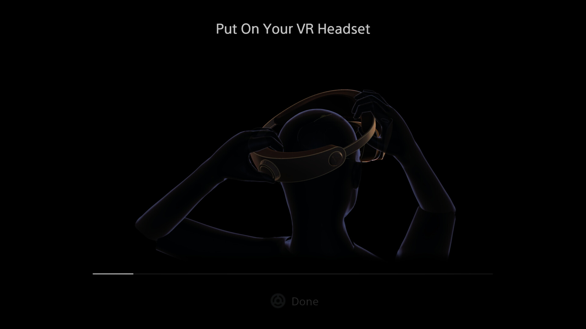

+++
title = "Sony prépare la transition du PSVR2 vers le PC"
date = 2024-07-25T16:44:32+01:00
draft = false
author = "Mickael"
tags = ["Actu"]
type = "telex"
+++

Le PSVR 2 qui prend la poussière à côté de la PS5 va reprendre du service sur PC. Sony va lancer un adaptateur qui permettra d'utiliser le casque de réalité virtuelle avec les jeux SteamVR ; l'accessoire sera commercialisé à partir du 7 août au prix de 59,99 €. Le joueur devra fournir un câble DisplayPort et installer sur son PC l'application qui vient tout juste d'apparaitre sur [Steam](https://store.steampowered.com/app/2580190/PlayStationVR2_App/) (elle sera téléchargeable à partir du 6 août). Elle fera le pont entre le casque et l'ordi.

Jouer à *Half-Life Alyx* et aux autres titres VR de Steam (et il y en a un paquet) pourrait redonner au PSVR2 le second souffle dont il a cruellement besoin car [Sony n'a pas l'air de trop s'en préoccuper](https://nostick.fr/articles/2024/juin/2106-sony-sapin-psvr2/). Attention, toutes les fonctions du casque ne  seront pas disponibles sur PC : pas de HDR, pas de suivi du regard, pas de gâchettes adaptatives, pas de retour haptique… Si on ajoute à ça le fil à la patte et le prix de l'appareil, autour de 550 balles, on aura peut-être mieux fait d'acheter un Quest 3 plus complet et qui fonctionne sans fil avec le PC.