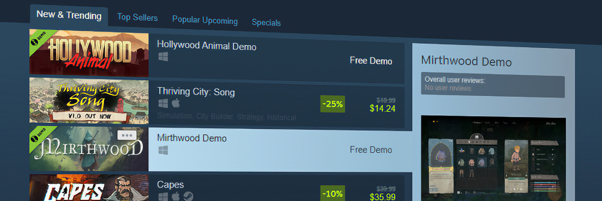

+++
title = "Les démos deviennent des jeux comme les autres sur Steam"
date = 2024-07-26T12:47:32+01:00
draft = false
author = "Mickael"
tags = ["Actu"]
image = "https://nostick.fr/articles/2024/juillet/2607-demo-steam/demo-steam.jpg"
+++

 

Steam met les démos au même plan que les jeux « normaux » : elles [peuvent](https://steamcommunity.com/games/593110/announcements/detail/6233628070477025191) désormais avoir droit à leur propre page ! Terminé la présence minimaliste (et trop discrète) d'une démo sur la page d'un jeu. Ce changement va donner davantage d'espace aux développeurs pour faire la promotion de leurs démos[^1]. Et bien sûr, ces pages intègrent un lien vers le jeu au complet, ainsi que leurs propres évaluations.

Et ça n'est pas tout : le comportement d'une démo est maintenant similaire à celui d'un jeu standard. Il est ainsi possible d'ajouter une démo à sa bibliothèque sans avoir à l'installer immédiatement. Les démos peuvent être retirées de son compte d'un clic, via le menu *Gérer* > *Supprimer du compte*. Et après désinstallation, une démo est supprimée automatiquement du compte.

 

Les développeurs (et les curieux) pourront également télécharger une démo, même s'ils possèdent le jeu au complet. Dans la boutique, les démos s'affichent de la même manière que les jeux gratuits, elles peuvent ainsi apparaitre dans la section « Nouveautés et tendances ». Et il est aussi possible d'ajouter une démo à sa liste de souhaits : quand elle sera disponible, le joueur sera prévenu par email.

Tout cela est une bonne nouvelle pour les fans de démos et pour tous les joueurs en général ! Rappelons l'existence d'un hub des démos sur Steam, accessible à cette [adresse](https://store.steampowered.com/demos/?snr=2_groupannouncements_detail_). Le prochain festival de la démo, le Steam Néo Fest, débutera le 14 octobre.

[^1]: Pourquoi les démos ont-elles ce symbole tout rond ? Valve explique qu'il s'agit d'un « symbole » qui remonte à l'époque où les démos étaient distribuées par la poste, « *soigneusement emballées dans le blister d'un magazine spécialisé imprimé sur des arbres morts, et gravées sur des supports circulaires que l'on appelait "CD"* ». Vous savez tout.