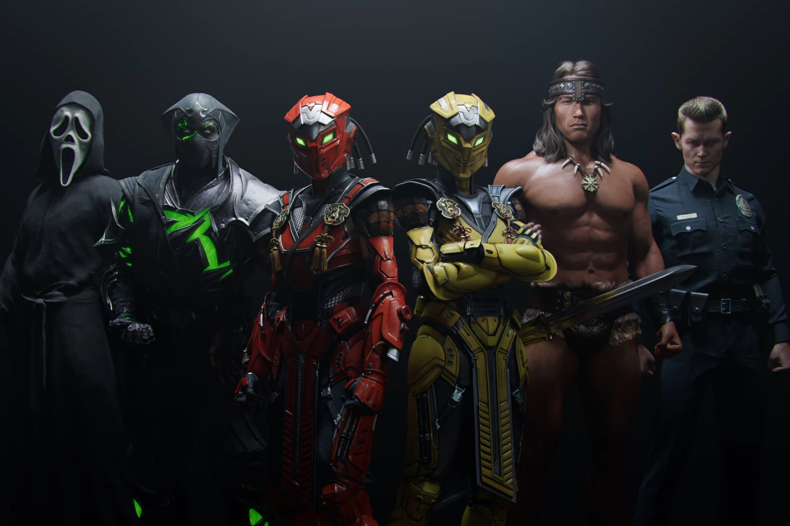

+++
title = "Le Règne du Khaos va mettre le souk dans Mortal Kombat 1"
date = 2024-07-26T23:47:32+01:00
draft = false
author = "Mickael"
tags = ["Trailer"]
image = "https://nostick.fr/articles/2024/juillet/2607-mortal-kombat-1-regne-du-khaos/mk1-regne-khaos.jpg"
+++

La deuxième fournée de nouveaux combattants déboulera à partir du 24 septembre dans *Mortal Kombat 1*, qui va s'accompagner pour l'occasion d'une nouvelle campagne solo, [Règne du Khaos](https://www.mortalkombat.com/fr-fr/khaos-reigns) ! Les futurs kombattants sont Cyrax, Sektor et Noob Saibot, des classiques de *MK* revisités, et trois prestigieux invités de marque : Ghostface (de la franchise *Scream*), le T-1000 de *Terminator 2* évidemment, et rien moins que Conan le Barbare.

Du lourd, du très lourd, ce d'autant que Robert Patrick, l'acteur dans la peau de métal liquide du T-1000, va donner de la voix. Quant au Règne du Khaos, l'histoire est du n'importe quoi jouissif qui fait suite au portnawak du jeu original. Liu Kang va devoir rameuter ses troupes pour kombattre le méchant Titan Havik bien décidé à mettre le souk.

 

Et si tout cela ne suffisait pas, NetherRealm va remettre au goût du jour les animality, des variantes des fatality à base d'animaux très voraces qui étaient apparues dans *MK3*… en 1995. Jetez un œil à la fin de la bande annonce, c'est quelque chose. Pas besoin d'acheter le nouveau DLC pour en profiter, ce sera inclus avec la mise à jour gratuite qui tombera le 24 septembre. Et en bonus, le studio offre à tous les joueurs le skin pour Scorpion tiré du film de 1995, et ce dès aujourd'hui ! C'est Noël.